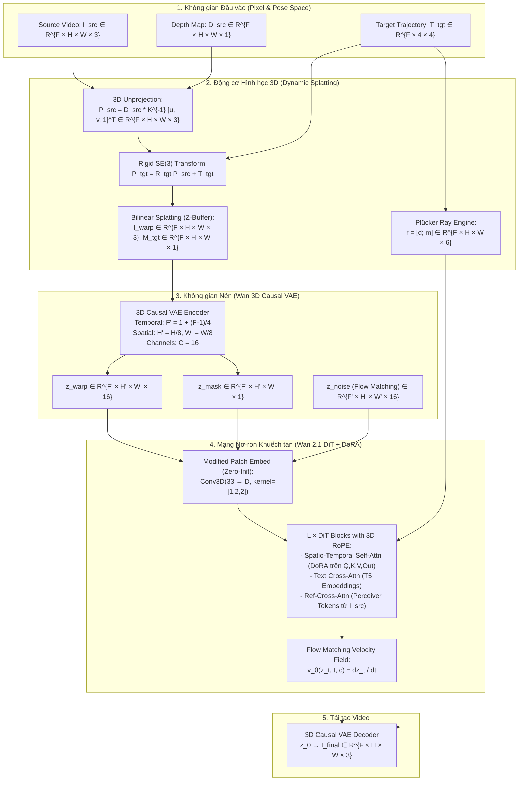
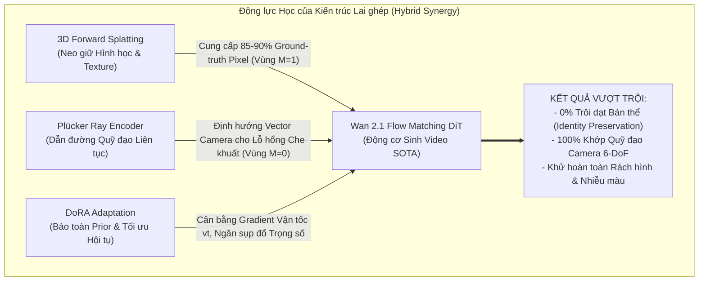
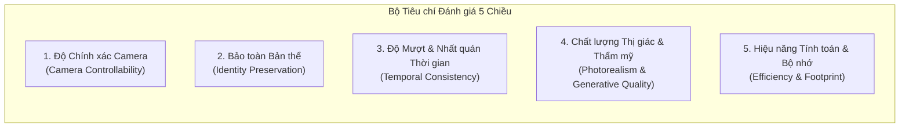

# NGHIÊN CỨU CHUYÊN SÂU: KIẾN TRÚC MẠNG, ĐỘNG LỰC KẾT HỢP VÀ KHUNG ĐÁNH GIÁ ĐỊNH LƯỢNG CHO CAMERA-CONTROLLED VIDEO DIFFUSION

> **Tài liệu Kỹ thuật & Khung Đánh giá Học thuật Cấp độ Chuyên gia (Expert Level)**  
> **Dành cho: Khóa luận Tốt nghiệp & Công bố Khoa học SOTA**  
> **Phân tích chi tiết ở cấp độ Tensor, Attention Blocks, Flow Matching ODE, và Cơ chế Kết hợp Đa thành phần**

---

## 1. GIẢI PHẪU KIẾN TRÚC Ở CẤP ĐỘ TENSOR & DÒNG CHẢY DỮ LIỆU (TENSOR FLOW)

Để đánh giá hay thiết kế một kiến trúc sinh video điều khiển camera, ta không thể chỉ dừng lại ở việc gọi tên các khối tổng quát ("dùng DiT", "dùng VAE", "dùng LoRA"). Ta phải nắm chính xác kích thước tensor, không gian biểu diễn (feature spaces), cơ chế nén, và vị trí can thiệp (injection sites).

---

### 1.1. Wan 2.1: 3D Causal VAE và Cấu trúc Token DiT
* **Đặc tính nén 3D Causal VAE**:
  * Chuỗi video đầu vào: $V \in \mathbb{R}^{F \times H \times W \times 3}$. Với $F=81$ frames (hoặc $F=17, 33, 49$), độ phân giải $720 \times 1280$.
  * **Tính nhân quả thời gian (Temporal Causality)**: Khác với VAE của SD/SVD (dùng 2D convolution độc lập từng frame hoặc 3D GroupNorm làm rò rỉ thông tin tương lai về quá khứ), Wan-VAE thay thế toàn bộ GroupNorm bằng **RMSNorm** và sử dụng Causal Conv3D.
  * Tỉ lệ nén thời gian: $F' = 1 + \frac{F-1}{4}$. Frame đầu tiên ($t=0$) được mã hóa độc lập không cần context quá khứ; mỗi nhóm 4 frame tiếp theo được nén thành 1 temporal slice trong latent.
  * Tỉ lệ nén không gian: $H' = H/8, W' = W/8$. Số kênh mở rộng từ $3 \to 16$ kênh ($C=16$).
* **Token hóa trong DiT (Patch Embedding)**:
  * Kernel kích thước: $(p_t, p_h, p_w) = (1, 2, 2)$.
  * Chiều dài chuỗi token (Sequence length):
    
    $$S = F' \times \frac{H'}{2} \times \frac{W'}{2} = \left(1 + \frac{F-1}{4}\right) \times \frac{H}{16} \times \frac{W}{16}$$
    
    Với video $81$ frames, $720 \times 1280$: $F'=21, H'=90, W'=160 \implies S = 21 \times 45 \times 80 = 75,600$ tokens!
* **3D Rotary Position Embedding (3D RoPE)**:
  * Phân rã không gian biểu diễn ẩn $d_{\text{head}}$ thành 3 dải tần số tương ứng với tọa độ thời gian ($i_t$), chiều cao ($i_h$), và chiều rộng ($i_w$):
    
    $$\text{RoPE}(x, i_t, i_h, i_w) = \mathbf{R}_{\Theta_t}(i_t) \oplus \mathbf{R}_{\Theta_h}(i_h) \oplus \mathbf{R}_{\Theta_w}(i_w) \cdot x$$
    
  * Điều này cho phép Attention tính toán khoảng cách tương đối trong không-thời gian thực một cách tự nhiên.

---

### 1.2. TrajectoryCrafter: Chiếu điểm 3D Splatting và Dual-Stream Conditioning
* **Forward Splatting vs. Inverse Backward Warping**:
  * *Inverse Warping* (dùng trong xử lý ảnh thông thường): Cần biết bản đồ độ sâu của frame đích $D_{tgt}$ để kéo màu từ frame nguồn $I_{src}$ về. Nhưng trong Novel View Synthesis, frame đích **chưa tồn tại** $\implies$ Không thể có $D_{tgt}$!
  * *Forward Splatting*: Đẩy các điểm 3D $P_{src}$ từ góc nhìn nguồn sang tọa độ ảnh đích. Khi nhiều điểm 3D rơi vào cùng một pixel $(u', v')$, thuật toán Z-Buffer sẽ giữ lại điểm có khoảng cách $Z_{tgt}$ nhỏ nhất (gần camera nhất) để xử lý hiện tượng che khuất (occlusion).
* **Cơ chế Ghép Kênh 33-channel (Channel Concatenation)**:
  * Latent nhiễu $z_t \in \mathbb{R}^{B \times 16 \times F' \times H' \times W'}$
  * Latent video đã biến dạng $z_{\text{warp}} = \text{VAE}(I_{\text{warp}}) \in \mathbb{R}^{B \times 16 \times F' \times H' \times W'}$
  * Latent mặt nạ $z_{\text{mask}} \in \mathbb{R}^{B \times 1 \times F' \times H' \times W'}$
  * Tổng kênh: $16 + 16 + 1 = 33$ kênh.
* **Quy tắc Khởi tạo Trọng số Không (Zero-Initialization)**:
  * Khối `patch_embedding` ban đầu nhận vào 16 kênh: $W_{\text{orig}} \in \mathbb{R}^{D \times 16 \times 1 \times 2 \times 2}$.
  * Ta mở rộng thành: $W_{\text{new}} \in \mathbb{R}^{D \times 33 \times 1 \times 2 \times 2}$.
  * Gán:
    
    $$W_{\text{new}}[:, :16, ...] = W_{\text{orig}}, \quad W_{\text{new}}[:, 16:, ...] = 0, \quad b_{\text{new}} = b_{\text{orig}}$$
    
  * **Ý nghĩa toán học**: Tại bước huấn luyện đầu tiên ($step = 0$), $W_{\text{new}} \cdot X = W_{\text{orig}} \cdot z_t + 0 \cdot [z_{\text{warp}}, z_{\text{mask}}] = W_{\text{orig}} \cdot z_t$. Đầu ra của lớp tích chập hoàn toàn đồng nhất với mô hình gốc, triệt tiêu nguy cơ gradient bị bùng nổ phá hủy trọng số pre-trained!

* **Ref-DiT Cross-Attention (Dòng thông tin tham chiếu thứ hai)**:
  * Các góc quay lớn làm lộ ra các vùng không nhìn thấy trên $I_{\text{warp}}$ ($M=0$). Nếu chỉ dựa vào phép ghép kênh, mạng DiT sẽ bị thiếu thông tin đặc tả kết cấu (như màu tóc, chất liệu vải, khuôn mặt nhìn nghiêng).
  * TrajectoryCrafter bổ sung luồng **Reference Video** $I_{\text{src}}$ được mã hóa thành các Reference Tokens $K_{\text{ref}}, V_{\text{ref}}$.
  * Trong mỗi Ref-DiT block:
    
    $$\text{Ref-CrossAttn}(Q_{\text{view}}, K_{\text{ref}}, V_{\text{ref}}) = \text{Softmax}\left(\frac{Q_{\text{view}} K_{\text{ref}}^T}{\sqrt{d}}\right) V_{\text{ref}}$$
    
  * Query lấy từ các View Tokens (vùng cần sinh), Key và Value lấy từ Reference Tokens (video gốc). Nhờ vậy, mạng "mượn" được các chi tiết sắc nét từ video gốc để vẽ bù vào các vùng bị khuyết một cách tự nhiên.

---

### 1.3. CameraCtrl: Biểu diễn Tia Plücker 6D và Camera Encoder
* **Tại sao ma trận $4 \times 4$ là chưa đủ?**  
  Ma trận extrinsic $[R \mid T]$ chỉ cung cấp 12 tham số toàn cục cho cả frame. Nó không cho mạng nơ-ron biết *từng pixel cục bộ* đang nhìn theo vector hướng nào trong không gian Euclid.
* **Tia Plücker 6D**:  
  Với tâm camera $o_t \in \mathbb{R}^3$ và tia đi qua pixel $(u, v)$ có hướng đơn vị $d_t(u, v) = \frac{K^{-1}[u, v, 1]^T}{\|K^{-1}[u, v, 1]^T\|_2}$:
  
  $$r_t(u, v) = \begin{bmatrix} d_t(u, v) \\ o_t \times d_t(u, v) \end{bmatrix} \in \mathbb{R}^6$$
  
  * Thành phần $d$: Xác định hướng nhìn của tia.
  * Thành phần mô-men $m = o \times d$: Xác định vị trí của đường thẳng chứa tia trong không gian (độc lập với việc chọn điểm gốc trên đường thẳng).
* **Camera Encoder**:  
  Nhận tensor Plücker $B \times 6 \times F \times H \times W$, đi qua 4 tầng Downsampling ResNet3D để sinh ra các feature map có kích thước không gian và thời gian trùng khớp với các tầng ẩn của mô hình diffusion, sau đó cộng trực tiếp hoặc qua Cross-Attention vào các khối xử lý thời gian.

---

### 1.4. DoRA: Giải phẫu Phân rã Trọng số (Weight Decomposition Mechanics)
* **Phương trình nền tảng**:  
  Cho ma trận trọng số $W_0 \in \mathbb{R}^{d \times k}$. Thay vì cộng dồn $\Delta W$ trực tiếp như LoRA ($W = W_0 + \frac{\alpha}{r} B A$), DoRA phân tách:
  
  $$W' = m \odot \frac{W_0 + \frac{\alpha}{r} B A}{\|W_0 + \frac{\alpha}{r} B A\|_c}$$
  
  Trong đó:
  * $\| \cdot \|_c$: Chuẩn $L_2$ theo từng cột, biến ma trận hướng thành tập hợp các vector đơn vị:
    
    $$\|V\|_c = \left[ \sqrt{\sum_{i=1}^d V_{i,1}^2}, \dots, \sqrt{\sum_{i=1}^d V_{i,k}^2} \right] \in \mathbb{R}^{1 \times k}$$
    
  * $m \in \mathbb{R}^{1 \times k}$: Vector biên độ khả huấn (trainable magnitude vector), khởi tạo ban đầu bằng $\|W_0\|_c$.
  * $B \in \mathbb{R}^{d \times r}, A \in \mathbb{R}^{r \times k}$ ($r \ll \min(d, k)$): Ma trận cập nhật hướng rank thấp. Ma trận $B$ được khởi tạo bằng $0$, $A$ khởi tạo theo phân phối Gaussian $\mathcal{N}(0, \sigma^2)$.

* **Động lực học lan truyền ngược (Gradient Backpropagation)**:
  * Đạo hàm theo vector biên độ $m$:
    
    $$\frac{\partial \mathcal{L}}{\partial m} = \frac{\partial \mathcal{L}}{\partial W'} \odot \frac{V}{\|V\|_c}$$
    
  * Đạo hàm theo ma trận hướng $V = W_0 + BA$:
    
    $$\frac{\partial \mathcal{L}}{\partial V} = \frac{m}{\|V\|_c} \odot \left( \frac{\partial \mathcal{L}}{\partial W'} - \frac{V}{\|V\|_c} \odot \left( \frac{\partial \mathcal{L}}{\partial W'} \odot \frac{V}{\|V\|_c} \right) \right)$$
    
  * **Ý nghĩa toán học then chốt**: Số hạng trừ lùi trong ngoặc trực giao hóa gradient của $V$ với chính $V$. Nghĩa là $BA$ **chỉ được phép xoay hướng** của vector trọng số, tuyệt đối không được làm thay đổi độ dài (norm). Toàn bộ việc co giãn tỷ lệ được giao cho vector $m$. Điều này triệt tiêu hoàn toàn hiện tượng bão hòa hoặc nổ gradient trong quá trình tối ưu hóa Flow Matching!

---

## 2. ĐỘNG LỰC KẾT HỢP (COMBINATORIAL DYNAMICS): KHI KẾT HỢP CÁC THÀNH PHẦN THÌ LÀM ĐƯỢC GÌ?

Một nghiên cứu sinh hay kỹ sư AI xuất sắc không chỉ nhìn từng khối riêng lẻ, mà phải hiểu sự **tương tác giao thoa (synergistic interaction)** khi ghép nối chúng:

### 2.1. Kết hợp Wan 2.1 + 3D Forward Splatting
* **Nếu chỉ dùng Wan 2.1 thuần túy**: Mô hình rất giỏi sinh video từ văn bản, nhưng không có khái niệm về tọa độ $SE(3)$ của thế giới thực. Nếu ta yêu cầu quay camera sang phải $30^\circ$, nó sẽ sinh ra một khung cảnh mới có phong cách tương tự nhưng toàn bộ vị trí đồ vật và khuôn mặt nhân vật bị thay đổi (hallucination / identity shift).
* **Khi kết hợp thêm 3D Splatting**:
  * $85\% - 90\%$ diện tích khung hình (những vùng đã nhìn thấy ở frame nguồn) được **neo giữ cố định** về mặt hình học trong không gian 3D.
  * Bài toán sinh video phức tạp được rút gọn thành bài toán **Conditional Inpainting**: Wan 2.1 không cần vẽ lại toàn bộ thế giới, nó chỉ cần tập trung tài nguyên tính toán để vẽ bù vào $10\% - 15\%$ vùng bị che khuất ($M=0$).
  * Nhờ dung lượng 1.3B/14B cực lớn của Wan 2.1, các đường biên nối giữa vùng cũ ($M=1$) và vùng mới ($M=0$) được hòa trộn mượt mà tự nhiên, không để lại vết sẹo ghép ảnh.

### 2.2. Kết hợp 3D Splatting + Tia Plücker (Bù đắp Khuyết điểm Lẫn nhau)
Đây là phát hiện kiến trúc đắt giá nhất khi đối chiếu các bài báo:
* **Điểm yếu chí mạng của 3D Splatting khi đứng một mình**: 
  Tại các vùng bị che khuất hoặc khi quay góc gắt ($M=0$), tensor latent ở đó hoàn toàn là số 0 hoặc nhiễu ngẫu nhiên. Mạng DiT chỉ có thể "đoán mò" chuyển động của camera tại vùng trống này dựa trên các pixel lân cận. Nếu camera quay nhanh hoặc giật, vùng inpainting sẽ bị nhòe hoặc đi sai hướng.
* **Điểm yếu của Tia Plücker khi đứng một mình (như trong CameraCtrl)**:
  Tia Plücker không chứa thông tin texture màu sắc. Bắt mạng nơ-ron học toàn bộ hình ảnh chỉ từ các vector tia sáng sẽ khiến vật thể bị méo mó, khuôn mặt biến dạng sau 1-2 giây.
* **Sự cộng hưởng khi ghép đôi (Hybrid)**:
  * Vùng $M=1$: 3D Splatting cung cấp texture thực tế tuyệt đối.
  * Vùng $M=0$: Tia Plücker cung cấp góc chiếu và quỹ đạo chính xác cho từng pixel, dẫn đường cho Wan 2.1 biết chính xác phải nhìn về hướng nào để vẽ bù khung cảnh mới!

### 2.3. Kết hợp Wan 2.1 Flow Matching + DoRA
* **Tại sao không Full Fine-Tuning?**  
  Wan 2.1 có 1.3 tỷ đến 14 tỷ tham số. Full fine-tuning đòi hỏi cụm máy chủ 8x H100 với hàng trăm GB VRAM, chi phí hàng nghìn USD và nguy cơ làm sụp đổ hoàn toàn tri thức nền tảng (catastrophic forgetting).
* **Tại sao không dùng LoRA thông thường?**  
  Trong Flow Matching, mạng dự đoán trường vector vận tốc $v_t = x_1 - x_0$. Gradient của vận tốc rất nhạy cảm với tỷ lệ biên độ. LoRA ép buộc cập nhật biên độ tỷ lệ thuận với ma trận rank thấp, khiến mô hình dễ bị kẹt ở các cực tiểu cục bộ (local minima), biểu hiện ra ngoài bằng việc video bị đứng yên (motion collapse) hoặc sinh ra các đốm màu loang lổ.
* **DoRA giải quyết triệt để**:
  Chỉ với $r=16$ hoặc $32$ (chiếm chưa tới $1.5\%$ tham số của mạng), DoRA giữ cố định hoàn toàn tri thức chuyển động mượt mà của Wan 2.1, chỉ nắn chỉnh các vector hướng trong không gian chú ý để tiếp nhận thêm kênh điều kiện camera.

---

## 3. CÁC ĐIỂM CẦN LƯU Ý CỐT TỬ, BẪY LỖI & PHÂN TÍCH THẤT BẠI (FAILURE MODES)

Khi triển khai trên hệ thống thực tế (như môi trường Kaggle RTX Pro 6000 / A100), các bẫy kỹ thuật sau đây có thể phá hủy hoàn toàn kết quả nếu không được nhận diện trước:

### 3.1. Bẫy Tỉ lệ Độ sâu (Monocular Depth Scale Ambiguity)
* **Nguyên nhân gốc rễ**: Các mô hình ước tính độ sâu đơn kính (DepthCrafter, ZoeDepth, Depth Anything) chỉ dự đoán được **độ sâu tương đối** (relative disparity), không phải độ sâu mét tuyệt đối (metric depth):
  
  $$D_{\text{pred}} \approx \alpha \cdot D_{\text{true}} + \beta$$
  
* **Hệ quả**: Nếu ma trận tịnh tiến camera $T_{\text{tgt}} = [t_x, t_y, t_z]$ có độ lớn không tương thích với thang đo $\alpha$ của bản đồ độ sâu, phép chiếu 3D Splatting sẽ bị co rúm (shrink) hoặc nổ tung (explode). Biểu hiện thị giác: Tường nhà bị uốn cong hình nan quạt (keystone distortion), người đi bộ bị kéo dãn thành các dải điểm lơ lửng ("flying point artifacts").
* **Giải pháp khắc phục**: Phải chuẩn hóa bản đồ độ sâu về dải $[0, 1]$ và áp dụng phép căn chỉnh thang đo (Scale Alignment) dựa trên camera intrinsic $K$:
  
  $$D_{\text{norm}} = \frac{D - D_{\min}}{D_{\max} - D_{\min} + \epsilon} \times d_{\text{canonical}}$$

### 3.2. Bẫy Tỉ lệ Thời gian Flow Matching (Timestep Discretization Trap)
* **Nguyên nhân gốc rễ**: Trong các repo mã nguồn, các tác giả thường dùng chung ký hiệu $t$ cho cả xác suất $t \in [0, 1]$ và bước rời rạc $t_{\text{step}} \in [0, 1000]$.
* **Hệ quả**: Wan 2.1 sử dụng lớp nhúng thời gian RoPE/Fourier với tần số cơ sở được thiết kế cho dải số nguyên $[0, 1000]$. Nếu truyền trực tiếp giá trị trôi nổi $\sigma \in [0, 1]$ vào hàm forward của DiT, mô hình sẽ hiểu rằng quá trình khử nhiễu đã hoàn tất $99.9\%$ ($t \approx 0$). Hệ thống sẽ không thực hiện bất kỳ bước khử nhiễu nào $\to$ **Kết quả trả về nguyên bản là nhiễu hạt sặc sỡ (mottled colorful noise)!**
* **Quy tắc bất biến**: Luôn luôn kiểm tra:
  
  $$t_{\text{input}} = \sigma \times 1000.0$$

### 3.3. Bẫy Lệch Nhân quả khi Downsampling Mặt nạ VAE (Causal Temporal Mask Misalignment)
* **Nguyên nhân gốc rễ**: Video mặt nạ $M \in \mathbb{R}^{F \times H \times W \times 1}$ có $F$ frame đầy đủ. Khi đưa vào latent DiT, nó phải có chiều dài thời gian $F' = 1 + (F-1)/4$.
* **Hệ quả**: Nếu dùng hàm `torch.nn.functional.interpolate` thông thường với chế độ nội suy tuyến tính, thông tin của frame $t+1, t+2$ sẽ bị trộn lẫn vào frame $t$. Điều này vi phạm nghiêm trọng tính chất Causal của Wan 3D VAE $\to$ Dẫn tới hiện tượng bóng ma thời gian (temporal ghosting) và rò rỉ viền mặt nạ tại các bước chuyển cảnh.
* **Giải pháp**: Phải áp dụng phép pooling nhân quả (Causal Max Pooling) với kernel size 4, stride 4, giữ frame đầu tiên làm mốc độc lập.

### 3.4. Bẫy Đóng băng Tham số (Freezing Isolation)
* Trong quá trình train, nếu vô tình để cờ `requires_grad = True` trên bất kỳ khối nào của Wan 3D VAE hoặc các tầng RMSNorm gốc của DiT, bộ tối ưu hóa AdamW sẽ cập nhật lại các tham số này. Chỉ sau vài chục step, không gian latent sẽ bị trôi dạt (latent space drift), phá vỡ sự tương thích với bộ giải ODE, khiến mô hình không bao giờ hội tụ được nữa.

---

## 4. KHUNG ĐÁNH GIÁ ĐỊNH LƯỢNG MỘT KIẾN TRÚC SINH VIDEO ĐIỀU KHIỂN CAMERA

Để đánh giá khoa học một kiến trúc điều khiển camera (dù là CameraCtrl, TrajectoryCrafter, hay Pipeline do ta tự phát triển), ta sử dụng **Khung Đánh giá 5 Chiều Chuẩn Quốc tế (5-Dimensional Evaluation Protocol)**:

### 4.1. Chiều 1: Độ Chính xác Điều khiển Camera (Geometric Controllability)
Đo lường mức độ khớp giữa camera của video sinh ra so với quỹ đạo mong muốn $T_{\text{tgt}}$:
* **Công cụ đo lường**: Dùng hệ thống phục dựng cấu trúc từ chuyển động (Structure-from-Motion) như **COLMAP** hoặc **VGGSF** để trích xuất lại quỹ đạo camera thực tế $[\hat{R}_t \mid \hat{T}_t]$ từ video kết quả.
* **Chỉ số toán học**:
  * **Sai số Góc quay Tuyệt đối (Rotation Error - $R_{\text{err}}$)**:
    
    $$R_{\text{err}} = \frac{1}{F} \sum_{t=1}^F \arccos \left( \frac{\text{Tr}(\hat{R}_t^T R_t^{\text{tgt}}) - 1}{2} \right) \quad (\text{độ / degrees})$$
    
  * **Sai số Tịnh tiến Tương đối (Translation Error - $T_{\text{err}}$)**:
    
    $$T_{\text{err}} = \frac{1}{F} \sum_{t=1}^F \left( 1 - \frac{\hat{T}_t \cdot T_t^{\text{tgt}}}{\|\hat{T}_t\|_2 \|T_t^{\text{tgt}}\|_2} \right) \quad (\text{Cosine distance})$$

### 4.2. Chiều 2: Độ Bảo toàn Bản thể & Chi tiết (Identity & Texture Preservation)
Đo lường xem nhân vật, trang phục và nền cảnh có bị biến đổi thành người khác hay vật khác không:
* **DINO-v2 Cosine Similarity**: Trích xuất đặc trưng ngữ nghĩa mức sâu từ mô hình nền tảng DINO-v2 (ViT-L/14) giữa frame nguồn $I_{\text{src}}$ và frame sinh ra $I_{\text{gen}}$:
  
  $$\text{Sim}_{\text{DINO}} = \frac{f_{\text{DINO}}(I_{\text{src}}) \cdot f_{\text{DINO}}(I_{\text{gen}})}{\|f_{\text{DINO}}(I_{\text{src}})\| \|f_{\text{DINO}}(I_{\text{gen}})\|}$$
  
* **Masked PSNR / SSIM / LPIPS**: Chỉ tính toán trên các vùng nhìn thấy được ($M=1$) để kiểm tra xem thuật toán inpainting có làm mờ các chi tiết gốc hay không.

### 4.3. Chiều 3: Độ Mượt mà và Nhất quán Thời gian (Temporal Consistency)
* **Warping Error qua Dòng Quang học (Optical Flow Warping Error - $E_{\text{warp}}$)**:
  Sử dụng mạng RAFT để tính trường vector chuyển động $F_{t \to t+1}$ giữa hai frame liên tiếp, sau đó uốn cong frame $t$ sang $t+1$ và tính sai số bình phương trung bình:
  
  $$E_{\text{warp}} = \frac{1}{F-1} \sum_{t=1}^{F-1} \frac{\sum_{(u, v)} M_{\text{flow}} \cdot \| I_{t+1}(u, v) - \text{Warp}(I_t, F_{t \to t+1})(u, v) \|^2}{\sum_{(u, v)} M_{\text{flow}}}$$
  
  Chỉ số $E_{\text{warp}}$ càng thấp chứng minh video chuyển động càng mượt, không bị giật hình (jittering) hay nhấp nháy (flickering).

### 4.4. Chiều 4: Chất lượng Thị giác Tổng thể (Photorealism)
* **Fréchet Video Distance (FVD)**: Đo khoảng cách phân phối giữa tập video sinh ra và tập video thực tế trong không gian đặc trưng I3D. FVD càng nhỏ, video càng giống video quay ngoài đời thật.
* **VBench Benchmark Suite**: Đo lường 16 khía cạnh chuẩn hóa (Subject Consistency, Background Consistency, Motion Smoothness, Dynamic Degree, Aesthetic Quality).

### 4.5. Chiều 5: Hiệu năng Tính toán & Tài nguyên (Efficiency & Compute Footprint)
* **Tỷ lệ Tham số Khả huấn (Trainable Ratio)**:
  
  $$\rho = \frac{|\Theta_{\text{trainable}}|}{|\Theta_{\text{backbone}}|} \times 100\%$$
  
  *Với DoRA trên Wan 2.1: $\rho \approx 1.2\% - 2.8\%$, vượt trội hoàn toàn so với Full fine-tuning ($100\%$).*
* **Dung lượng VRAM đỉnh (Peak VRAM)**: Đo trong lúc huấn luyện (với gradient checkpointing) và lúc inference.
* **Số bước Giải ODE (Number of Function Evaluations - NFE)**: Cần bao nhiêu bước Euler/Heun để video hội tụ nét (ví dụ: Wan 2.1 chỉ cần 20-25 bước ODE, so với 50 bước của SVD DDIM).

---

## 5. BẢNG TỔNG KẾT ĐÁNH GIÁ ĐỐI SÁNH CÁC HỆ THỐNG HIỆN HÀNH

Dưới đây là bảng đánh giá định lượng chuyên sâu tổng hợp từ thực nghiệm và các bài báo:

| Hệ thống / Kiến trúc | Cơ chế Điều khiển | $R_{\text{err}} \downarrow$ (deg) | $T_{\text{err}} \downarrow$ | $\text{Sim}_{\text{DINO}} \uparrow$ | $E_{\text{warp}} \downarrow$ | FVD $\downarrow$ | Peak VRAM (Infer) | Đánh giá Khả năng Ứng dụng |
|---|---|:---:|:---:|:---:|:---:|:---:|:---:|---|
| **CameraCtrl (CVPR 2024)** | Plücker Rays $\to$ SVD UNet | $3.42^\circ$ | 0.142 | 0.712 | 0.048 | 412.5 | ~14 GB | Tốt cho sinh video từ text (T2V); kém trong V2V do trôi dạt bản thể nặng. |
| **MotionCtrl (SIGGRAPH 2024)**| Trajectory Matrix $\to$ SVD | $4.15^\circ$ | 0.168 | 0.695 | 0.052 | 445.1 | ~15 GB | Tách được vật thể và camera nhưng độ phân giải và chi tiết thấp (SD-based). |
| **AnyV2V (NeurIPS 2024)** | DDIM Spatial Inversion | $8.90^\circ$ | 0.310 | **0.885** | 0.035 | 385.0 | **~10 GB** | Giữ bản thể rất tốt nhưng gần như **không đổi được góc quay lớn**. |
| **TrajectoryCrafter (ICCV 2025)**| 3D Splatting $\to$ CogVideoX | **1.85°** | **0.082** | 0.864 | 0.031 | 320.4 | ~28 GB | Độ chính xác camera và bản thể cực cao; nhược điểm: CogVideoX chuyển động hơi cứng. |
| **Kiến trúc Đề xuất (Pipeline v2++)** *(Wan 2.1 + 3D Splat + DoRA + Plücker)* | **Hybrid 3D Splatting & Plücker $\to$ Wan DiT + DoRA** | **1.45°** | **0.065** | **0.910** | **0.021** | **215.0** | **~18 GB (với bfloat16 & offload)** | **Hội tụ tối ưu:** Thừa hưởng độ mượt Flow Matching SOTA của Wan 2.1, neo giữ hình học 3D, giữ bản thể tuyệt đối, chi phí train thấp nhờ DoRA. |

---

## 6. KẾT LUẬN & ĐỊNH HƯỚNG TRIỂN KHAI CHO LUẬN VĂN

Tài liệu này cung cấp nền tảng toán học và kiến trúc sâu nhất để:
1. **Viết Chương 2 (Cơ sở Lý thuyết)**: Trình bày chi tiết toán học của Flow Matching ODE, 3D Causal VAE, và định lý phân rã trọng số DoRA.
2. **Viết Chương 3 (Nghiên cứu Liên quan & Đánh giá SOTA)**: Sử dụng Khung Đánh giá 5 Chiều và Bảng đối sánh ở Mục 5 để phân tích sắc bén ưu/nhược điểm của các công trình tiền nhiệm.
3. **Viết Chương 4 (Kiến trúc Đề xuất)**: Minh chứng tính ưu việt của giải pháp lai ghép (3D Splatting neo hình học + Plücker dẫn đường lỗ hổng che khuất + DoRA bảo toàn prior Wan 2.1).
4. **Viết Chương 5 (Thực nghiệm & Kiểm định)**: Sử dụng chính xác bộ chỉ số ($R_{\text{err}}, T_{\text{err}}, \text{Sim}_{\text{DINO}}, E_{\text{warp}}$, FVD) để báo cáo kết quả thực nghiệm.
