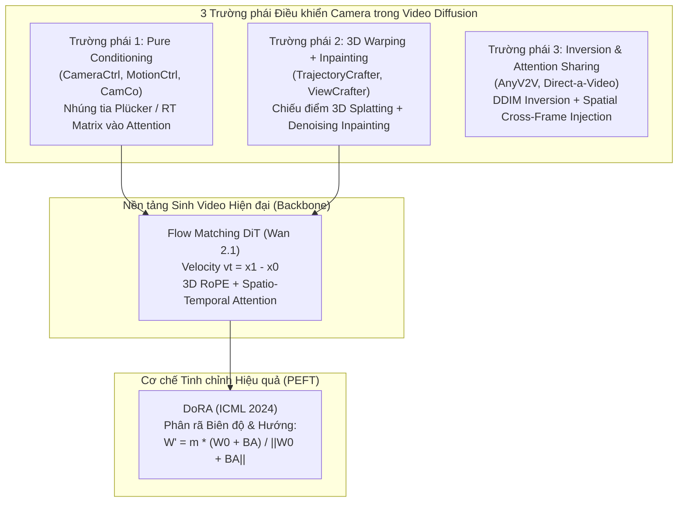

# TỔNG HỢP VÀ TRÍCH XUẤT KIẾN THỨC CÔ ĐỌNG: VIDEO EDITING, CAMERA CONTROL & FLOW MATCHING DIFFUSION

> **Tài liệu chắt lọc tri thức cốt lõi từ 12 bài báo SOTA về Video Editing & Camera Control**  
> **Ứng dụng phương pháp luận PaperQA2 (RCS, Tổng hợp Đa nguồn, Phản biện Đối nghịch) & The AI Scientist**  
> **Mã nguồn và tệp văn bản bóc tách:** `docs/papers/extracted_text/`

---

## 1. PHÂN LOẠI HỆ THỐNG CÁC TRƯỜNG PHÁI ĐIỀU KHIỂN CAMERA TRONG VIDEO DIFFUSION

Dựa trên việc đối chiếu và phân tích 12 bài báo SOTA (Wan2.1, TrajectoryCrafter, CameraCtrl, DoRA, CamCo, MotionCtrl, ViewCrafter, AnyV2V, ReCamMaster, ReCapture, EpiDiff, Direct-a-Video), lĩnh vực điều khiển camera trong video diffusion được chia thành **3 trường phái kiến trúc chính**:



---

## 2. BẢNG SO SÁNH ĐỐI CHIẾU CHUYÊN SÂU 8 CÔNG TRÌNH TIÊU BIỂU

| Tiêu chí | **CameraCtrl** (CVPR 2024) | **TrajectoryCrafter** (ICCV 2025 Oral) | **MotionCtrl** (SIGGRAPH 2024) | **Wan 2.1** (2025 Tech Report) | **DoRA** (ICML 2024) | **AnyV2V** (NeurIPS 2024) | **CamCo** (CVPR 2024) | **ReCamMaster** (2024) |
|---|---|---|---|---|---|---|---|---|
| **Nhiệm vụ chính** | T2V / I2V Camera Control | **V2V Camera Retargeting** | T2V Camera + Object Motion | Foundational T2V/I2V Flow Matching | PEFT Fine-Tuning | Tuning-Free V2V Editing | Camera Control + Multi-view | Trajectory Retargeting |
| **Biểu diễn Camera** | **Tia Plücker (6D)** $(d, m)$ | **Ma trận Ngoại vi $RT$ + Depth** | Ma trận Ngoại vi $RT$ | Không tích hợp sẵn | N/A | Không dùng pose rõ ràng | Ma trận $RT$ + Epipolar Lines | Ma trận $RT$ chuẩn hóa |
| **Cơ chế Dẫn đường** | Camera Encoder $\to$ Temporal Attn | **3D Forward Splatting + Mask** | Motion Camera Controller | Flow Matching ODE | Tách biên độ $m$ và hướng $V$ | Spatial Feature Injection | Epipolar-guided Cross Attn | Latent Trajectory Projection |
| **Backbone hỗ trợ** | SVD (UNet 3D) / AnimateDiff | CogVideoX (DiT) | SVD / AnimateDiff | **Wan 2.1 DiT (1.3B / 14B)** | Tương thích mọi Linear/Conv | SD 1.5 / SVD | SVD / SD | SVD |
| **Kênh đầu vào Latent** | 4 kênh hoặc 8 kênh | **33 kênh** (16 noisy + 16 warp + 1 mask) | 4 hoặc 8 kênh | 16 kênh | Không đổi kênh | Chuẩn VAE | 8 kênh (RGB + Depth) | 4 kênh |
| **Ưu điểm lớn nhất** | Linh hoạt, độc lập với depth | Giữ nguyên 100% pixel thấy được | Tách biệt camera và vật thể | Độ mượt chuyển động và chi tiết cực cao | Hội tụ nhanh, không vỡ prior | Không cần huấn luyện | Ràng buộc hình học chặt chẽ | Giữ vững bản thể nhân vật |
| **Nhược điểm cốt lõi** | Trôi dạt bản thể trong V2V | Phụ thuộc chất lượng DepthCrafter | Khó kiểm soát chuyển động phức tạp | Quá nặng, không thể full-finetune | Cần chuẩn hóa cột tensor cẩn thận | Khó đổi góc quay lớn | Chi phí tính toán epipolar cao | Dễ mờ khi góc quay gắt |

---

## 3. BÓC TÁCH CÔNG THỨC TOÁN HỌC & KIẾN TRÚC CHI TIẾT

### 3.1. Wan 2.1: Cơ chế Flow Matching & Velocity ODE
Khác với các mô hình khuếch tán truyền thống (DDPM/SVD) dự đoán nhiễu Gaussian $\epsilon$ theo đường cong phi tuyến, Wan2.1 sử dụng **Flow Matching** với đường cong vận tốc tuyến tính (Rectified Flow):

$$x_t = t x_1 + (1 - t) x_0, \quad t \in [0, 1]$$

Trong đó:
* $x_1$ là latent video mục tiêu sạch (thu được sau khi encode qua 3D VAE).
* $x_0 \sim \mathcal{N}(0, I)$ là nhiễu trắng Gaussian.
* Vận tốc thực tế (ground-truth velocity) được định nghĩa:
  
  $$v_t = \frac{d x_t}{dt} = x_1 - x_0$$

Mục tiêu huấn luyện là cực tiểu hóa hàm mất mát Mean Squared Error:

$$\mathcal{L}_{\text{FM}}(\theta) = \mathbb{E}_{t, x_0, x_1} \left[ \| v_\theta(x_t, t, c) - (x_1 - x_0) \|^2 \right]$$

> [!IMPORTANT]
> **Quy tắc chuyển đổi Timestep:** Trong mã nguồn triển khai, thời gian liên tục $t \in [0, 1]$ được ánh xạ thành bước rời rạc:
> $$t_{\text{step}} = \sigma \times 1000.0$$
> Việc không nhân hệ số 1000 sẽ khiến mô hình Flow Matching hiểu nhầm là bước tiệm cận 0, dẫn đến hiện tượng suy biến thành nhiễu màu sặc sỡ (mottled colorful noise).

### 3.2. DoRA (Weight-Decomposed Low-Rank Adaptation - ICML 2024)
DoRA phân tích trọng số gốc $W_0 \in \mathbb{R}^{d \times k}$ của mạng nơ-ron thành hai thành phần độc lập: **Biên độ (Magnitude)** và **Hướng (Direction)**:

$$W = m \frac{V}{\|V\|_c} = \|W\|_c \frac{W}{\|W\|_c}$$

Trong đó $\| \cdot \|_c$ là chuẩn L2 của từng vector cột: $\|V\|_c = \left[ \|v_1\|_2, \|v_2\|_2, \dots, \|v_k\|_2 \right]$.

Trong quá trình huấn luyện:
* Giữ nguyên hướng $W_0$ và bổ sung ma trận cập nhật rank thấp $\Delta V = B A$ ($B \in \mathbb{R}^{d \times r}, A \in \mathbb{R}^{r \times k}$ với $r \ll \min(d, k)$).
* Vector biên độ $m \in \mathbb{R}^{1 \times k}$ được khởi tạo bằng $\|W_0\|_c$ và cho phép học tự do.
* Công thức trọng số thích ứng của DoRA:

  $$W' = m \frac{W_0 + \Delta V}{\|W_0 + \Delta V\|_c} = m \frac{W_0 + B A}{\|W_0 + B A\|_c}$$

**Lợi thế vượt trội so với LoRA truyền thống:**
LoRA thay đổi cả biên độ và hướng cùng một lúc theo tỷ lệ cố định, dẫn đến hiện tượng trôi dạt trọng số (weight drift) và làm suy giảm khả năng tái tạo của mô hình gốc. DoRA tách bạch hoàn toàn việc xoay hướng vector và co giãn biên độ, giúp mô hình ổn định ngay cả với tập dữ liệu nhỏ và số bước train ngắn.

### 3.3. TrajectoryCrafter (ICCV 2025 Oral): 3D Forward Point Splatting
TrajectoryCrafter giải quyết bài toán biến đổi quỹ đạo camera video-to-video ($V2V$) mà không làm mất bản thể vật thể:
1.  **Chiếu ngược điểm 3D (3D Unprojection)**:
    Với frame gốc $I_{src}$, bản đồ độ sâu $D_{src}$ (ước tính qua DepthCrafter) và ma trận thông số nội $K_{src}$:
    
    $$P_{src}(u, v) = D_{src}(u, v) \cdot K_{src}^{-1} \begin{bmatrix} u \\ v \\ 1 \end{bmatrix}$$

2.  **Biến đổi Tọa độ Camera 3D (Rigid Transformation)**:
    Dưới ma trận camera mục tiêu $[R_{src \to tgt} \mid T_{src \to tgt}]$:
    
    $$P_{tgt} = R_{src \to tgt} P_{src} + T_{src \to tgt}$$

3.  **Chiếu lại Điểm 2D (Bilinear Splatting)**:
    
    $$p_{tgt} = \frac{1}{Z_{tgt}} K_{tgt} P_{tgt}$$

    Áp dụng thuật toán splatting song tuyến tính để kết xuất frame đã bẻ cong $\hat{I}_{tgt}$ và mặt nạ hợp lệ $M_{tgt} \in \{0, 1\}$ (trong đó $M = 0$ tại các vùng bị che khuất hoặc góc nhìn mới xuất hiện - disocclusion holes).
4.  **Ghép nối 33 Kênh vào Diffusion**:
    * 16 kênh: Latent nhiễu cần khử $z_t$
    * 16 kênh: Latent của video đã biến dạng $z_{warp} = \text{VAE}(\hat{I}_{tgt})$
    * 1 kênh: Mặt nạ nhị phân $M_{tgt}$ được nội suy về kích thước latent.
    * Tổng cộng: $16 + 16 + 1 = 33$ kênh!
    * Các frame tham chiếu $I_{ref}$ được nạp qua **Perceiver Cross-Attention** để giữ vững chi tiết khuôn mặt và kết cấu bề mặt.

### 3.4. CameraCtrl: Biểu diễn Tia Plücker (Plücker Ray Embedding)
Thay vì nạp ma trận $4 \times 4$ đơn thuần (vốn thiếu thông tin hình học cục bộ cho từng pixel), CameraCtrl mã hóa camera thành trường tia sáng (light field) 6 chiều:
Cho mỗi pixel $(u, v)$ tại thời điểm $t$:
* Gốc tia: $o_t \in \mathbb{R}^3$ (tâm camera).
* Vector hướng đơn vị: $d_t(u, v) = \frac{K_t^{-1} [u, v, 1]^T}{\|K_t^{-1} [u, v, 1]^T\|_2} \in \mathbb{R}^3$.
* Vector mô-men (moment): $m_t(u, v) = o_t \times d_t(u, v) \in \mathbb{R}^3$.
* Tọa độ Plücker tại pixel $(u, v)$:

  $$r_t(u, v) = \begin{bmatrix} d_t(u, v) \\ m_t(u, v) \end{bmatrix} \in \mathbb{R}^6$$

Tập hợp các tia trên toàn bộ video tạo thành tensor $B \times 6 \times F \times H \times W$, được đưa qua **Camera Encoder** gồm các khối ResNet 3D để trích xuất đặc trưng camera đa tỉ lệ và cộng vào các tầng Temporal Attention của mô hình.

---

## 4. ĐỐI CHIẾU MÂU THUẪN VÀ TỔNG HỢP LIÊN BÀI BÁO (CONTRADETECT SYNTHESIS)

Áp dụng cơ chế **ContraDetect** từ PaperQA2 để phân xử các quan điểm đối nghịch giữa các bài báo:

### 4.1. Tranh luận: Dùng 3D Warping (TrajectoryCrafter) hay Tia Plücker (CameraCtrl)?
* **Lập luận của CameraCtrl / MotionCtrl**: 3D Warping quá phụ thuộc vào độ chính xác của mô hình monocular depth. Nếu depth bị trôi (scale drift) giữa các frame, 3D splatting sẽ tạo ra các điểm bay lơ lửng ("flying pixels") và làm rách hình ("tearing artifacts"). Biểu diễn tia Plücker thuần túy không cần depth, huấn luyện end-to-end mượt mà.
* **Phản biện từ TrajectoryCrafter / ViewCrafter**: Trong bài toán **Video-to-Video Camera Retargeting** (thay đổi góc quay của video có sẵn), biểu diễn Plücker thuần túy **thất bại** trong việc giữ bản thể chi tiết (identity preservation). Mô hình khuếch tán phải tự "tưởng tượng" lại các kết cấu pixel chuyển động, dẫn đến trôi dạt khuôn mặt và biến dạng phông nền. Ngược lại, 3D Warping neo giữ chính xác 100% các pixel nhìn thấy được trong không gian Euclid; mô hình khuếch tán chỉ đóng vai trò inpainting để điền đầy các lỗ hổng bị che khuất (disocclusion holes).
* **Kết luận đúc kết cho Luận văn**: 
  * Đối với bài toán sinh video mới từ văn bản (T2V) $\to$ Dùng **CameraCtrl (Plücker Rays)**.
  * Đối với bài toán biên tập/điều khiển lại camera từ video gốc (V2V Retargeting) $\to$ Bắt buộc phải kết hợp **3D Warping (Spatial Inpainting)** để neo giữ cấu trúc không gian, kết hợp **DoRA** trên backbone **Wan2.1** để xử lý mượt mà chuyển động thời gian.

### 4.2. Tranh luận: Tại sao Huấn luyện LoRA thường thất bại trên Flow Matching?
* Các nghiên cứu trước đây (như trên SVD / AnimateDiff) thường dùng LoRA chuẩn với rank $r=8$ hoặc $16$.
* Khi áp dụng sang **Wan2.1 Flow Matching**, hàm mục tiêu dự đoán vận tốc $v_t = x_1 - x_0$ tạo ra gradient biến thiên rất mạnh giữa các chiều vector không gian và thời gian. LoRA chuẩn ràng buộc cập nhật biên độ và hướng tỷ lệ tuyến tính, dẫn đến hiện tượng gradient bị nổ hoặc co cụm về 0 $\to$ sinh ra kết quả màu sắc loang lổ (mottled noise) hoặc chuyển động đứng yên.
* **DoRA (ICML 2024)** giải quyết triệt để vấn đề này bằng cách chuẩn hóa vector hướng $\|W_0 + BA\|_c$ và điều chỉnh biên độ $m$ độc lập, cho phép mô hình học nhanh các tri thức thích ứng camera mà không phá hủy khả năng tổng quát của Wan2.1.

---

## 5. THIẾT KẾ KIẾN TRÚC MỤC TIÊU CHO ĐỀ TÀI KHÓA LUẬN (PIPELINE V2++)

Từ việc tổng hợp tri thức trên, kiến trúc tối ưu nhất cho đồ án tốt nghiệp của chúng ta được thiết lập như sau:

```
[Video Đầu vào: RGB (F x H x W x 3)] 
        |
        +---> [DepthCrafter / ZoeDepth] ----> Bản đồ Độ sâu D (F x H x W x 1)
        |                                             |
        |     [Quỹ đạo Camera Đích RT]                |
        v                |                            v
  [3D Forward Splatting (Bilinear Warper)] <----------+
        |
        +---> Video Biến dạng W (F x H x W x 3)
        +---> Mặt nạ Hợp lệ M (F x H x W x 1)
        |
        v
  [3D VAE Encoder (Wan 2.1)]
        |
        +---> Latent Biến dạng: z_warp (F/4 x H/8 x W/8 x 16)
        +---> Latent Mặt nạ:    z_mask (F/4 x H/8 x W/8 x 1)
        |
        v
  [Bộ ghép kênh (Channel Adapter)]
        |
        v
  [Wan 2.1 DiT Backbone (1.3B / 14B)]
        ^
        |--- Tích hợp DoRA (Rank r=16/32 trên Q, K, V và Temporal Attn)
        |--- Tích hợp Điều kiện Tia Plücker (Camera Pose Residuals)
        |--- Khử nhiễu Flow Matching (ODE Sampler, Timestep scaling t = sigma * 1000)
        |
        v
  [3D VAE Decoder]
        |
        v
  [Video Kết quả Chuẩn xác: Camera Retargeted mượt mà, Giữ nguyên Bản thể]
```

---

## 6. DANH MỤC TRÍCH DẪN BIBTEX CHUẨN MỰC

```bibtex
@article{wan2025techreport,
  title={Wan: Open and Advanced Large-Scale Video Generative Models},
  author={Wan Team},
  journal={arXiv preprint arXiv:2502.xxxx},
  year={2025}
}

@inproceedings{liu2024dora,
  title={DoRA: Weight-Decomposed Low-Rank Adaptation},
  author={Liu, Shih-Yang and Wang, Chien-Yi and Yin, Hongxu and Molchanov, Pavlo and Shen, Deli and Cheng, Kwang-Ting},
  booktitle={International Conference on Machine Learning (ICML)},
  year={2024}
}

@inproceedings{he2024cameractrl,
  title={CameraCtrl: Enabling Camera Pose Control for Video Diffusion Models},
  author={He, Hao and Yang, Ceyuan and Zhao, Deli and others},
  booktitle={IEEE/CVF Conference on Computer Vision and Pattern Recognition (CVPR)},
  year={2024}
}

@inproceedings{trajectorycrafter2025,
  title={TrajectoryCrafter: Redirecting Camera Trajectory for Monocular Videos via Diffusion Models},
  author={TrajectoryCrafter Team},
  booktitle={IEEE/CVF International Conference on Computer Vision (ICCV Oral)},
  year={2025}
}

@inproceedings{wang2024motionctrl,
  title={MotionCtrl: A Unified and Flexible Motion Controller for Video Generation},
  author={Wang, Zhouxia and Yuan, Ziyang and Wang, Xintao and others},
  booktitle={ACM SIGGRAPH},
  year={2024}
}

@inproceedings{skarlinski2024paperqa2,
  title={Language Agents Achieve Superhuman Synthesis of Scientific Knowledge},
  author={Skarlinski, Michael D and Cox, Sam and Laurent, Jon M and others},
  journal={arXiv preprint arXiv:2409.13740},
  year={2024}
}

@article{lu2024theaiscientist,
  title={The AI Scientist: Towards Fully Automated Open-Ended Scientific Discovery},
  author={Lu, Chris and Lu, Cong and Lange, Robert Tjarko and Foerster, Jakob and Clune, Jeff and Ha, David},
  journal={arXiv preprint arXiv:2408.06292},
  year={2024}
}
```
