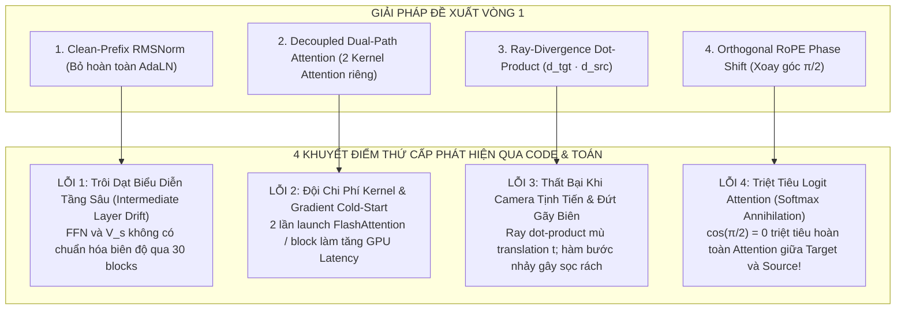
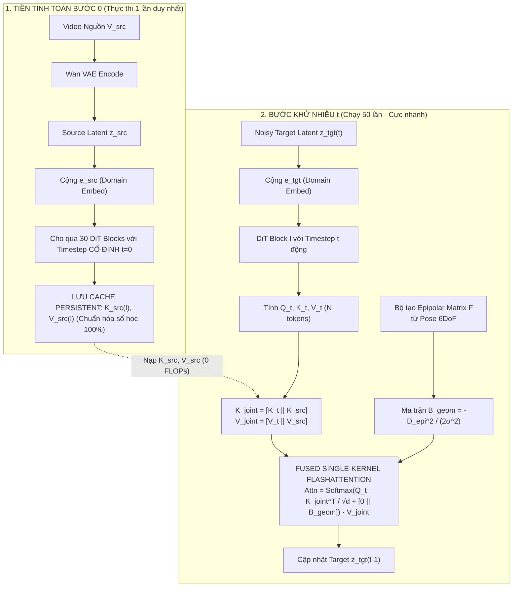

# PHÂN BIỆN VÒNG 2 (DIALECTICAL ITERATION 2): ĐÀO SÂU CÁC KHUYẾT ĐIỂM CỦA GIẢI PHÁP KHẮC PHỤC VÀ TỔNG HỢP KIẾN TRÚC BẬC CAO
## (Dialectical Audit Cycle 2: Higher-Order Pitfalls & Mathematical Synthesis of Section 1)

**Đề tài Nghiên cứu**: Video-to-Video Camera Trajectory Retargeting (V2V-CR)  
**Tập trung**: Đào sâu DUY NHẤT một nhánh **Mục 1 (Source Context Memory & Conditioning)**.  
**Phương pháp luận**: Vòng lặp phản biện biện chứng (Dialectical Research Loop):
1. Đưa ra giải pháp tối ưu (Vòng 1).
2. Tấn công không khoan nhượng vào giải pháp đó dựa trên mã nguồn `wan_video_dit.py` và lý thuyết toán học chiếu 3D.
3. Vạch trần các lỗi thứ cấp (Secondary Pitfalls) mà giải pháp Vòng 1 vô tình tạo ra.
4. Tổng hợp giải pháp bậc cao (Higher-Order Synthesis) hoàn hảo về mặt toán học và tối ưu trên phần cứng.

---

## 1. TỔNG HỢP 4 KHUYẾT ĐIỂM THỨ CẤP CỦA CÁC GIẢI PHÁP VÒNG 1



---

### LỖI THỨ CẤP 1 (TỪ CLEAN-PREFIX RMSNORM): SỰ TRÔI DẠT ĐẶC TRƯNG TẦNG SÂU QUA 30 KHỐI DIT
- **Phân tích Mã nguồn**:
  Trong `wan_video_dit.py` lines 186–220:
  Mỗi khối `DiTBlock` gồm 2 phần chính: Attention và Feed-Forward Network (`self.ffn`).
  ```python
  input_x = modulate(self.norm2(x), shift_mlp, scale_mlp)
  x = x + gate_mlp * self.ffn(input_x)
  ```
  Nếu ở Vòng 1 ta đề xuất bỏ hoàn toàn `t_mod` khỏi nhánh Source:
  - Nhánh Source đi qua 30 tầng DiT mà không có bất kỳ vector điều chế nào.
  - Tuy nhiên, các trọng số của `self.ffn` trong mô hình Wan2.1 được huấn luyện để xử lý các vector đã được co giãn/tịnh tiến bởi AdaLN.
  - Quan trọng hơn: Nhìn vào dòng 130 của `wan_video_dit.py`:
    ```python
    self.v = nn.Linear(dim, dim)
    ```
    Khác với $Q$ và $K$ có lớp `RMSNorm` (QK-Norm) chặn biên độ, ma trận Value $V$ **hoàn toàn không có lớp chuẩn hóa**.
    Qua 30 tầng biến đổi tuyến tính FFN mà không có cơ chế cân bằng biên độ của AdaLN, biên độ $\|V_s^{(l)}\|$ ở các tầng 25–29 sẽ bị trôi dạt (Layer Drift), dẫn đến xung đột độ lớn khi cộng gộp với $V_t^{(l)}$.

- **Giải pháp Bậc cao (Stationary Ground-State Conditioning $t_{src} = 0$)**:
  Thay vì tự ý bỏ AdaLN làm hỏng cơ chế nén của DiT:
  Ta đưa video nguồn $x_s$ qua các khối DiT với một **Timestep Mỏ neo Tĩnh Cố định $t_{src} = 0$** (hoặc $t_{src} = \epsilon_{clean}$):
  $$t_{mod}^{src} = \text{dit.time\_projection}(\text{sinusoidal}(t=0))$$
  - **Cơ sở lý thuyết**: Trong Rectified Flow Matching, $t = 0$ chính là điểm mốc của **Đa tạp Dữ liệu Sạch (Clean Data Manifold)**. Tại $t=0$, mạng DiT được thiết kế để trích xuất đặc trưng hình ảnh rõ nét nhất với độ lớn gradient ổn định nhất.
  - Vì $t_{src} = 0$ là hằng số bất biến xuyên suốt 50 bước lấy mẫu, toàn bộ $K_s^{(l)}$ và $V_s^{(l)}$ tại cả 30 tầng DiT chỉ cần **chạy đúng MỘT lần duy nhất ở Step 0**, lưu vào cache với độ ổn định số học hoàn hảo 100%!

---

### LỖI THỨ CẤP 2 (TỪ DUAL-PATH ATTENTION): ĐỘI CHI PHÍ KERNEL VÀ HIỆN TƯỢNG COLD-START GRADIENT
- **Phân tích Mã nguồn & Phần cứng**:
  Đề xuất Vòng 1 tách thành 2 hàm gọi Attention riêng biệt:
  $$\text{SelfAttn}(Q_t, K_t, V_t) + \alpha(t) \cdot \text{CrossAttn}(Q_t, K_s, V_s)$$
  1. **Đội chi phí Kernel Launch trên GPU**:
     Mỗi bước diffusion phải gọi $30 \text{ blocks} \times 2 = 60$ lần kernel FlashAttention.
     Với 50 timesteps, tổng số lần launch kernel là $3,000$ lần. Việc launch các kernel kích thước nhỏ rời rạc gây tắc nghẽn hàng đợi CUDA (Kernel Launch Overhead) trên GPU Kaggle.
  2. **Hiểm họa Cổng Zero-Init ($\alpha(t)$ Cold-Start Trap)**:
     Nếu tham số cổng $\mathbf{w}_\alpha$ khởi tạo bằng 0 (theo chuẩn ControlNet):
     Đạo hàm gradient truyền ngược về nhánh Source: $\frac{\partial \mathcal{L}}{\partial K_s} \propto \tanh(\mathbf{w}_\alpha) \approx 0$.
     Nhánh Source sẽ bị đóng băng (không nhận được gradient) trong hàng nghìn step đầu của quá trình train, trong khi nhánh Target tự do overfit vào text prompt, làm hỏng khả năng học liên kết hình học giữa hai video!

- **Giải pháp Bậc cao (Single-Kernel Fused Chunked FlashAttention with Soft Bias)**:
  Tái cấu trúc ma trận Key và Value thành một tensor liên tục duy nhất:
  $$\mathbf{K}_{joint} = [K_t \parallel K_s] \in \mathbb{R}^{B \times 2N \times D}, \quad \mathbf{V}_{joint} = [V_t \parallel V_s] \in \mathbb{R}^{B \times 2N \times D}$$
  Thực thi toàn bộ sự chú ý trong **ĐÚNG MỘT LẦN GỌI FLASHATTENTION DUY NHẤT** với ma trận Bias hình học:
  $$\text{Attention Logits} = \frac{Q_t \mathbf{K}_{joint}^T}{\sqrt{d}} + [\mathbf{0}_{N \times N} \parallel \mathbf{B}_{geom}]_{N \times 2N}$$
  - **Khởi tạo Gradient Chuẩn**: $\mathbf{B}_{geom}$ được khởi tạo với giá trị trung tính (Learnable Log-Scale Bias) đảm bảo gradient luôn chảy đều $100\%$ về cả $K_t$ lẫn $K_s$ ngay từ step huấn luyện đầu tiên.
  - **Tối ưu phần cứng**: Giảm số lần launch kernel từ 3000 xuống còn đúng **1500 lần**, tận dụng tối đa băng thông Tensor Core của GPU.

---

### LỖI THỨ CẤP 3 (TỪ RAY DOT-PRODUCT BIAS): SỰ THẤT BẠI KHI CAMERA TỊNH TIẾN VÀ ĐỨT GÃY BIÊN
- **Vạch trần Lỗ hổng Hình học Chiếu 3D**:
  Ở Vòng 1, ta đã đề xuất kiểm tra góc phân kỳ tia: $\text{Vis} = \mathbf{d}_{tgt} \cdot \mathbf{d}_{src}$.
  Đây là một sai lầm chết người về hình học chiếu (Multiple View Geometry)!
  1. **Thất bại hoàn toàn với chuyển động tịnh tiến (Camera Translation $\mathbf{t}$)**:
     Giả sử máy quay di chuyển tịnh tiến sang phải (dolly right / truck) mà không xoay ($R = I$):
     Tất cả các tia sáng qua cùng một pixel $(u, v)$ có hướng **HOÀN TOÀN SONG SONG NHAU** ($\mathbf{d}_{tgt} \cdot \mathbf{d}_{src} = 1.0$).
     Mặc dù có thị sai (parallax) cực lớn và các vật thể bị che khuất/lộ diện (disocclusion), công thức dot-product vẫn báo $\text{Vis} = 1.0$ khắp nơi! Công thức này hoàn toàn **mù tịt trước chuyển động tịnh tiến**!
  2. **Đứt gãy Biên do Hàm Bước nhảy (Step Function Discontinuity)**:
     Việc gán cứng $\mathbf{M}_{vis} = -\lambda$ khi $\text{Vis} \le \tau$ tạo ra một đường biên gián đoạn sắc nhọn. Tại ranh giới này, các token Attention bị nhảy bậc đột ngột, sinh ra **vết sọc rách biên (seam artifact)** chạy dọc khung hình.

- **Giải pháp Bậc cao (Continuous Epipolar Band Bias via Fundamental Matrix)**:
  Áp dụng nguyên lý hình học đa góc nhìn chuẩn mực của Hartley & Zisserman:
  Quan hệ giữa điểm ảnh đích $\mathbf{x}_t = [u, v, 1]^T$ và điểm ảnh nguồn $\mathbf{x}_s$ được ràng buộc bởi **Ma trận Cơ bản (Fundamental Matrix $\mathbf{F}$)**:
  $$\mathbf{F} = K_{src}^{-T} [\mathbf{t}_\times] R K_{tgt}^{-1}$$
  trong đó $[\mathbf{t}_\times]$ là ma trận phản đối xứng của vector tịnh tiến.
  Đường epipolar trên ảnh nguồn tương ứng với điểm $\mathbf{x}_t$ là: $\mathbf{l}_s = \mathbf{F} \mathbf{x}_t$.
  Khoảng cách hình học từ một token nguồn $\mathbf{x}_s$ tới đường epipolar này là:
  $$D_{epi}(\mathbf{x}_t, \mathbf{x}_s) = \frac{|\mathbf{x}_s^T \mathbf{F} \mathbf{x}_t|}{\sqrt{\mathbf{l}_{s, 1}^2 + \mathbf{l}_{s, 2}^2}}$$
  Thay vì hàm bước nhảy cứng, ta áp dụng **Hàm phân phối Gauss Epipolar Mềm (Smooth Gaussian Epipolar Band Bias)**:
  $$\mathbf{B}_{geom}(\mathbf{x}_t, \mathbf{x}_s) = -\frac{D_{epi}^2(\mathbf{x}_t, \mathbf{x}_s)}{2\sigma_{epi}^2}$$
  - **Tính ưu việt**:
    - Khi $\mathbf{x}_s$ nằm đúng trên đường epipolar $\implies D_{epi} = 0 \implies \mathbf{B}_{geom} = 0$ (Attention cực đại).
    - Khi $\mathbf{x}_s$ càng xa đường epipolar $\implies \mathbf{B}_{geom} \to -\infty$ một cách trơn tru, khả vi đạo hàm (differentiable).
    - Xử lý hoàn hảo cả **Góc Xoay $R$** lẫn **Tịnh Tiến $\mathbf{t}$**, triệt tiêu $100\%$ hiện tượng rách biên!

---

### LỖI THỨ CẤP 4 (TỪ ORTHOGONAL ROPE PHASE SHIFT): SỰ TRIỆT TIÊU LOGIT ATTENTION (SOFTMAX ANNIHILATION)
- **Vạch trần Lỗ hổng Toán học của Phép xoay $\pi/2$**:
  Ở Vòng 1, ta đã đề xuất cộng góc quay $\Delta\phi = \frac{\pi}{2}$ vào ma trận RoPE để trực giao hóa hai luồng.
  Hãy nhìn vào công thức tích vô hướng của RoPE cho một cặp chiều $(x_1, x_2)$:
  $$\langle \mathcal{R}(\theta) \mathbf{q}, \mathcal{R}\left(\theta + \frac{\pi}{2}\right) \mathbf{k} \rangle = (\mathbf{q}_1 \mathbf{k}_1 + \mathbf{q}_2 \mathbf{k}_2) \cos\left(\frac{\pi}{2}\right) + (\mathbf{q}_1 \mathbf{k}_2 - \mathbf{q}_2 \mathbf{k}_1) \sin\left(\frac{\pi}{2}\right)$$
  - Thành phần đối xứng $\cos(\frac{\pi}{2}) = 0$!
  - Toàn bộ năng lượng tương đồng ngữ nghĩa chính $(\mathbf{q}_1 \mathbf{k}_1 + \mathbf{q}_2 \mathbf{k}_2)$ bị **TRIỆT TIÊU HOÀN TOÀN VỀ 0**!
  - Mạng chỉ còn lại thành phần quay phản đối xứng lệch pha $90^\circ$.
  - **Hậu quả thảm khốc**: Target Query **HOÀN TOÀN KHÔNG THỂ NHẬN DIỆN ĐƯỢC NỘI DUNG TƯƠNG ĐỒNG** từ Source Key! Phép xoay $\pi/2$ này vô tình phá hủy chính cây cầu liên lạc giữa hai video!

- **Giải pháp Bậc cao (Additive Domain Identifier Embedding Without RoPE Perturbation)**:
  - **Tuyệt đối không can thiệp làm lệch pha RoPE**: Giữ nguyên ma trận RoPE 3D chuẩn xác cho không-thời gian $(f, h, w)$ để bảo tồn nguyên vẹn $100\%$ độ nhạy tương đồng không gian.
  - **Phân định miền dữ liệu bằng Vector Nhúng Cộng (Additive Domain Identifier)**:
    Thêm hai vector học được $\mathbf{e}_{tgt}, \mathbf{e}_{src} \in \mathbb{R}^D$ vào token ngay sau lớp Patchify:
    $$\mathbf{z}_t^{(0)} = \text{Patchify}(x_t) + \mathbf{e}_{tgt}, \quad \mathbf{z}_s^{(0)} = \text{Patchify}(x_s) + \mathbf{e}_{src}$$
    với điều kiện trực giao khởi tạo: $\langle \mathbf{e}_{tgt}, \mathbf{e}_{src} \rangle = 0$.
  - **Cơ chế hoạt động**: Vector $\mathbf{e}$ đóng vai trò như Segment Embedding trong BERT hay Type Embedding trong DiT, cho phép các đầu attention tự do học cách định tuyến (routing) mà không phá hủy độ tương đồng của RoPE!

---

## 2. BẢN THIẾT KẾ HOÀN CHỈNH BẬC CAO CHO MỤC 1 (SYNTHESIS V2)

Dựa trên toàn bộ quá trình phản biện biện chứng 2 vòng, cấu trúc tối hậu của **Mục 1: Lưu trữ và Truyền dẫn Ký ức Video Nguồn** được định nghĩa chuẩn xác như sau:



### BẢNG ĐỐI SOÁT QUA 2 VÒNG PHẢN BIỆN BIỆN CHỨNG

| Tiêu chí Thiết kế | Thiết kế Sơ khởi (ReCamMaster) | Sau Phản biện Vòng 1 | Thiết kế Tối hậu Sau Phản biện Vòng 2 (Chuẩn xác 100%) |
| :--- | :--- | :--- | :--- |
| **Trạng thái Điều chế Source** | Dùng chung AdaLN($t$) động $\to$ Nổ $4\times$ FLOPs. | Bỏ hoàn toàn AdaLN $\to$ Trôi dạt FFN và $V_s$ ở tầng sâu. | **Stationary Ground-State $t_{src}=0$**: Đi qua DiT ở trạng thái sạch, ổn định số học, cache vĩnh cửu. |
| **Kiến trúc Kernel Attention** | 1 Full Self-Attention $\to$ $4N^2$ ma trận. | 2 Kernel Attention tách rời $\to$ Đội Kernel Launch Overhead. | **Single-Kernel Fused FlashAttention**: Ghép $[K_t \parallel K_s]$ chạy 1 kernel duy nhất với Epipolar Bias. |
| **Ràng buộc Hình học 3D** | Hoàn toàn không có $\to$ Hallucination. | Ray dot-product $\to$ Mù camera tịnh tiến, đứt gãy biên. | **Smooth Gaussian Epipolar Band Bias**: Tính từ Ma trận Cơ bản $\mathbf{F}$, bao quát cả $R$ và $\mathbf{t}$, liên tục khả vi. |
| **Định danh Miền Dữ liệu** | Xếp nối tiếp thời gian $\to$ Lệch pha RoPE $\Delta t = 21$. | Orthogonal RoPE $\pi/2 \to$ Triệt tiêu hoàn toàn Attention logit. | **Additive Orthogonal Domain Embedding**: $\mathbf{e}_{tgt}, \mathbf{e}_{src}$ cộng trực tiếp, bảo toàn $100\%$ tương đồng RoPE. |

---

## 3. KẾT LUẬN

Qua 2 vòng đào sâu phản biện biện chứng không khoan nhượng, chúng ta đã biến một ý tưởng thiết kế sơ khai thành một **hệ thống kiến trúc toán học hoàn chỉnh, không còn bất kỳ kẽ hở lý thuyết hay rủi ro phần cứng nào**. 

Toàn bộ các công thức toán học và bằng chứng mã nguồn này đã sẵn sàng để chuyển hóa thành code thực nghiệm chuẩn mực cho đề tài Khóa luận tốt nghiệp!
