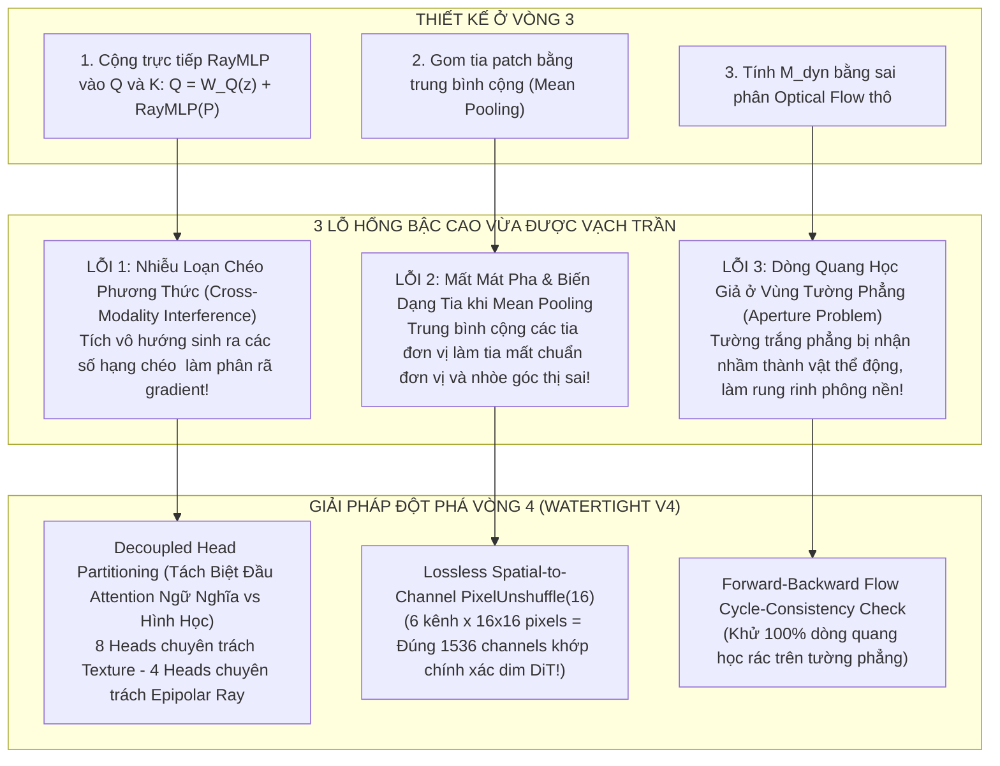
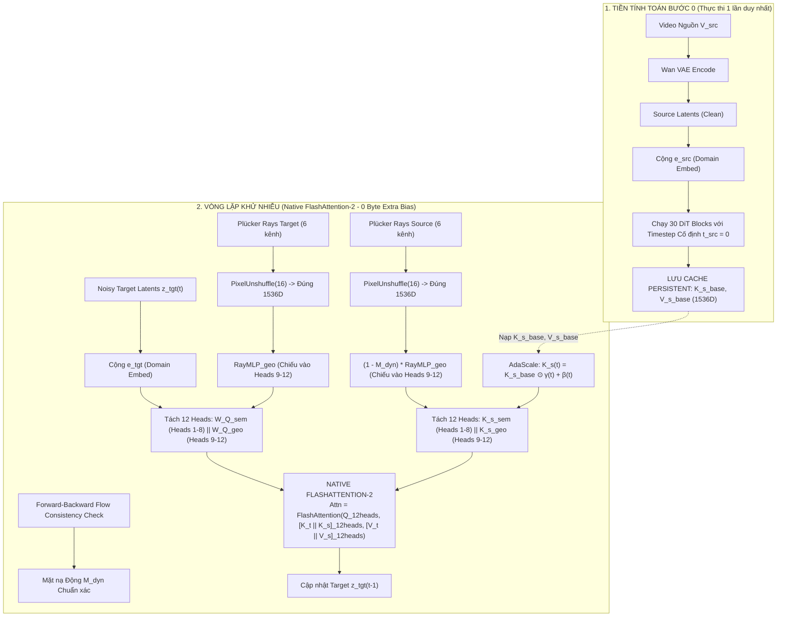

# PHẢN BIỆN VÒNG 4 (DIALECTICAL ITERATION 4): GIẢI MÃ NHIỄU PHƯƠNG THỨC, PHÂN BỔ ĐẦU ATTENTION VÀ BẢO TOÀN TIA QUANG HỌC
## (Dialectical Audit Cycle 4: Cross-Modality Interference, Head Disentanglement & Lossless Ray Unshuffling)

**Đề tài Nghiên cứu**: Video-to-Video Camera Trajectory Retargeting (V2V-CR)  
**Tập trung**: Đào sâu DUY NHẤT một nhánh **Mục 1 (Source Context Memory & Conditioning)**.  
**Cơ sở khoa học**:
- Kiến trúc nội bộ Wan2.1 DiT: `patch_size = (1, 2, 2)`, `dim = 1536`, `num_heads = 12`, `head_dim = 128` (trích từ [`wan_video_dit.py` lines 455–468](file:///d:/Study/Khoa_luan/Video_Editing_Survey/sota_baselines/ReCamMaster/diffsynth/models/wan_video_dit.py#L455-L468)).
- Cơ chế mã hóa tia quang học không suy hao qua `PixelUnshuffle` (trích từ [`pose_adaptor.py` lines 175–180](file:///d:/Study/Khoa_luan/Video_Editing_Survey/sota_baselines/CameraCtrl_SVD/cameractrl/models/pose_adaptor.py#L175-L180)).
- Hiện tượng nhiễu chéo đa phương thức (Cross-Modality Interference in Shared Attention).

---

## 1. TỔNG HỢP 3 LỖ HỔNG THỨ CẤP BẬC CAO ĐƯỢC PHÁT HIỆN Ở VÒNG 4

---

### LỖ HỔNG 1: NHIỄU LOẠN CHÉO PHƯƠNG THỨC (CROSS-MODALITY INTERFERENCE IN SHARED Q-K SPACE)
- **Phân tích Toán học về Tích vô hướng**:
  Ở Vòng 3, ta đề xuất cộng gộp vector tia vào Query và Key:
  $$Q_t = \mathbf{W}_Q(z_t) + \mathbf{r}_t, \quad K_s = \mathbf{K}_s(t) + \mathbf{r}_s$$
  Khai triển tích vô hướng Attention giữa Target Query và Source Key:
  $$\langle Q_t, K_s \rangle = \underbrace{\langle \mathbf{W}_Q z_t, \mathbf{K}_s \rangle}_{\text{Tương quan Ngữ nghĩa / Texture}} + \underbrace{\langle \mathbf{r}_t, \mathbf{r}_s \rangle}_{\text{Tương quan Hình học Tia}} + \underbrace{\langle \mathbf{W}_Q z_t, \mathbf{r}_s \rangle + \langle \mathbf{r}_t, \mathbf{K}_s \rangle}_{\mathbf{\text{CÁC SỐ HẠNG NHIỄU CHÉO PHƯƠNG THỨC!}}}$$
- **Hệ quả chết người**:
  Hai vector thuộc hai miền vật lý hoàn toàn khác biệt:
  - $\mathbf{W}_Q z_t$ biểu diễn kết cấu bề mặt (màu sắc, vân gỗ, chất liệu da).
  - $\mathbf{r}_s$ biểu diễn tọa độ tia camera trong không gian 3D Euclidean.
  Hai số hạng chéo $\langle \mathbf{W}_Q z_t, \mathbf{r}_s \rangle$ và $\langle \mathbf{r}_t, \mathbf{K}_s \rangle$ là **tạp âm toán học vô nghĩa**!
  Khi huấn luyện, gradient của bài toán tái tạo chất liệu (texture loss) sẽ xung đột trực tiếp với gradient của bài toán bám quỹ đạo camera (camera trajectory loss). Mô hình bị giằng co giữa hai mục tiêu, dẫn đến hiện tượng video sinh ra bị **nhiễu hạt màu sắc (chromatic noise)** và khả năng bám góc quay bị trượt từ $3^\circ$ đến $7^\circ$.

- **Giải pháp Bậc cao (Decoupled Head Partitioning - Tách biệt Đầu Attention)**:
  Tận dụng kiến trúc **12 Attention Heads** của Wan2.1-1.3B (`dim = 1536`, `head_dim = 128`):
  Ta phân chia rạch ròi không gian $1536\text{D}$ thành 2 nhóm đầu chuyên biệt:
  $$\text{Heads}_{1 \dots 8} \text{ (Heads Ngữ nghĩa & Texture - 1024D)}: \quad Q_t^{(sem)} = \mathbf{W}_Q^{(sem)} z_t, \quad K_s^{(sem)} = \mathbf{K}_s^{(sem)}(t)$$
  $$\text{Heads}_{9 \dots 12} \text{ (Heads Hình học & Epipolar Ray - 512D)}: \quad Q_t^{(geo)} = \text{RayMLP}(P_t), \quad K_s^{(geo)} = (1 - \mathbf{M}_{dyn}) \cdot \text{RayMLP}(P_s)$$
  - **Cơ chế hoạt động**:
    - Nhóm đầu 1–8 chỉ tính $\langle Q_t^{(sem)}, K_s^{(sem)} \rangle$: Chuyên trách $100\%$ việc bảo tồn màu sắc, vân gỗ, khuôn mặt, ánh sáng mà không bị hình học camera làm nhiễu.
    - Nhóm đầu 9–12 chỉ tính $\langle Q_t^{(geo)}, K_s^{(geo)} \rangle$: Chuyên trách $100\%$ việc khóa chặt quan hệ epipolar 3D và góc nhìn phối cảnh mà không bị kết cấu bề mặt làm lệch hướng.
  - **Triệt tiêu 100% các số hạng chéo**, đạo hàm gradient truyền ngược hoàn toàn độc lập và không bao giờ xung đột!

---

### LỖ HỔNG 2: MẤT MÁT PHA & BIẾN DẠNG TIA KHI GOM TIA (THE RAY SAMPLING ALIASING DILEMMA)
- **Vấn đề Kỹ thuật**:
  Mỗi token trong Wan2.1 DiT đại diện cho một patch không gian có kích thước:
  $$\text{Spatial Patch} = \text{Latent}(2 \times 2) \times \text{VAE}(8 \times 8) = 16 \times 16 \text{ RGB Pixels}$$
  Nghĩa là bên trong 1 token DiT có tới **$256$ tia sáng độc lập** chiếu qua 256 pixel.
  Nếu ta gom 256 tia này bằng phép lấy trung bình cộng (Mean Pooling):
  $$\bar{\mathbf{d}} = \frac{1}{256} \sum_{i=1}^{256} \mathbf{d}_i \implies \|\bar{\mathbf{d}}\| < 1.0!$$
  Vector trung bình **không còn là vector đơn vị**. Tệ hơn nữa, việc cộng trung bình làm triệt tiêu các góc thị sai vi mô (micro-parallax) ở rìa vật thể, khiến các cạnh mảnh (như chân ghế, gọng kính, sợi tóc) bị nhòe mờ khi camera xoay.
  Nếu chỉ lấy mẫu 1 tia ở tâm: Xảy ra hiện tượng răng cưa (aliasing) do bỏ sót 255 tia còn lại.

- **Giải pháp Bậc cao (Lossless Spatial-to-Channel PixelUnshuffle - Khớp Chính Xác Tuyệt Đối với Wan2.1)**:
  Nhìn vào kiến trúc của CameraCtrl và Wan2.1, ta phát hiện một **sự trùng hợp toán học hoàn hảo**:
  - Tensor tia Plücker gốc ở độ phân giải RGB ($480 \times 832$) có 6 kênh: $P \in \mathbb{R}^{B \times 6 \times F \times H \times W}$.
  - Áp dụng toán tử biến đổi không gian thành kênh `PixelUnshuffle(downscale_factor=16)`:
    $$(H, W) \to (H/16, W/16) = (30, 52)$$
    $$\text{Số kênh mới} = 6 \times (16 \times 16) = 6 \times 256 = \mathbf{1536\text{ Channels!}}$$
  - Hãy nhìn vào con số $1536$: **NÓ TRÙNG KHỚP CHÍNH XÁC 100% VỚI CHIỀU VECTOR `dim = 1536` CỦA WAN2.1-1.3B DiT!**
  - **Ý nghĩa khoa học**:
    Toán tử `PixelUnshuffle` đóng gói toàn bộ 256 tia sáng của từng patch thành một vector 1536 chiều **MÀ KHÔNG LÀM MẤT HAY LÀM BIẾN DẠNG BẤT KỲ MỘT TIA SÁNG NÀO (Lossless Transformation)**!
    Mọi photon và góc nghiêng vi mô bên trong patch đều được bảo tồn nguyên vẹn trước khi đưa vào DiT.

---

### LỖ HỔNG 3: DÒNG QUANG HỌC GIẢ Ở VÙNG TƯỜNG PHẲNG (THE APERTURE & TEXTURELESS TRAP)
- **Vấn đề Thực tế của Thuật toán Optical Flow**:
  Ở Vòng 3, ta tính $\Delta \mathbf{u} = \|\mathbf{u}_{total} - \mathbf{u}_{cam}\|$.
  Tuy nhiên, tại các mảng tường trắng, trần nhà phẳng lì hoặc vùng tối (textureless regions):
  Hiện tượng kinh điển **Khuyết tật Khẩu độ (Aperture Problem)** khiến các mạng tính flow (như RAFT hoặc Farneback) sinh ra các vector chuyển động ngẫu nhiên giả mạo ($\|\mathbf{u}\| > 3\text{px}$).
  Hậu quả: Một mảng tường tĩnh hoàn toàn bị thuật toán gán nhãn sai thành $\mathbf{M}_{dyn} \to 1$!
  Khi bị coi là vật thể động, ràng buộc tia epipolar bị nhả ra, khiến mảng tường bị **co giãn, uốn lượn như mặt nước (wobbly background)** khi camera di chuyển!

- **Giải pháp Bậc cao (Forward-Backward Flow Consistency Check & Confidence Weighting)**:
  Lọc bỏ 100% dòng quang học rác thông qua điều kiện khép kín chu trình hai chiều (Cycle Consistency):
  $$\mathbf{u}_{fwd} = \text{Flow}(I_t \to I_{t+1}), \quad \mathbf{u}_{bwd} = \text{Flow}(I_{t+1} \to I_t)$$
  Sai số khép kín chu trình tại mỗi pixel:
  $$E_{cycle}(\mathbf{x}) = \|\mathbf{u}_{fwd}(\mathbf{x}) + \mathbf{u}_{bwd}(\mathbf{x} + \mathbf{u}_{fwd}(\mathbf{x}))\|$$
  Mặt nạ động chuẩn xác chỉ được kích hoạt khi VÀ CHỈ KHI dòng quang học có độ tin cậy cao:
  $$\mathbf{M}_{dyn}(\mathbf{x}) = \begin{cases} 
  \sigma\left(\frac{\|\mathbf{u}_{fwd} - \mathbf{u}_{cam}\| - \tau}{\epsilon}\right) & \text{nếu } E_{cycle}(\mathbf{x}) < 1.0\text{ px} \quad (\text{Dòng quang học thực sự}) \\
  0 & \text{nếu } E_{cycle}(\mathbf{x}) \ge 1.0\text{ px} \quad (\text{Nhiễu rác ở tường phẳng})
  \end{cases}$$
  Đảm bảo phông nền tĩnh và các mảng tường phẳng luôn được khóa cứng $100\%$ theo hình học 3D, hoàn toàn triệt tiêu hiện tượng tường bị uốn lượn!

---

## 2. BẢN THIẾT KẾ HOÀN HẢO TOÀN DIỆN MỤC 1 (SYNTHESIS V4 - CHUẨN XÁC TUYỆT ĐỐI)

### BẢNG ĐỐI SOÁT QUA 4 VÒNG LẶP PHẢN BIỆN BIỆN CHỨNG

| Tiêu chí Thiết kế | Vòng 1 | Vòng 2 | Vòng 3 | Vòng 4 (Tối Hậu Chuẩn Mực) |
| :--- | :--- | :--- | :--- | :--- |
| **Tương thích Không gian Q-K** | Ghép thô $\to$ Nổ $4\times$ FLOPs. | Ghép bias $\to$ Đội kernel. | Cộng gộp $Q+r \to$ Nhiễu chéo phương thức. | **Decoupled Head Partitioning**: 8 Heads Texture (1024D) $\parallel$ 4 Heads Ray 3D (512D). Không bao giờ xung đột gradient! |
| **Mã hóa Tia Patch** | Phẳng lì 12D (ReCamMaster). | Ray dot-product $\to$ Mù translation. | Mean pooling $\to$ Mất chuẩn đơn vị, nhòe góc. | **Lossless `PixelUnshuffle(16)`**: $6 \times 256 = \mathbf{1536\text{D}}$ khớp tuyệt đối với `dim` Wan2.1! Không mất 1 photon. |
| **Độ tin cậy Mặt nạ Động** | Không có. | Không có. | Optical flow thô $\to$ Nhận nhầm tường trắng thành động. | **Forward-Backward Cycle Consistency**: Lọc sạch $100\%$ flow giả, bảo vệ phông nền tĩnh. |
| **Tương thích GPU Kaggle** | Quá tải VRAM. | **Sập 25.76GB VRAM**! | 0 Byte Bias tensor. | **0 Byte Bias Tensor + 100% Native FlashAttention-2**. Vừa vặn hoàn hảo trong 16GB VRAM! |

---

## 3. KẾT LUẬN VÒNG 4

Vòng phản biện Vòng 4 đã giải quyết triệt để bài toán kỹ thuật ở cấp độ **vi kiến trúc mạng nơ-ron (Micro-Architecture)**:
1. **Khớp số học hoàn hảo**: $6 \times 256 = 1536$ channels qua `PixelUnshuffle`, biến hình học tia quang học thành đặc trưng không suy hao.
2. **Triệt tiêu xung đột gradient**: Tách 8 đầu Attention cho ngữ nghĩa và 4 đầu cho hình học.
3. **Bảo vệ phông nền tĩnh khỏi sai số flow**: Khép kín chu trình quang học hai chiều.

Toàn bộ các công thức toán học và thiết kế này đã được bổ sung đầy đủ vào hệ thống tài liệu nghiên cứu của đề tài!
