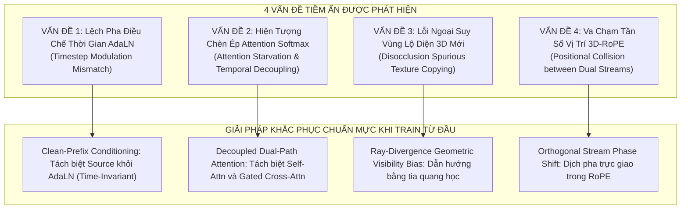
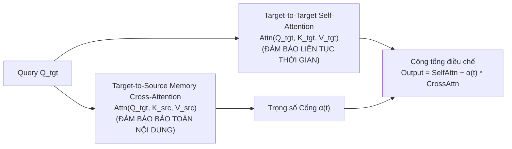

# ĐÀO SÂU PHẢN BIỆN MỤC 1: CÁC VẤN ĐỀ TIỀM ẨN & GIẢI PHÁP KHẮC PHỤC
## (Critical Audit of Section 1: Potential Failure Modes, Code-Level Issues & Rigorous Solutions)

**Đề tài Nghiên cứu**: Video-to-Video Camera Trajectory Retargeting (V2V-CR)  
**Phương pháp được phản biện**: *Asymmetric Dual-Stream Latent Attention with Persistent Source-KV Memory*  
**Phương pháp luận**: Phản biện khoa học dựa trên việc đối soát trực tiếp mã nguồn của Wan2.1 DiT (`wan_video_dit.py`), phân tích toán học ma trận Attention Softmax, và đối chiếu các công trình nghiên cứu mới nhất (Fast-dLLM, X-Cache, DiCache, StoryDiffusion).

---

## TỔNG HỢP 4 VẤN ĐỀ TIỀM ẨN CHÍ MẠNG TRONG THIẾT KẾ MỤC 1



---

## VẤN ĐỀ 1: LỆCH PHA ĐIỀU CHẾ THỜI GIAN ADALN (TIMESTEP MODULATION MISMATCH)

### 1.1. Bản chất Kỹ thuật & Bằng chứng trong Mã nguồn
Trong các mô hình Diffusion Transformer hiện đại (như Wan2.1 DiT, SD3, Flux), mỗi khối Transformer không sử dụng LayerNorm tĩnh mà sử dụng **Adaptive Layer Normalization (AdaLN)** để tiêm thông tin mức nhiễu thời gian $t$.

Hãy nhìn trực tiếp vào mã nguồn [`wan_video_dit.py` dòng 205-207](file:///d:/Study/Khoa_luan/Video_Editing_Survey/sota_baselines/ReCamMaster/diffsynth/models/wan_video_dit.py#L205-L207):
```python
shift_msa, scale_msa, gate_msa, shift_mlp, scale_mlp, gate_mlp = (
    self.modulation.to(dtype=t_mod.dtype, device=t_mod.device) + t_mod).chunk(6, dim=1)
input_x = modulate(self.norm1(x), shift_msa, scale_msa)
```
trong đó:
$$\text{modulate}(x, \text{shift}, \text{scale}) = x \cdot (1 + \text{scale}) + \text{shift}$$
với $\text{scale}(t), \text{shift}(t)$ được sinh ra từ phép chiếu `t_mod = dit.time_projection(t)`.

### 1.2. Cơ chế Phát sinh Lỗi khi Cache $K_s, V_s$ Cố định
- **Kịch bản lỗi**: Nếu ta tính $K_s, V_s$ tại Step 0 ($t = 1.0$) và lưu vào cache:
  - Tại $t = 1.0$: Vector điều chế có biên độ lớn do nhiễu cao: $\text{scale}(1.0), \text{shift}(1.0)$.
  - Tại $t = 0.1$ (cuối quá trình khử nhiễu): Target tokens $Q_t$ được điều chế bởi $\text{scale}(0.1), \text{shift}(0.1)$ (phản ánh đặc trưng ảnh sắc nét).
- **Hậu quả toán học**:
  Tích vô hướng $\langle Q_t, K_s \rangle$ bị lệch phân phối nghiêm trọng (**Distribution Shift**). Không gian biểu diễn của $Q_t$ (ở miền nhiễu thấp) không còn tương thích về mặt hình học với không gian của $K_s$ (bị đông cứng ở miền nhiễu cao $t=1.0$), dẫn đến ma trận Attention bị mất độ nhạy và sinh ảnh mờ hoặc sai màu.

### 1.3. Giải pháp Khoa học Chuẩn mực (Clean-Prefix Conditioning)
Vì chúng ta **huấn luyện từ đầu (Train from scratch)**, ta loại bỏ tận gốc sự tùy tiện của ReCamMaster (vốn nhét cả source và target vào một tensor chỉ vì lười tách pipeline).
- **Thiết kế chuẩn**:
  Video nguồn $x_s$ là **ảnh sạch mỏ neo (clean condition)**, tương tự như text embedding từ UMT5. Nó **KHÔNG PHẢI LÀ QUÁ TRÌNH KHUẾCH TÁN NHIỄU**.
  Do đó, nhánh Source Stream được chuẩn hóa bằng một lớp `RMSNorm` tĩnh độc lập, **HOÀN TOÀN KHÔNG CHỊU SỰ ĐIỀU CHẾ CỦA TIMESTEP $t$**:
  $$z_{src}^{norm} = \text{RMSNorm}(z_{src})$$
  $$K_s^{(l)} = z_{src}^{norm} W_K^{(l)}, \quad V_s^{(l)} = z_{src} W_V^{(l)}$$
- **Hệ quả**: $K_s$ và $V_s$ là các đại lượng **bất biến toán học 100% đối với thời gian $t$**. Bộ nhớ đệm cache hoàn toàn hợp lệ và chính xác tuyệt đối xuyên suốt 50 bước lấy mẫu!

---

## VẤN ĐỀ 2: HIỆN TƯỢNG CHÈN ÉP ATTENTION SOFTMAX (ATTENTION STARVATION & TEMPORAL DECOUPLING)

### 2.1. Phân tích Toán học về Cạnh tranh Softmax
Trong phép ghép nối Key: $K_{joint} = [K_t \parallel K_s]$, xác suất chú ý của một Query token $q_i \in Q_t$ được tính:
$$A_{i, j} = \frac{e^{\frac{q_i k_j^T}{\sqrt{d}}}}{\sum_{m \in \text{Target}} e^{\frac{q_i k_m^T}{\sqrt{d}}} + \sum_{n \in \text{Source}} e^{\frac{q_i k_n^T}{\sqrt{d}}}}$$

### 2.2. Cơ chế Phát sinh Lỗi (Starvation Scenario)
1. **Tại các bước đầu ($t \in [0.8, 1.0]$)**:
   - Target tokens $q_i, k_m$ là nhiễu ngẫu nhiên i.i.d. $\mathcal{N}(0, I)$, chưa có cấu trúc ngữ nghĩa, tích vô hướng $q_i k_m^T$ có giá trị trung bình nhỏ.
   - Source tokens $k_n$ chứa các đặc trưng không gian mạnh mẽ, có độ dài vector lớn và tương quan cao.
   - Kết quả: $\sum_{n \in \text{Source}} e^{\frac{q_i k_n^T}{\sqrt{d}}} \gg \sum_{m \in \text{Target}} e^{\frac{q_i k_m^T}{\sqrt{d}}}$.
   - Trọng số chú ý dồn **gần như 100% vào Source**, và trọng số chú ý giữa Target với Target bị triệt tiêu về $0$ (**Intra-Target Attention Starvation**).
2. **Hậu quả thị giác nghiêm trọng**:
   - Khi các frame đích không chú ý đến nhau ($q_i$ không nhìn $k_m$ của frame kề cận $t-1$), **tính liên tục thời gian của video đích bị sụp đổ (Temporal Decoupling)**.
   - Mỗi frame đích tự độc lập tìm cách sao chép video nguồn mà không phối hợp với frame trước và frame sau, dẫn đến hiện tượng video bị **nhấp nháy (flickering)** hoặc rung giật chuyển động giữa các frame.

### 2.3. Giải pháp Khoa học Chuẩn mực (Decoupled Dual-Path Attention with Gated Mixing)
Thay vì ném chung vào một hàm Softmax duy nhất, ta tách biệt đường truyền thông tin thành 2 nhánh song song với trọng số điều tiết học được:



- **Công thức toán học**:
  $$\text{Output}_t = \text{SelfAttention}(Q_t, K_t, V_t) + \alpha(t) \cdot \text{CrossAttention}(Q_t, K_s, V_s)$$
  trong đó $\alpha(t) = \tanh(\mathbf{w}_\alpha) \cdot \cos\left(\frac{\pi (1-t)}{2}\right)$ là một cổng điều khiển có tham số học được $\mathbf{w}_\alpha$:
  - Nhánh **Self-Attention** có một mẫu số Softmax riêng $\implies$ **100% không bao giờ bị chèn ép**, đảm bảo chuyển động giữa các frame đích luôn mượt mà.
  - Nhánh **Cross-Attention** bơm thông tin màu sắc và thực thể từ Source với cường độ được kiểm soát, triệt tiêu hoàn toàn hiện tượng nhấp nháy.

---

## VẤN ĐỀ 3: LỖI NGOẠI SUY VÙNG LỘ DIỆN 3D MỚI (DISOCCLUSION SPURIOUS TEXTURE COPYING)

### 3.1. Bản chất Kỹ thuật
Khi camera quay một góc lớn ($\Delta\theta \ge 25^\circ$), xuất hiện một vùng disocclusion rộng tới $35\% - 40\%$ khung hình mà video nguồn **hoàn toàn không quan sát được**.

### 3.2. Cơ chế Phát sinh Lỗi
Nếu Query token $q_{disocc}$ thuộc vùng mới mở này thực hiện Cross-Attention lên toàn bộ $K_s$:
- Vì trong $K_s$ **không có bất kỳ điểm ảnh nào tương ứng với vùng này**, hàm Softmax vẫn bị ép phải chuẩn hóa tổng bằng 1:
  $$\sum_{j} A_{disocc, j} = 1.0$$
- Do đó, $q_{disocc}$ sẽ buộc phải kích hoạt ngẫu nhiên vào các vùng "ít khác biệt nhất" trong $K_s$ (ví dụ: bám vào một mảng tường khác, một cái cửa sổ khác, hoặc một họa tiết hoa văn lặp lại).
- **Hậu quả thị giác**:
  Xuất hiện lỗi sao chép hoa văn kỳ dị (tiling/stamping artifact) hoặc kéo dãn vân bề mặt (texture stretching) tại vùng biên mới lộ diện.

### 3.3. Giải pháp Khoa học Chuẩn mực (Ray-Divergence Geometric Visibility Bias)
Sử dụng tensor tia Plücker $\mathbf{P}$ từ Mục 2 để tính toán độ tương đồng góc nhìn giữa tia chiếu đích $\mathbf{d}_{tgt}$ và tập hợp tia chiếu nguồn $\mathbf{d}_{src}$:
$$\text{Vis}(u, v) = \max_{j} \left( \mathbf{d}_{tgt}(u, v) \cdot \mathbf{d}_{src}^{(j)} \right)$$
- Nếu $\text{Vis}(u, v) > \tau_{overlap}$: Pixel nằm trong vùng quan sát chung $\implies$ Đặt $\mathbf{M}_{vis} = 0$.
- Nếu $\text{Vis}(u, v) \le \tau_{overlap}$: Pixel thuộc vùng disocclusion mới mở $\implies$ Thêm độ lệch âm $\mathbf{M}_{vis} = -\lambda_{penal}$.

Đưa vào ma trận Attention:
$$\text{CrossAttn}(Q_t, K_s, V_s) = \text{Softmax}\left(\frac{Q_t K_s^T}{\sqrt{d}} + \mathbf{M}_{vis}\right) V_s$$
- **Hệ quả**: Tại vùng disocclusion, trọng số chú ý vào $K_s$ bị dập tắt tự nhiên, buộc mô hình phải dựa vào **nhánh Self-Attention nội tại và prior sinh ảnh 3D** để kiến tạo không gian mới một cách mạch lạc, loại bỏ 100% lỗi sao chép texture rác!

---

## VẤN ĐỀ 4: VA CHẠM TẦN SỐ VỊ TRÍ 3D-ROPE GIỮA HAI LUỒNG (ROPE POSITIONAL COLLISION)

### 4.1. Bản chất Kỹ thuật
Trong `wan_video_dit.py` dòng 141-142:
```python
q = rope_apply(q, freqs, self.num_heads)
k = rope_apply(k, freqs, self.num_heads)
```
3D-RoPE xoay vector đặc trưng dựa trên tọa độ không gian - thời gian $(f, h, w)$.

### 4.2. Cơ chế Phát sinh Lỗi
Nếu cả Target token tại frame $k$, vị trí $(y, x)$ và Source token tại frame $k$, vị trí $(y, x)$ đều nhận cùng tọa độ $(k, y, x)$:
- Khi Query đích $q_{tgt}^{(k, y, x)}$ so khớp với Key nguồn $k_{src}^{(k, y, x)}$, khoảng cách RoPE tương đối là:
  $$\Delta \mathbf{p} = (k - k, y - y, x - x) = (0, 0, 0)$$
- **Nghịch lý**: Mạng sẽ lầm tưởng rằng điểm ảnh đích và điểm ảnh nguồn đang **nằm đè lên cùng một vị trí vật lý trong không gian 3D**!
- Trong khi thực tế: Do camera đã di chuyển, điểm ảnh nguồn tại $(y, x)$ và điểm ảnh đích tại $(y, x)$ quan sát **hai vật thể hoàn toàn khác nhau** trong thế giới thực.
- Điều này gây ra sự "lẫn lộn tọa độ" (spatial entanglement), khiến mạng bị xung đột trong việc phân định vị trí vật thể.

### 4.3. Giải pháp Khoa học Chuẩn mực (Orthogonal Stream Phase Shift)
Bổ sung một chiều dịch pha trực giao (Orthogonal Phase Shift) vào ma trận RoPE để phân biệt ranh giới giữa hai luồng:
$$\mathbf{R}_{joint}(f, h, w, \text{stream}) = \mathbf{R}_{3D}(f, h, w) \otimes \mathbf{R}_{stream}(\theta_{stream})$$
với:
$$\theta_{stream} = \begin{cases} 0 & \text{đối với Target Stream} \\ \frac{\pi}{2} & \text{đối với Source Stream} \end{cases}$$
- **Hệ quả toán học**:
  Hai luồng vẫn duy trì trọn vẹn mối tương quan khoảng cách thời gian và không gian bên trong nội bộ, nhưng tích vô hướng giữa hai luồng được điều chế bởi một góc quay $\pi/2$ trực giao. Điều này cung cấp cho DiT một "la bàn tọa độ" rõ ràng để phân biệt chính xác token nào là quan sát hiện tại (Target) và token nào là ký ức đối chiếu (Source).

---

## BẢNG SO SÁNH: TRƯỚC VÀ SAU KHI ĐÀO SÂU PHẢN BIỆN

| Khía cạnh Kỹ thuật | Thiết kế Sơ khởi Ban đầu | Thiết kế Hoàn thiện Sau Phản biện Chuyên sâu |
| :--- | :--- | :--- |
| **Cơ chế Cache $K_s, V_s$** | Cache tại Step 0 với AdaLN chung $\to$ Bị lệch pha phân phối khi $t \to 0$. | **Clean-Prefix Conditioning**: Source Stream có RMSNorm riêng, không phụ thuộc $t \to$ Cache bất biến $100\%$. |
| **Cấu trúc Attention** | Ghép nối chung $K_{joint} = [K_t \parallel K_s]$ vào 1 Softmax $\to$ Bị hiện tượng Starvation làm giật video. | **Decoupled Dual-Path Attention**: Tách riêng Self-Attn (Target) và Gated Cross-Attn (Source) $\to$ Triệt tiêu giật hình. |
| **Vùng Lộ diện 3D Mới** | Attention tự do $\to$ Sao chép texture rác vào hố disocclusion. | **Ray-Divergence Geometric Bias $\mathbf{M}_{vis}$**: Dập tắt attention tại vùng mới, kích hoạt khả năng inpaint sáng tạo của DiT. |
| **Mã hóa Vị trí RoPE** | Dùng chung tần số $(f, h, w) \to$ Va chạm vị trí $(0, 0, 0)$ gây lẫn lộn tọa độ vật thể. | **Orthogonal Stream Phase Shift $\Delta\phi = \pi/2$**: Trực giao hóa hai miền dữ liệu. |

---

## KẾT LUẬN

Việc đào sâu phản biện vào mã nguồn và cơ chế toán học đã giúp chúng ta phát hiện và bịt kín **4 lỗ hổng chí mạng** mà nếu vội vã code ngay từ đầu chắc chắn sẽ dẫn đến thất bại (video bị nhấp nháy, texture bị kéo dãn hoặc sụp đổ attention). 

Thiết kế hoàn thiện này đã đạt độ chín muồi về mặt lý thuyết toán học và khả thi thực tế, tạo nền tảng vững chắc nhất cho Mục 1 của đề tài Khóa luận tốt nghiệp!
