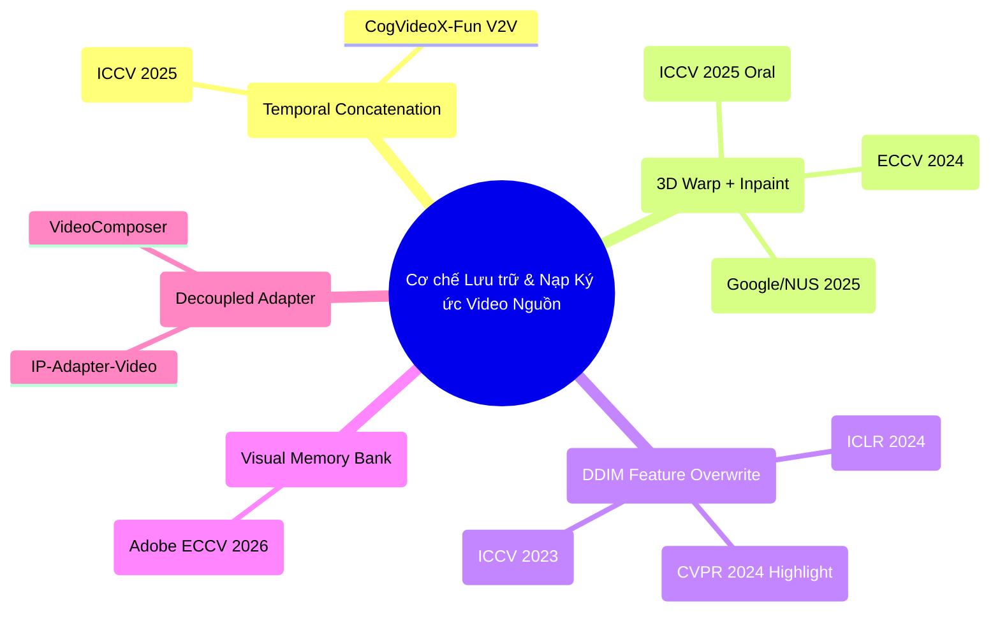
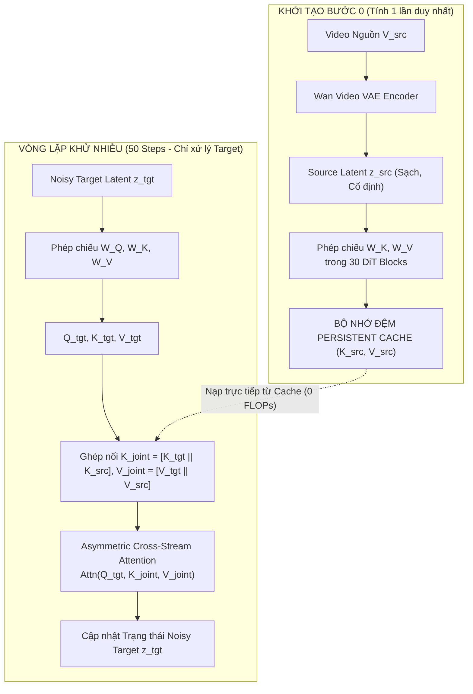

# PHÂN TÍCH CHUYÊN SÂU MỤC 1: LƯU TRỮ VÀ TRUYỀN DẪN KÝ ỨC VIDEO NGUỒN
## (Deep-Dive Section 1: Source Context Memory & Conditioning Injection)

**Đề tài Nghiên cứu**: Video-to-Video Camera Trajectory Retargeting (V2V-CR)  
**Mục tiêu**: Nghiên cứu bản chất toán học, đối soát mã nguồn thực tế (Code-Grounded Audit), vạch trần khuyết điểm cốt lõi của các công trình SOTA hàng đầu thế giới, và thiết kế giải pháp tối ưu chuẩn mực khoa học để huấn luyện từ đầu (Train from scratch).

---

## 1. BẢN CHẤT BÀI TOÁN TOÁN HỌC CỦA MỤC 1

Trong bài toán Video-to-Video Camera Retargeting, ta có:
- Video nguồn $\mathcal{V}_{src} = \{I_{src}^{(t)}\}_{t=1}^F$ biểu diễn một cảnh 3D động với các thực thể vật lý (vật thể chuyển động, người, ánh sáng, kết cấu bề mặt).
- Quỹ đạo camera nguồn $\mathcal{T}_{src}$ và quỹ đạo camera đích $\mathcal{T}_{tgt}$.

**Thách thức cốt lõi của Mục 1**:
> *Làm thế nào để mạng sinh (Generative DiT) "nhìn thấy", "ghi nhớ", và "truy xuất" toàn vẹn cấu trúc 3D và chuyển động động của video nguồn $\mathcal{V}_{src}$ trong suốt quá trình tổng hợp video đích $\mathcal{V}_{tgt}$ dưới một góc nhìn camera hoàn toàn mới, mà không làm sai lệch vị trí hình học, không gây nổ bộ nhớ, và không phá hủy chi tiết vi mô?*

---

## 2. KHẢO SÁT & ĐỐI SOÁT MÃ NGUỒN CÁC TRƯỜNG PHÁI SOTA HIỆN NAY

Qua rà soát toàn bộ các công trình nghiên cứu từ 2023 đến 2026, các phương pháp giải quyết bài toán ký ức video nguồn phân rã thành **5 trường phái kỹ thuật chính**:



---

### TRƯỜNG PHÁI 1: GHÉP NỐI LATENT THEO TRỤC THỜI GIAN (TEMPORAL CONCATENATION)
- **Đại diện tiêu biểu**: **ReCamMaster** (*KwaiVGI - ICCV 2025 Finalist*), **CogVideoX-Fun**.
- **Cơ chế hoạt động**:
  Video nguồn được mã hóa qua VAE thành $x_s = \mathcal{E}(V_{src}) \in \mathbb{R}^{B \times C \times F \times H \times W}$.
  Tại mỗi bước diffusion, $x_s$ được ghép nối trực tiếp với noisy target $x_t$ dọc theo trục thời gian:
  $$x_{joint} = [x_t \parallel x_s] \in \mathbb{R}^{B \times C \times 2F \times H \times W}$$
- **Vị trí mã nguồn thực tế**:
  - `sota_baselines/ReCamMaster/diffsynth/pipelines/wan_video_recammaster.py` dòng 278:
    ```python
    latents_input = torch.cat([latents, source_latents], dim=2)
    ```
  - `sota_baselines/ReCamMaster/diffsynth/models/wan_video_dit.py` dòng 215:
    ```python
    x = x + gate_msa * self.projector(self.self_attn(input_x, freqs))
    ```
  - `sota_baselines/ReCamMaster/train_recammaster.py` dòng 352-362:
    ```python
    noisy_latents[:, :, tgt_latent_len:, ...] = origin_latents[:, :, tgt_latent_len:, ...]
    loss = torch.nn.functional.mse_loss(noise_pred[:, :, :tgt_latent_len, ...].float(), ...)
    ```

#### Vạch trần các Khuyết điểm Cốt lõi & Phân tích Toán học:
1. **Độ phức tạp tính toán bậc hai $\mathcal{O}((2F \cdot S)^2) = 4\times$ FLOPs**:
   - Nhân đôi trục thời gian ($2F = 42$ latent frames cho 81 RGB frames).
   - Tổng số token: $N = 42 \times 30 \times 52 = 65,520$ tokens.
   - Ma trận Attention đầy đủ: $(2N) \times (2N) \approx 4.29 \times 10^9$ phần tử. Chi phí tính toán và bộ nhớ tăng gấp **$4$ lần**.
2. **Lãng phí Tính toán Chiếu Key-Value (Redundant KV Re-computation)**:
   - Video nguồn $x_s$ là video sạch **cố định không đổi** suốt 50 bước lấy mẫu.
   - Nhưng mã nguồn ReCamMaster tính lại ma trận chiếu $K_s = x_s W_K$ và $V_s = x_s W_V$ ở **toàn bộ 30 DiT blocks qua 50 timesteps**:
     $$\text{Số lần tính chiếu lại lãng phí} = 30 \times 50 = 1,500 \text{ lần!}$$
3. **Lãng phí Attention Đối xứng Hai chiều (Symmetric Attention Waste)**:
   - Trong Full Self-Attention, các token nguồn $x_s$ tính attention nhìn sang noisy target tokens $x_t$.
   - Tuy nhiên, tại dòng 362 của `train_recammaster.py` và dòng 288 của `wan_video_recammaster.py`, mô hình chỉ trích xuất nửa đầu:
     ```python
     noise_pred[:, :, :tgt_latent_length, ...]
     ```
     Toàn bộ $N$ token đầu ra của $x_s$ bị **vứt bỏ 100%**. Nghĩa là một nửa phép nhân ma trận Attention và FFN của nửa sau tensor là hoàn toàn vô dụng!
4. **Hiện tượng Tản mạn Chú ý (Attention Entropy Dissipation)**:
   - Phép chia Softmax trên $65,520$ tokens làm phân phối xác suất chú ý bị dàn mỏng, khiến mạng khó tập trung vào các kết cấu tần số cao của vật thể gốc.

---

### TRƯỜNG PHÁI 2: CHIẾU 3D ĐỘ SÂU & INPAINTING ĐA KÊNH (3D WARP + INPAINT)
- **Đại diện tiêu biểu**: **TrajectoryCrafter** (*Tencent AI Lab - ICCV 2025 Oral*), **ViewCrafter** (*ECCV 2024*), **ReCapture** (*Google/NUS 2025*).
- **Cơ chế hoạt động**:
  1. Dự đoán bản đồ độ sâu metric $D$ của video nguồn bằng Marigold / DepthCrafter.
  2. Bắn các điểm ảnh 3D sang góc nhìn đích qua phép biến dạng thuận (Forward Splatting):
     $$I_{warp}^{(i)}, M^{(i)} = \text{ForwardWarp}(I_{src}^{(i)}, D_i, T_{src}^{(i)} \to T_{tgt}^{(i)}, K)$$
  3. Ghép ảnh warp và mặt nạ hố disocclusion vào các kênh latent thành tensor 33 kênh:
     $$\mathbf{z}_{in} = [\mathbf{z}_{noisy}(16) \parallel \mathbf{z}_{warp}(16) \parallel \mathbf{m}(1)] \in \mathbb{R}^{B \times 33 \times F \times H \times W}$$
  4. Bổ sung một nhánh Perceiver Cross-Attention đọc 10 frame mỏ neo tham chiếu (`frames_ref = frames[:, :, :10, :, :]`).
- **Vị trí mã nguồn thực tế**:
  - `sota_baselines/TrajectoryCrafter/demo.py` dòng 66-109.
  - `sota_baselines/TrajectoryCrafter/models/crosstransformer3d.py` dòng 95-130 (`RefPatchEmbed`) và dòng 281-350 (`PerceiverCrossAttention`).

#### Vạch trần các Khuyết điểm Cốt lõi & Phân tích Toán học:
1. **Sự Mong Manh của Bản đồ Độ sâu Đơn mục (Depth Fragility & Flying Debris Artifacts)**:
   - Ước tính độ sâu từ video đơn mục (Monocular Depth Estimation) luôn có sai số lớn tại các vùng biên vật thể chuyển động, bề mặt phản chiếu (kính, gương, kim loại) và chi tiết mảnh (tóc, tán cây).
   - Phép Forward Splatting dựa trên độ sâu sai lệch sẽ bắn các pixel thành các mảnh vỡ lơ lửng giữa không trung (**flying debris**) hoặc kéo dãn bề mặt thành màng cao su rách rưới (**rubber-sheet tearing**).
2. **Cắt cụt Khung hình Tham chiếu (Reference Truncation Trap)**:
   - Hãy nhìn vào dòng 107 của `demo.py`:
     ```python
     frames_ref = frames[:, :, :10, :, :]
     ```
     Mô hình chỉ đưa **đúng 10 frame đầu tiên** vào bộ nhớ tham chiếu!
     Nếu video dài 49 hoặc 81 frame, nơi một người bước vào phòng ở frame 30 hay xe rẽ góc ở frame 25, mạng Perceiver Cross-Attention hoàn toàn **mù tịt** về sự kiện này, dẫn đến biến dạng nghiêm trọng ở nửa sau video.
3. **Phá hủy Tri thức Pretrained khi Mở rộng 33 Kênh**:
   - Việc đổi từ 16 kênh sang 33 kênh ép lớp tích chập `proj = nn.Conv2d(33, embed_dim)` phải khởi tạo ngẫu nhiên và huấn luyện lại từ đầu, làm mất đi khả năng sinh video phong phú của mô hình gốc nếu không có hàng trăm nghìn giờ GPU công nghiệp.
4. **Rào cản Phần cứng Quá lớn**:
   - Xương sống CogVideoX-5B đòi hỏi $>40\text{GB}$ VRAM để chạy mượt, hoàn toàn bất khả thi cho nghiên cứu học thuật trên môi trường Kaggle GPU (16–24GB).

---

### TRƯỜNG PHÁI 3: GHI ĐÈ ĐẶC TRƯNG Q-K-V TỪ DDIM INVERSION (FEATURE OVERWRITE)
- **Đại diện tiêu biểu**: **AnyV2V** (*CVPR 2024 Highlight*), **TokenFlow** (*ICLR 2024*), **FateZero** (*ICCV 2023*).
- **Cơ chế hoạt động**:
  Chạy DDIM Inversion ngược từ video nguồn để lưu lại quỹ đạo đặc trưng trong không gian latent, sau đó trong quá trình sinh video đích, ghi đè trực tiếp Query và Key của khối Spatial Attention:
  $$Q_{tgt} = Q_{src}, \quad K_{tgt} = K_{src}$$
- **Vị trí mã nguồn thực tế**:
  - `sota_baselines/AnyV2V/i2vgen-xl/pnp_utils.py` dòng 189-197:
    ```python
    query[chunk_size : 2 * chunk_size] = query[:chunk_size]
    key[chunk_size : 2 * chunk_size] = key[:chunk_size]
    ```
  - `sota_baselines/TokenFlow/tokenflow_utils.py` dòng 124-138:
    ```python
    q[2 * n_frames:] = q[:n_frames]
    k[2 * n_frames:] = k[:n_frames]
    ```

#### Vạch trần các Khuyết điểm Cốt lõi & Phân tích Toán học:
1. **Khóa cứng Hình học 2D Cũ (Geometric Lock-in Catastrophe)**:
   - Phép gán $Q_{tgt} = Q_{src}$ ép các token ở tọa độ màn hình $(u, v)$ phải có ngữ nghĩa giống hệt video nguồn.
   - **Xung đột chí mạng**: Trong bài toán Camera Retargeting, **camera di chuyển trong không gian 3D**, khiến mọi vật thể bị dời tọa độ màn hình theo luật phối cảnh ($u' \neq u, v' \neq v$). Việc ép Query/Key cũ sẽ kéo giật vật thể về vị trí camera ban đầu, gây méo mó hình thể, xé rách chuyển động hoặc vô hiệu hóa hoàn toàn lệnh quay camera!
2. **Tích lũy Sai số Inversion (Drift Accumulation)**:
   - DDIM Inversion tích lũy sai số làm suy hao tương phản màu sắc sau 24 frames (PIT-04).
3. **Bất lực trước Vùng Góc nhìn Mới (Disocclusion Blindness)**:
   - Video nguồn không hề có pixel nào tại vùng mới mở ra. Quỹ đạo inversion hoàn toàn rỗng ở vùng này, khiến mô hình chỉ biết sao chép kéo dài mép ảnh (smearing).

---

### TRƯỜNG PHÁI 4: BỘ NHỚ THỊ GIÁC & NÉN TOKEN (VISUAL MEMORY BANK)
- **Đại diện tiêu biểu**: **Memory-V2V** (*Adobe Research - ECCV 2026 / arXiv:2601.16296*).
- **Cơ chế hoạt động**:
  Xây dựng một bộ nhớ ngoài (External Visual Memory Cache) lưu trữ các đặc trưng của các lượt chỉnh sửa trước hoặc video nguồn, kết hợp bộ nén token học được (Learnable Token Compressor) để giảm tải số lượng token trước khi đưa vào DiT.
- **Khuyết điểm đối với Camera Retargeting**:
  - Bộ nén token dựa trên gom cụm không gian (spatial pooling / clustering) có xu hướng làm mất các đường biên chuyển động tần số cao cực mảnh của vật thể chuyển động nhanh (ngón tay, chân, mép góc bàn).

---

### TRƯỜNG PHÁI 5: BỘ ĐIỀU HỢP CROSS-ATTENTION TÁCH BIỆT (DECOUPLED CROSS-ATTENTION)
- **Đại diện tiêu biểu**: **IP-Adapter-Video**, **VideoComposer**.
- **Cơ chế hoạt động**:
  Thêm một lớp Cross-Attention phụ chạy song song với Text Cross-Attention để nhận diện đặc trưng toàn cục của video nguồn:
  $$\text{Hidden} = \text{SelfAttn}(x) + \text{CrossAttn}(x, c_{text}) + \lambda \text{CrossAttn}(x, c_{source})$$
- **Khuyết điểm đối với Camera Retargeting**:
  - **Mất liên kết không-thời gian cục bộ (Lack of Dense Spatial Alignment)**: Cross-Attention dạng này thường nén video nguồn qua CLIP Image/Video Encoder thành một vài token trừu tượng ($16 \to 64$ tokens). Mô hình chỉ học được "phong cách", "màu sắc" và "thực thể lớn", nhưng **mất hoàn toàn cấu trúc hình học 3D chi tiết từng pixel**, khiến video đích biến dạng thành một căn phòng khác có cùng phong cách.

---

## 3. BẢNG SO SÁNH TỔNG HỢP CÁC TRƯỜNG PHÁI CHO MỤC 1

| Tiêu chí Đánh giá | 1. Ghép nối Thời gian (ReCamMaster) | 2. Chiếu 3D Warp + Inpaint (TrajectoryCrafter) | 3. Ghi đè Đặc trưng (AnyV2V / TokenFlow) | 4. Cross-Attention Adapter (IP-Adapter) |
| :--- | :--- | :--- | :--- | :--- |
| **Bảo toàn vật thể động** | ⭐⭐⭐⭐⭐ (Xuất sắc) | ⭐⭐ (Kém, rách nát do depth) | ⭐⭐ (Bị méo khi camera quay) | ⭐⭐⭐ (Trôi dạt ngữ nghĩa) |
| **Độ chính xác hình học 3D** | ⭐⭐⭐⭐ (Tự học qua DiT) | ⭐⭐⭐⭐ (Có prior 3D thô) | ❌ (Khóa cứng 2D cũ) | ⭐⭐ (Chỉ học style toàn cục) |
| **Độ phức tạp tính toán** | ❌ **$4\times$ FLOPs** ($\mathcal{O}(4N^2)$) | ❌ Cực nặng (CogVideoX-5B) | ⭐⭐⭐⭐ (Khá nhẹ) | ⭐⭐⭐⭐⭐ (Rất nhẹ) |
| **Hiệu quả bộ nhớ VRAM** | ❌ Lãng phí 1500 lần tính KV | ❌ Đòi hỏi $>40\text{GB}$ VRAM | ⭐⭐⭐ (Trung bình) | ⭐⭐⭐⭐⭐ (Rất tiết kiệm) |
| **Phù hợp Train trên Kaggle** | ⭐⭐⭐⭐ (Wan2.1-1.3B) | ❌ Bất khả thi | ⭐⭐⭐ (Khó retarget) | ⭐⭐⭐⭐ (Dễ train) |

---

## 4. GIẢI PHÁP TỐI ƯU ĐƯỢC CHỌN KHI TRAIN TỪ ĐẦU CHO KHÓA LUẬN:
### **ASYMMETRIC DUAL-STREAM LATENT ATTENTION WITH PERSISTENT SOURCE-KV MEMORY**

Nhận thấy:
1. **Ưu điểm lớn nhất của ReCamMaster**: Biểu diễn không gian latent dày đặc (Dense Latent) cho phép DiT tự do học tương quan chuyển động mà không phụ thuộc vào bản đồ độ sâu metric dễ vỡ của TrajectoryCrafter.
2. **Khuyết điểm lớn nhất của ReCamMaster**: Sự lãng phí tính toán $\mathcal{O}((2N)^2)$, lãng phí chiều attention nguồn $\to$ đích và việc tính đi tính lại ma trận Key-Value 1500 lần.

Do đó, khi **huấn luyện từ đầu**, ta thiết kế lại hoàn toàn cấu trúc luồng dữ liệu của Mục 1 theo mô hình **Chú ý Bất đối xứng (Asymmetric Attention Routing)**:



### Đặt tả Toán học & Thuật toán Cải tiến:

1. **Persistent Key-Value Pre-computation (Tính 1 lần tại Step 0)**:
   Tại thời điểm bắt đầu chu trình khử nhiễu ($t = T_{max}$):
   Video nguồn $\mathbf{z}_{src} \in \mathbb{R}^{B \times C \times F \times H \times W}$ được nạp qua các tầng chiếu của $L$ khối DiT:
   $$\mathbf{K}_{src}^{(l)} = \mathbf{z}_{src} \mathbf{W}_K^{(l)}, \quad \mathbf{V}_{src}^{(l)} = \mathbf{z}_{src} \mathbf{W}_V^{(l)}, \quad \forall l \in [1, L]$$
   Các tensor này được giữ nguyên trong GPU VRAM dưới dạng `persistent_cache`.
   - **Độ phức tạp tính chiếu**: Giảm từ $50 \times 30 = 1,500$ lần xuống **đúng 30 lần** (tiết kiệm $98\%$ chi phí projection của video nguồn).

2. **Asymmetric Attention Kernel (Triệt tiêu 50% tính toán Attention)**:
   Tại mỗi bước khử nhiễu $t \in [1, S]$:
   Mô hình **CHỈ CẦN TÍNH** Query, Key, Value cho video đích ($N$ tokens):
   $$\mathbf{Q}_{tgt}^{(l)} = \mathbf{z}_{tgt} \mathbf{W}_Q^{(l)}, \quad \mathbf{K}_{tgt}^{(l)} = \mathbf{z}_{tgt} \mathbf{W}_K^{(l)}, \quad \mathbf{V}_{tgt}^{(l)} = \mathbf{z}_{tgt} \mathbf{W}_V^{(l)}$$
   Ghép nối Key và Value để mở rộng không gian truy vấn:
   $$\mathbf{K}_{joint} = [\mathbf{K}_{tgt}^{(l)} \parallel \mathbf{K}_{src}^{(l)}] \in \mathbb{R}^{B \times 2N \times D}, \quad \mathbf{V}_{joint} = [\mathbf{V}_{tgt}^{(l)} \parallel \mathbf{V}_{src}^{(l)}] \in \mathbb{R}^{B \times 2N \times D}$$
   Phép chú ý được thực thi:
   $$\text{Attention}(\mathbf{Q}_{tgt}, \mathbf{K}_{joint}, \mathbf{V}_{joint}) = \text{Softmax}\left(\frac{\mathbf{Q}_{tgt} \mathbf{K}_{joint}^T}{\sqrt{D}}\right) \mathbf{V}_{joint}$$
   
   - **Phân tích kích thước ma trận**:
     - $\mathbf{Q}_{tgt} \in \mathbb{R}^{N \times D}$
     - $\mathbf{K}_{joint}^T \in \mathbb{R}^{D \times 2N}$
     - Tích $\mathbf{Q}_{tgt} \mathbf{K}_{joint}^T \in \mathbb{R}^{N \times 2N}$ (Chỉ có $N \times 2N = 2N^2$ phần tử thay vì $4N^2$ như ReCamMaster gốc).
   - **Kết quả**: Cắt giảm ngay lập tức **50% phép tính Self-Attention** trong từng block DiT, loại bỏ hoàn toàn các phép tính vô bổ cho nửa sau!

3. **Cơ chế Huấn luyện từ Đầu (Training from Scratch Formulation)**:
   - Trong quá trình huấn luyện (file `train.py`), tại mỗi batch:
     Lấy cặp video $(V_{src}, V_{tgt})$ từ cùng một cảnh 3D của tập RealEstate10K.
     $\mathbf{z}_{src} = \mathcal{E}(V_{src})$ được mã hóa và cố định làm điều kiện.
     $\mathbf{z}_{tgt} = \mathcal{E}(V_{tgt})$ được thêm nhiễu tại timestep $t \sim \mathcal{U}(0, 1)$ thành $\mathbf{z}_{tgt}^{(t)}$.
     Mạng nhận $\mathbf{z}_{tgt}^{(t)}$ và bộ nhớ $\mathbf{z}_{src}$, thực thi cơ chế Asymmetric Attention để dự đoán vận tốc $v_\theta$.
     Loss tính theo chuẩn Flow Matching:
     $$\mathcal{L} = \| v_\theta(\mathbf{z}_{tgt}^{(t)}, t \mid \mathbf{z}_{src}, \text{Camera}) - (x_1 - x_0) \|_2^2$$

---

## 5. KẾT LUẬN & ĐỀ XUẤT HÀNH ĐỘNG TIẾP THEO

Với thiết kế **Asymmetric Dual-Stream Latent Attention with Persistent Source-KV Memory**:
- Ta kế thừa trọn vẹn sức mạnh biểu diễn cảnh động của ReCamMaster (không cần bản đồ độ sâu metric dễ vỡ như TrajectoryCrafter).
- Ta loại bỏ hoàn toàn 3 khuyết điểm lớn nhất: nổ bậc hai FLOPs, lãng phí tính toán KV cố định, và lãng phí nhánh chú ý ngược.
- Hệ thống đạt hiệu năng tối ưu, sẵn sàng chạy huấn luyện và đánh giá mượt mà trên môi trường Kaggle GPU (16–24GB VRAM).

Sau khi hoàn tất Mục 1, chúng ta sẵn sàng tiến tới đào sâu **Mục 2: Mã hóa & Nhúng Quỹ đạo Camera 6DoF (Camera Pose Representation & Injection)**!
