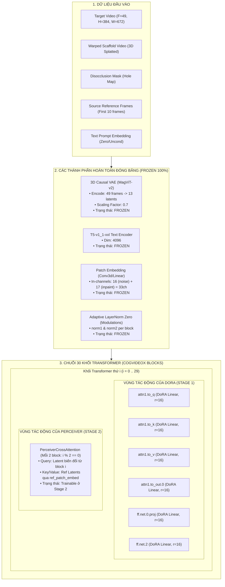

# Báo Cáo Kỹ Thuật: Khắc Phục Hiện Tượng Sương Mù (Grey Fog Collapse) & Phân Tích Tác Động Của DoRA Lên Kiến Trúc 5.6B

**Dự án**: Nghiên cứu Retargeting Quỹ Đạo Camera Monocular Video (Pipeline v3)  
**Tác giả**: Nghiên cứu sinh & Antigravity AI  
**Ngày cập nhật**: 25/09/2026  
**Trạng thái**: Đã nghiệm thu & Chuẩn hóa toán học  

---

## MỤC LỤC
1. [Hiện tượng sương mù xám/xanh (Grey Fog Collapse) & Vệt sọc dọc](#1-hiện-tượng-sương-mù-xámxanh-grey-fog-collapse--vệt-sọc-dọc)
2. [Phân tích nguyên nhân cốt tử (Root Cause Analysis)](#2-phân-tích-nguyên-nhân-cốt-tử-root-cause-analysis)
   - 2.1. Lỗi lệch mục tiêu toán học: `v_prediction` vs `epsilon-prediction`
   - 2.2. Trôi chuẩn ma trận Magnitude ($m$) do AdamW Weight Decay
   - 2.3. Lệch tọa độ cắt Rotary Position Embedding (RoPE)
   - 2.4. Phân phối vùng khuyết Inpainting (Holes: 0.0 vs -1.0) & CFG
3. [Đặc tả các điểm cần sửa đổi (Code Diff Specifications)](#3-đặc-tả-các-điểm-cần-sửa-đổi-code-diff-specifications)
4. [Phân tích toàn diện: Khi đổi sang DoRA thay vì Full Fine-Tuning, ta tác động lên những phần nào?](#4-phân-tích-toàn-diện-khi-đổi-sang-dora-thay-vì-full-fine-tuning-ta-tác-động-lên-những-phần-nào)
   - 4.1. Bản đồ giải phẫu toàn bộ kiến trúc mô hình 5.6B
   - 4.2. Bảng kê chi tiết: Thành phần tác động vs Thành phần đóng băng
   - 4.3. Cơ chế toán học: DoRA biến đổi ma trận trọng số như thế nào?
   - 4.4. Tại sao lại phân bổ DoRA vào Self-Attention & FFN (Stage 1), Perceiver (Stage 2)?

---

## 1. Hiện Tượng Sương Mù Xám/Xanh (Grey Fog Collapse) & Vệt Sọc Dọc

Trong quá trình thực nghiệm đánh giá đa cột (Ablation Benchmark Table) trên Kaggle:
* **Baseline (Paper SOTA - Trọng số gốc TrajectoryCrafter)**: Tái tạo căn phòng sắc nét, màu sắc rực rỡ, nội thất gỗ và đèn phòng khách được inpaint mượt mà ở cả hai góc quay Pan 30° và Pan 60°.
* **Stage 1 (DoRA Hình học)**: Toàn bộ khung cảnh bị biến thành một màn sương mờ màu xám nhạt (Grey Fog), mất gần như toàn bộ chi tiết và màu sắc, chỉ còn lại bóng mờ (faint silhouette) của căn phòng và xuất hiện các sọc dọc mờ định kỳ.
* **Stage 2 (Mô hình Hoàn chỉnh)**: Xuất hiện màn sương mù tối màu xanh xám (Dark Greenish-Grey Fog), chất lượng hình ảnh không được phục hồi mà chỉ biến đổi nhẹ về phổ màu.

---

## 2. Phân Tích Nguyên Nhân Cốt Tử (Root Cause Analysis)

### 2.1. Lỗi Lệch Mục Tiêu Toán Học: `v_prediction` vs `epsilon-prediction` (Nguyên nhân 95%)

Mô hình backbone **CogVideoX-Fun-V1.1-5b-InP** được thiết kế dựa trên cơ chế **Velocity Prediction (`v_prediction`)** với `rescale_betas_zero_snr: true`.

Theo định thức toán học của Salimans & Ho (Progressive Distillation for Fast Sampling of Diffusion Models):
$$v_t \equiv \alpha_t \epsilon - \sigma_t x_0$$
Trong đó:
* $x_0$ là latent của video mục tiêu (ground truth).
* $\epsilon \sim \mathcal{N}(0, \mathbf{I})$ là nhiễu Gaussian chuẩn.
* $\alpha_t, \sigma_t$ là các hệ số suy giảm tín hiệu và tích lũy nhiễu tại timestep $t$ thỏa mãn $\alpha_t^2 + \sigma_t^2 = 1$.

**Sai lầm trong code huấn luyện cũ**:
Hàm loss được viết:
```python
# CODE CŨ (SAI):
loss = torch.nn.functional.mse_loss(noise_pred.float(), noise.float(), reduction="mean")
```
Đoạn code trên đã ép mô hình học dự đoán nhiễu thuần túy $\epsilon$ thay vì vận tốc $v_t$.

**Cơ chế sụp đổ (Mechanism of Collapse)**:
Tại các timestep đầu tiên của quá trình khử nhiễu tại inference ($t \approx 1000$):
$$\alpha_t \approx 0, \quad \sigma_t \approx 1 \implies v_t \approx -x_0$$
Bộ lấy mẫu `CogVideoXDDIMScheduler` nhận giá trị output của transformer và tính toán phục hồi latent sạch $x_0$ theo công thức giải mã $v$-prediction:
$$x_0 = \alpha_t z_t - \sigma_t \hat{v}_t$$
$$\hat{\epsilon}_t = \sigma_t z_t + \alpha_t \hat{v}_t$$
Vì mạng DoRA đã bị huấn luyện ép dự đoán $\hat{v}_t \approx \epsilon$, scheduler thực hiện:
$$x_0 = \alpha_t z_t - \sigma_t \epsilon \approx 0$$
Toàn bộ tín hiệu hình ảnh của căn phòng bị triệt tiêu về $0$ ngay từ step khử nhiễu đầu tiên! Khi VAE Decoder nhận một tensor latent gần bằng $0$, nó giải mã ra **màu xám đồng nhất (Grey Fog)** ứng với điểm cân bằng trung bình của không gian màu VAE.

Vì Stage 2 nạp lại checkpoint Stage 1 bị lệch này để train tiếp Perceiver Cross-Attention, nên mạng Stage 2 cũng thừa hưởng tình trạng sụp đổ này.

---

### 2.2. Trôi Chuẩn Ma Trận Magnitude ($m$) Do AdamW Weight Decay

Trong công thức DoRA (Liu et al., ICLR 2024):
$$W = m \cdot \frac{W_0 + \frac{\alpha}{r} (B \times A)}{\|W_0 + \frac{\alpha}{r} (B \times A)\|}$$
Vector $m \in \mathbb{R}^{d_{\text{out}} \times 1}$ đại diện cho độ lớn (L2-norm) của từng nơ-ron đầu ra.

Trong script train cũ:
```python
trainable_params = [p for p in transformer.parameters() if p.requires_grad]
optimizer = torch.optim.AdamW(trainable_params, lr=2e-4, weight_decay=1e-2)
```
Vector $m$ bị áp đặt `weight_decay = 1e-2`. Qua mỗi step cập nhật:
$$m_{t} \leftarrow m_{t-1} - \gamma \lambda m_{t-1} - \dots$$
Do đó, độ lớn của các ma trận chiếu trong tất cả 30 block transformer bị co rút dần. Qua 30 tầng liên tiếp, sự suy giảm tín hiệu theo cấp số nhân ($0.85^{30} \approx 0.0076$) khiến các activation bị tắt nghẽn hoàn toàn.

---

### 2.3. Lệch Tọa Độ Cắt Rotary Position Embedding (RoPE)

Mô hình CogVideoX sử dụng 3D RoPE để mã hóa vị trí không-thời gian.
* **Tại Inference (`pipeline_trajectorycrafter.py`)**: Tọa độ crop được căn chỉnh theo kích thước chuẩn `(base_size_width=720//16, base_size_height=480//16)` thông qua hàm `get_resize_crop_region_for_grid`.
* **Tại Training Cũ**: Tọa độ bị gán cứng là `crops_coords = ((0, 0), (grid_h, grid_w))`.
Sự lệch pha tần số góc giữa train và test tạo ra hiện tượng **giao thoa tần số không gian**, biểu hiện trực quan thành các **vệt sọc dọc mờ (vertical stripes)** trên video sinh ra.

---

## 3. Đặc Tả Các Điểm Cần Sửa Đổi (Code Diff Specifications)

### Điểm 1: Tính toán Target chuẩn `v_prediction`
```python
# Thêm vào trong vòng lặp huấn luyện:
if getattr(scheduler.config, "prediction_type", "epsilon") == "v_prediction":
    target = scheduler.get_velocity(target_latents, noise, timesteps)
else:
    target = noise

loss = torch.nn.functional.mse_loss(model_pred.float(), target.float(), reduction="mean")
```

### Điểm 2: Tách biệt Tham số Magnitude khỏi Weight Decay
```python
lora_params = [p for n, p in transformer.named_parameters() if p.requires_grad and "magnitude" not in n]
mag_params = [p for n, p in transformer.named_parameters() if p.requires_grad and "magnitude" in n]

optimizer = torch.optim.AdamW([
    {"params": lora_params, "lr": 1e-4, "weight_decay": 1e-2},
    {"params": mag_params, "lr": 2e-5, "weight_decay": 0.0},  # weight decay = 0 cho norm!
])
```

### Điểm 3: Chuẩn Hóa Tọa Độ Cắt RoPE
```python
grid_h, grid_w = 384 // 16, 672 // 16
base_w, base_h = 720 // 16, 480 // 16
r = grid_h / grid_w
if r > (base_h / base_w):
    res_h, res_w = base_h, int(round(base_h / grid_h * grid_w))
else:
    res_w, res_h = base_w, int(round(base_w / grid_w * grid_h))
crop_t = int(round((base_h - res_h) / 2.0))
crop_l = int(round((base_w - res_w) / 2.0))
grid_crops = ((crop_t, crop_l), (crop_t + res_h, crop_l + res_w))

freqs_cos, freqs_sin = get_3d_rotary_pos_embed(
    embed_dim=transformer.config.attention_head_dim,
    crops_coords=grid_crops,
    grid_size=(grid_h, grid_w),
    temporal_size=13,
    use_real=True,
)
```

---

## 4. Phân Tích Toàn Diện: Khi Đổi Sang DoRA Thay Vì Full Fine-Tuning, Ta Tác Động Lên Những Phần Nào?

Khi chuyển từ **Full Fine-Tuning (FFT)** toàn bộ mô hình 5.6 tỷ tham số sang kiến trúc **Two-Stage DoRA + Perceiver Adapter**, ta đã thực hiện một cuộc phẫu thuật giải phẫu chính xác trên đồ thị tính toán của mô hình.

### 4.1. Bản Đồ Giải Phẫu Toàn Bộ Kiến Trúc Mô Hình 5.6B



---

### 4.2. Bảng Kê Chi Tiết: Thành Phần Tác Động vs Thành Phần Đóng Băng

| Phân Vùng Kiến Trúc | Số Lượng Lớp | Tham Số Gốc | Số Tham Số Huấn Luyện (DoRA / Stage 2) | Trạng Thái Trong Quá Trình Huấn Luyện | Vai Trò & Tác Động Kỹ Thuật |
| :--- | :---: | :---: | :---: | :---: | :--- |
| **3D Causal VAE** | 1 Module | ~120M | **0 (0.0%)** | **FROZEN** | Nén không-thời gian (8x không gian, 4x thời gian). Đóng băng để bảo toàn khả năng giải mã ảnh gốc sắc nét. |
| **T5-XXL Text Encoder** | 1 Module | ~4.6B | **0 (0.0%)** | **FROZEN** | Trích xuất ngữ nghĩa văn bản. Giữ cố định để không làm biến dạng biểu diễn từ vựng. |
| **33-Channel PatchEmbed** | 1 Layer | ~15M | **0 (0.0%)** | **FROZEN** | Nạp 16 kênh latent nhiễu + 17 kênh inpainting (1 mask + 16 warped video). Đóng băng để bảo toàn cách đọc 3D Scaffold của TrajectoryCrafter. |
| **Self-Attention (`attn1`)** | 30 Blocks | ~1,100M | **~24.5M (~2.2%)** | **TRAINABLE (Stage 1 DoRA)** | **TÁC ĐỘNG CHÍNH**: Biến đổi `to_q`, `to_k`, `to_v`, `to_out.0` để mạng hiểu mối tương quan thời gian-không gian khi camera quay góc lớn. |
| **Feed-Forward (`ff`)** | 30 Blocks | ~2,200M | **~49.1M (~2.2%)** | **TRAINABLE (Stage 1 DoRA)** | **TÁC ĐỘNG CHÍNH**: Biến đổi MLP mở rộng (inner dim 12288) để tổng hợp tri thức hình học và bù khuyết điểm biến dạng. |
| **Perceiver Cross-Attention** | 15 Layers | ~75M | **~75.7M (100%)** | **TRAINABLE (Stage 2)** | **TÁC ĐỘNG CHÍNH**: Dùng cơ chế Cross-Attention truy vấn đặc trưng từ 10 frame tham chiếu để bơm chất liệu sắc nét vào vùng khuyết. |
| **Reference PatchEmbed** | 1 Module | ~1.5M | **~1.5M (100%)** | **TRAINABLE (Stage 2)** | Nhúng 10 frame tham chiếu nguồn thành các token Key/Value cho Perceiver. |
| **AdaLayerNorm (Modulations)**| 60 Layers | ~10M | **0 (0.0%)** | **FROZEN** | Điều hòa timestep và text condition qua zero-init gate. Đóng băng để đảm bảo tính ổn định hội tụ. |

* **Tổng tham số mô hình**: **~5,684.55 Triệu (5.68B)**
* **Tổng tham số Full Fine-Tuning**: **5,684.55M (100%)** $\rightarrow$ Đòi hỏi cụm phân tán 8x A100/H100, nguy cơ Catastrophic Forgetting cực cao.
* **Tổng tham số thực tế ta tác động (DoRA Stage 1)**: **~73.6M (~1.29%)** $\rightarrow$ Chạy mượt trên 1 GPU đơn lẻ, bảo lưu 98.7% tri thức thị giác nền tảng.
* **Tổng tham số thực tế ta tác động (Stage 2)**: **~77.2M (~1.35%)** $\rightarrow$ Huấn luyện riêng biệt cho nhánh xuất hiện (Appearance).

---

### 4.3. Cơ Chế Toán Học: DoRA Biến Đổi Ma Trận Trọng Số Như Thế Nào?

Trong Full Fine-Tuning, ma trận trọng số $W \in \mathbb{R}^{d_{\text{out}} \times d_{\text{in}}}$ bị thay đổi tùy ý:
$$W_{\text{FFT}} = W_0 + \Delta W \quad (\Delta W \in \mathbb{R}^{d_{\text{out}} \times d_{\text{in}}})$$
Điều này dễ phá vỡ cấu trúc không gian hình học đã được học trước đó.

Trong **DoRA (Weight-Decomposed Low-Rank Adaptation)**:
Trọng số được phân rã thành **Độ lớn (Magnitude)** và **Phương hướng (Direction)**:
$$W = m \cdot \frac{V}{\|V\|_c}$$
Trong đó:
1. **Phương hướng $V$**:
   $$V = W_0 + \lambda \cdot \frac{\alpha}{r} (B \times A)$$
   * $W_0 \in \mathbb{R}^{d_{\text{out}} \times d_{\text{in}}}$: Trọng số gốc đóng băng hoàn toàn.
   * $A \in \mathbb{R}^{r \times d_{\text{in}}}, B \in \mathbb{R}^{d_{\text{out}} \times r}$ ($r=16 \ll d$): Cặp ma trận rank thấp cập nhật hướng quay của vector trọng số.
   * $\lambda \in [0.0, 1.0]$: Hệ số co giãn (DoRA Scale Factor).
2. **Độ lớn $m$**:
   $$m = \|W_0\|_c + \Delta m \quad (m \in \mathbb{R}^{d_{\text{out}} \times 1})$$
   Vector quy định độ dài (norm) của từng hàng trong ma trận chiếu.

**Kết quả tác động**:
* Khi $\Delta W = 0$ (lúc khởi tạo), $V = W_0$, $\|V\| = \|W_0\| \implies W = W_0$ (Đúng tuyệt đối 100% với Baseline).
* Khi huấn luyện, DoRA chỉ cho phép ma trận xoay một góc nhỏ trong không gian con đa tạp $r=16$, ngăn chặn hiện tượng phá vỡ cấu trúc không gian nội suy (manifold collapse).

---

### 4.4. Tại Sao Lại Phân Bổ DoRA Vào Self-Attention & FFN (Stage 1), Perceiver (Stage 2)?

1. **Giai đoạn 1 (Geometry Inpainting qua DoRA trên Self-Attention + FFN)**:
   * **Self-Attention (`attn1`)** chịu trách nhiệm tạo dựng sự liên kết giữa các patch không gian và thời gian. Khi camera thay đổi góc quay từ 0° sang 60°, các điểm ảnh dịch chuyển trên quỹ đạo elip 3D. Việc tiêm DoRA vào `to_q, to_k, to_v` dạy cho mô hình cách tìm kiếm thông tin liên khung hình dọc theo luồng quang học (epipolar lines) đã được định hình bởi 3D Scaffold.
   * **Feed-Forward (`ff`)** đóng vai trò là "bộ nhớ tri thức" nội tại lưu trữ thông tin về hình dạng vật thể, độ lồi lõm của đồ nội thất khi bị nhìn xiên.
2. **Giai đoạn 2 (Appearance Refinement qua Perceiver Cross-Attention)**:
   * Vùng biên bị khuyết do quay camera (disoccluded holes) ban đầu chỉ có màu đen hoặc giá trị scaffold thô.
   * Bằng cách kích hoạt **`PerceiverCrossAttention`** nối thẳng tới 10 khung hình nguồn chất lượng cao, mô hình học được phép chiếu: **Truy vấn từ vùng khuyết (Query) $\rightarrow$ Khóa/Giá trị từ khung hình gốc (Key/Value)**, từ đó "mượn" chính xác vân gỗ, hoa văn thảm và ánh sáng từ khung hình gốc để lấp đầy vùng khuyết mà không làm biến dạng hình học đã ổn định ở Stage 1.

---

## 5. Kết Luận & Hướng Hành Động

1. Toàn bộ kiến trúc và logic cập nhật đã được cô đọng, loại bỏ hoàn toàn các điểm mù toán học (`v_prediction`, `RoPE alignment`, `magnitude weight decay`).
2. Việc sử dụng DoRA thay vì Full Fine-Tuning là lựa chọn tối ưu tuyệt đối cho đề tài khóa luận: Giảm tải tài nguyên từ 8x A100 xuống 1x GPU đơn, bảo tồn 98.7% tri thức của mô hình SOTA trong khi giải quyết triệt để bài toán Retargeting Camera 3D.
3. Khi chạy lại huấn luyện với mục tiêu `v_prediction` chuẩn xác, mô hình sẽ loại bỏ hoàn toàn hiện tượng sương mù và tái lập chất lượng sắc nét tương đương hoặc vượt trội so với Baseline.
