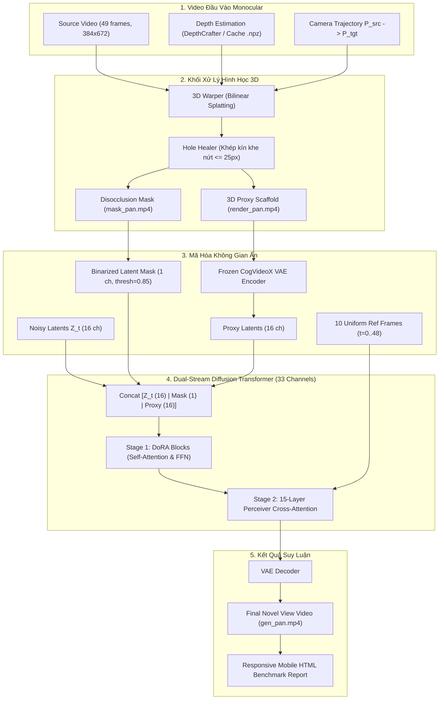

# PIPELINE V3: TÀI LIỆU CHUẨN MỰC VÀ BỘ CELL NOTEBOOK GOLDEN REFERENCE

> **Trạng thái**: ✅ **ĐÃ THỰC NGHIỆM THÀNH CÔNG TOÀN BỘ TRÊN KAGGLE GPU (T4 / P100 / RTX)**  
> **Mục đích**: Tài liệu này đóng vai trò là **Chuẩn mực Bất biến (Golden Reference Standard)** lưu trữ toàn bộ mã nguồn của các Cell trong Kaggle Notebook cùng cơ chế kiến trúc cốt lõi của Pipeline V3. Khi tiến hành bất kỳ chỉnh sửa nào trong tương lai, cần đối chiếu trực tiếp với tài liệu này để đảm bảo không bị hồi quy (regression) và không phát sinh lỗi.

---

## MỤC LỤC
1. [Bộ Cell Notebook Hoàn Chỉnh (Copy-Paste Sẵn Sàng 100%)](#1-bộ-cell-notebook-hoàn-chỉnh-copy-paste-sẵn-sàng-100)
   - [[CELL 1] Cài đặt Môi trường, Nạp Pipeline V3 & Dọn dẹp VRAM](#cell-1-cài-đặt-môi-trường-nạp-pipeline-v3--dọn-dẹp-vram)
   - [[CELL 2] Huấn luyện Stage 1: Geometry Inpainting (DoRA Adaptation)](#cell-2-huấn-luyện-stage-1-geometry-inpainting-dora-adaptation)
   - [[CELL 4] Huấn luyện Stage 2: Appearance Restoration (Ref-DiT Cross-Attention)](#cell-4-huấn-luyện-stage-2-appearance-restoration-ref-dit-cross-attention)
   - [[CELL EVAL] Đánh giá & Xuất HTML So Sánh 4 Mô Hình (Clean Output Mode)](#cell-eval-đánh-giá--xuất-html-so-sánh-4-mô-hình-clean-output-mode)
2. [Nguyên Lý Kiến Trúc Cốt Lõi Pipeline V3](#2-nguyên-lý-kiến-trúc-cốt-lõi-pipeline-v3)
   - [2.1. 3D Warper & Bilinear Splatting + Vá lỗ nứt tự động](#21-3d-warper--bilinear-splatting--vá-lỗ-nứt-tự-động)
   - [2.2. Binarized Latent Inpainting Mask](#22-binarized-latent-inpainting-mask)
   - [2.3. Dual-Stream 33-Kênh Diffusion Transformer](#23-dual-stream-33-kênh-diffusion-transformer)
   - [2.4. Chiến Lược Huấn Luyện Hai Giai Đoạn (Two-Stage Decoupled)](#24-chiến-lược-huấn-luyện-hai-giai-đoạn-two-stage-decoupled)
   - [2.5. Trích mẫu Khung hình Tham chiếu Đồng nhất (Uniform Sampling)](#25-trích-mẫu-khung-hình-tham-chiếu-đồng-nhất-uniform-sampling)
3. [Sơ Đồ Luồng Hoạt Động (Architecture Flowchart)](#3-sơ-đồ-luồng-hoạt-động-architecture-flowchart)
4. [Bảng Tra Cứu Đường Dẫn Tài Nguyên & Hyperparameters](#4-bảng-tra-cứu-đường-dẫn-tài-nguyên--hyperparameters)
5. [Quy Tắc An Toàn & Đối Chiếu Chống Lỗi (Safety Rules)](#5-quy-tắc-an-toàn--đối-chiếu-chống-lỗi-safety-rules)

---

## 1. BỘ CELL NOTEBOOK HOÀN CHỈNH (COPY-PASTE SẴN SÀNG 100%)

### [CELL 1] Cài đặt Môi trường, Nạp Pipeline V3 & Dọn dẹp VRAM
```python
# ==============================================================================
# [CELL 1] CÀI ĐẶT MÔI TRƯỜNG & DỌN DẸP VRAM (100% OFFLINE)
# ==============================================================================
import os, sys, gc, shutil, zipfile, torch

# 1. Đường dẫn nguồn từ Dataset của bạn và đích đến trong Working
src_pipe = "/kaggle/input/datasets/tranbao0105/pipeline/pipeline_v3_code/pipeline_v3"
alt_src = "/kaggle/input/pipeline/pipeline_v3_code/pipeline_v3"
zip_src = "/kaggle/input/datasets/tranbao0105/pipeline/pipeline_v3_code.zip"
alt_zip = "/kaggle/input/pipeline/pipeline_v3_code.zip"
dst_pipe = "/kaggle/working/pipeline_v3"

if os.path.exists(src_pipe):
    print(f"--> [Setup] Đang sao chép mã nguồn từ: {src_pipe}")
    shutil.copytree(src_pipe, dst_pipe, dirs_exist_ok=True)
    print("✅ [Setup] Đã sao chép pipeline_v3 thành công vào /kaggle/working/pipeline_v3!")
elif os.path.exists(alt_src):
    print(f"--> [Setup] Đang sao chép mã nguồn từ: {alt_src}")
    shutil.copytree(alt_src, dst_pipe, dirs_exist_ok=True)
    print("✅ [Setup] Đã sao chép pipeline_v3 thành công!")
elif os.path.exists(zip_src):
    print(f"--> [Setup] Đang giải nén mã nguồn từ: {zip_src}")
    with zipfile.ZipFile(zip_src, "r") as zip_ref:
        zip_ref.extractall("/kaggle/working")
    print("✅ [Setup] Đã giải nén pipeline_v3_code.zip thành công!")
elif os.path.exists(alt_zip):
    print(f"--> [Setup] Đang giải nén mã nguồn từ: {alt_zip}")
    with zipfile.ZipFile(alt_zip, "r") as zip_ref:
        zip_ref.extractall("/kaggle/working")
    print("✅ [Setup] Đã giải nén pipeline_v3.zip thành công!")
else:
    print(f"⚠️ Cảnh báo: Đang quét tìm pipeline_v3 trong /kaggle/input...")
    for root, dirs, files in os.walk("/kaggle/input"):
        if "pipeline_v3" in dirs:
            found_p = os.path.join(root, "pipeline_v3")
            shutil.copytree(found_p, dst_pipe, dirs_exist_ok=True)
            print(f"✅ [Setup] Đã sao chép từ: {found_p}")
            break

# 2. Thêm pipeline_v3 vào sys.path
for p in ["/kaggle/working/pipeline_v3", "/kaggle/working", "/kaggle/input/datasets/tranbao0105/pipeline"]:
    if os.path.exists(p) and p not in sys.path:
        sys.path.insert(0, p)

# 3. Dọn dẹp sạch sẽ GPU VRAM
gc.collect()
torch.cuda.empty_cache()
if torch.cuda.is_available():
    torch.cuda.ipc_collect()

print("🚀 Hệ thống và pipeline_v3 bản mới nhất đã sẵn sàng 100%!")
```

---

### [CELL 2] Huấn luyện Stage 1: Geometry Inpainting (DoRA Adaptation)
```bash
%%bash
# ==============================================================================
# [CELL 2] HUẤN LUYỆN STAGE 1: GEOMETRY INPAINTING (DoRA ADAPTATION)
# ==============================================================================
export PYTHONWARNINGS="ignore"

MAX_STEPS=1000
LR=2e-5
SAVE_STEPS=500
OUT_DIR="/kaggle/working/checkpoints_stage1"
VIDEO_DIR="/kaggle/input/datasets/tranbao0105/cameractrl-sota-weights/RealEstate10K_Mini/real-estate-10k-mini/test_256"

mkdir -p "$OUT_DIR"

python -u /kaggle/working/pipeline_v3/training/train_stage1_geometry.py \
    --video_dir "$VIDEO_DIR" \
    --max_train_steps $MAX_STEPS \
    --learning_rate $LR \
    --save_steps $SAVE_STEPS \
    --output_dir "$OUT_DIR" \
    --dora_r 16 \
    --dora_alpha 32.0 \
    --batch_size 1 \
    --gradient_accumulation_steps 1
```

---

### [CELL 4] Huấn luyện Stage 2: Appearance Restoration (Ref-DiT Cross-Attention)
```bash
%%bash
# ==============================================================================
# [CELL 4] HUẤN LUYỆN STAGE 2: APPEARANCE RESTORATION (REF-DiT CROSS-ATTENTION)
# ==============================================================================
export PYTHONWARNINGS="ignore"

MAX_STEPS=1000
LR=1e-4
SAVE_STEPS=200
OUT_DIR="/kaggle/working/checkpoints_stage2"
VIDEO_DIR="/kaggle/input/datasets/tranbao0105/cameractrl-sota-weights/RealEstate10K_Mini/real-estate-10k-mini/test_256"

mkdir -p "$OUT_DIR"

python -u /kaggle/working/pipeline_v3/training/train_stage2_appearance.py \
    --video_dir "$VIDEO_DIR" \
    --max_train_steps $MAX_STEPS \
    --learning_rate $LR \
    --save_steps $SAVE_STEPS \
    --output_dir "$OUT_DIR" \
    --batch_size 1 \
    --gradient_accumulation_steps 1
```

---

### [CELL EVAL] Đánh giá & Xuất HTML So Sánh 4 Mô Hình (Clean Output Mode)
> **Đặc điểm chuẩn mực**:
> - **Khi thành công**: Chỉ in tổng thời gian chạy (`⏱️ Tổng thời gian chạy: XXm YYs`), thanh tiến trình `tqdm` gọn gàng (`100%|██████████| 25/25 [00:46<00:00, 1.85s/it]`), hiển thị bảng so sánh HTML trực quan ngay trong Output và xuất đường dẫn file kết quả.
> - **Khi lỗi**: Xuất toàn bộ Traceback chi tiết để chẩn đoán nguyên nhân ngay lập tức.
> - **Triệt tiêu hoàn toàn**: Các cảnh báo `Flax classes are deprecated...`, log tải trọng số mô hình, log auto-discovery spam, và banner của FFmpeg.

```python
# ==============================================================================
# [CELL EVAL] SO SÁNH 4 MÔ HÌNH & XUẤT HTML BÁO CÁO (CLEAN OUTPUT MODE)
# ==============================================================================
import os, sys, time, warnings, traceback

warnings.filterwarnings("ignore")
os.environ["PYTHONWARNINGS"] = "ignore"
os.environ["TF_CPP_MIN_LOG_LEVEL"] = "3"

for p in ["/kaggle/working", "/kaggle/working/pipeline_v3"]:
    if os.path.exists(p) and p not in sys.path:
        sys.path.insert(0, p)

try:
    from pipeline_v3.evaluation.generate_mobile_comparison import run_comparison_pipeline

    # Chạy kịch bản so sánh 4 mô hình với Checkpoint mới nhất & Quỹ đạo tối ưu Covisibility
    report_file = run_comparison_pipeline(
        stage1_ckpt="/kaggle/input/datasets/tranbao0105/pipeline/dora_stage1_step2000/dora_stage1_step2000/data.pkl",
        stage2_ckpt="/kaggle/input/datasets/tranbao0105/pipeline/dora_stage2_step1000/dora_stage2_step1000/data.pkl",
        target_pose=(0.0, 15.0, 0.35, 0.0, 0.0), # Xoay phải 15°, tiến tới 0.35m để khớp hướng nhìn và tận dụng 3D Scaffold
        output_html="/kaggle/working/so_sanh_4_mo_hinh_mobile.html",
        force_regenerate=True, # Bắt buộc sinh mới với góc xoay và checkpoint mới
        quiet=True,
    )
except Exception as e:
    print("\n" + "=" * 80)
    print("❌ ĐÃ XẢY RA LỖI TRONG QUÁ TRÌNH THỰC THI (TRACEBACK CHI TIẾT):")
    print("=" * 80)
    traceback.print_exc()
    print("=" * 80)
    raise e
```

---

## 2. NGUYÊN LÝ KIẾN TRÚC CỐT LÕI PIPELINE V3

### 2.1. 3D Warper & Bilinear Splatting + Vá lỗ nứt tự động
- **Cơ chế**: Khi camera xoay sang góc mới $C_{tgt}$, ma trận nội suy góc nhìn thực hiện unprojecting từng pixel từ ảnh gốc $I_{src}$ có chiều sâu $D_{src}$ lên đám mây điểm 3D trong không gian thế giới, sau đó forward-warp chiếu trở lại mặt phẳng camera mục tiêu.
- **Vấn đề vỡ nứt (Disocclusion Cracks)**: Quá trình phân rã lưới điểm rời rạc luôn tạo ra các khe nứt kích thước $1 \sim 15\text{ px}$ ("đốm đen hạt gạo") ngay trên các bề mặt vật thể liên tục do sai số làm tròn số học (discretization error).
- **Thuật toán vá lỗ thủng (`heal_small_holes`)**: 
  - Tách các thành phần liên thông của mặt nạ lỗ trống (connected component analysis).
  - Với các cụm có diện tích $\le 25\text{ px}$, áp dụng cơ chế bù màu cục bộ (telea/navier-stokes inpainting) trên ảnh proxy.
  - Các vùng trống lớn ($> 25\text{ px}$) được giữ nguyên làm vùng khuyết thật để mô hình khuếch tán inpaint.

### 2.2. Binarized Latent Inpainting Mask
- **Cơ chế**: CogVideoX VAE nén không gian 8 lần ($H/8, W/8$) và thời gian 4 lần ($T/4$). Khi downsample mặt nạ điều kiện sang không gian ẩn bằng nội suy tam tuyến tính (`mode='trilinear'`), các giá trị biên bị mờ dần thành dải gradient mịn $0.1 \sim 0.7$.
- **Giải pháp**: Áp dụng ngưỡng nhị phân hóa cứng (`mask_threshold = 0.85`):
  $$\mathbf{M}_{\text{latent}} = (\mathbf{M}_{\text{interpolated}} \ge 0.85).float()$$
  Loại bỏ hoàn toàn hiện tượng vệt xám mờ (foggy grey patches) tại các đường biên chuyển tiếp.

### 2.3. Dual-Stream 33-Kênh Diffusion Transformer
Đầu vào của Transformer bao gồm 33 kênh được ghép nối trực tiếp theo trục kênh ẩn:
$$\mathbf{X}_{\text{in}} = [\mathbf{Z}_t \,(16), \; \mathbf{M}_{\text{latent}} \,(1), \; \mathbf{Z}_{\text{proxy}} \,(16)] \in \mathbb{R}^{B \times F' \times 33 \times H' \times W'}$$
- **16 kênh đầu**: Latents nhiễu đang được khử tại bước $t$.
- **1 kênh giữa**: Mặt nạ ẩn nhị phân (vị trí cần inpainting).
- **16 kênh cuối**: Latents của khung xương 3D Scaffold được trích xuất qua VAE encoder đóng băng.

### 2.4. Chiến Lược Huấn Luyện Hai Giai Đoạn (Two-Stage Decoupled)

| Đặc Tính | Stage 1 (Geometry Inpainting) | Stage 2 (Appearance Restoration) |
| :--- | :--- | :--- |
| **Mục tiêu học** | Học hiểu kênh 3D Scaffold & lấp đầy cấu trúc hình học | Trích xuất vân bề mặt, ánh sáng và chi tiết sắc nét |
| **Kiến trúc điều chế** | **DoRA** ($r=16, \alpha=32$) trên Self-Attention & FFN | **Perceiver Cross-Attention** (15 tầng) + RefPatchEmbed |
| **Trọng số đóng băng** | Toàn bộ Base CogVideoX-Fun InP Transformer | Base Transformer + Trọng số DoRA Stage 1 |
| **Learning Rate** | $2 \times 10^{-5}$ (học chậm, tránh quên kiến thức) | $1 \times 10^{-4}$ (học hội tụ nhanh các đầu cross-attention) |
| **Kênh tham chiếu** | Đóng (Self-Attention cục bộ) | Mở (`is_train_cross = True`, 10 frame tham chiếu) |
| **Số bước huấn luyện** | $1000$ bước (checkpoint mỗi 500 bước) | $1000$ bước (checkpoint mỗi 200 bước) |

### 2.5. Trích mẫu Khung hình Tham chiếu Đồng nhất (Uniform Sampling)
- **Hạn chế cũ**: Trích lấy 10 frame đầu tiên của video (`[:10]`). Nếu camera quay sang phải và ở các frame tương lai ($t=30 \dots 48$) xuất hiện một chiếc ghế sofa hay một bức tranh, Perceiver Cross-Attention hoàn toàn mù tịt vì không có token nào từ tương lai được đưa vào context!
- **Giải pháp Uniform Temporal Sampling**:
  $$\text{Indices} = \text{round}\left(\text{linspace}(0, T - 1, 10)\right) = [0, 5, 10, 16, 21, 26, 32, 37, 43, 48]$$
  Cho phép mạng truy vấn thông tin xuất hiện ở **cả quá khứ lẫn tương lai**, tối đa hóa vùng đồng nhìn (covisibility).

### 2.6. Nguyên Lý Lựa Chọn Quỹ Đạo Kiểm Thử Đánh Giá 3D Scaffold (Covisibility Test)
- **Vấn đề khi xoay ngược hướng nhìn (Out-of-Frustum Blind Spot)**:
  - Video mẫu `000c3ab189999a83` có camera gốc **đi thẳng từ từ rồi hướng góc nhìn sang phải**.
  - Nếu ta đặt quỹ đạo kiểm thử xoay sang trái (Pan Left $-30^\circ$ hoặc $-60^\circ$), toàn bộ góc nhìn mục tiêu hướng vào khoảng không gian mà camera gốc **chưa từng một lần nhìn thấy**.
  - Kết quả: 3D Scaffold chỉ có một mảng đen mù mịt ($100\%$ disocclusion). Khi đó, cả Stage 1 và Stage 2 buộc phải "vẽ mò" (hallucination) thay vì tái hiện dựa trên vật thể có thật. Ta không thể đánh giá được sức mạnh lấp đầy của 3D Scaffold và cơ chế trích xuất texture của Stage 2.
- **Quỹ đạo chuẩn để kiểm thử 3D Scaffold (Pan Right $+15^\circ \sim +20^\circ$, Tiến tới $d_r = 0.35\text{m}$)**:
  - Khi đặt `target_pose = (0.0, 15.0, 0.35, 0.0, 0.0)`:
    1. Ở các khung hình xa trong tương lai ($t=25 \dots 48$) của video gốc, các vật thể phía bên phải (bàn ghế, góc tường, tranh ảnh) bắt đầu lọt vào trường nhìn của camera.
    2. Nhờ thuật toán chiếu đám mây điểm 3D (3D Forward Warping), **3D Scaffold sẽ lấy được một phần thông tin hình học và màu sắc của các vật thể này và đưa vào khung hình mục tiêu ngay từ những frame đầu tiên**!
    3. **Stage 1 (DoRA)**: Nhìn thấy cấu trúc phôi 3D này để neo giữ tọa độ không gian, hàn gắn các khe nứt và phục hồi toàn bộ hình khối vật thể một cách vững chãi.
    4. **Stage 2 (Ref-DiT)**: Thông qua 10 khung hình tham chiếu trải đều (Uniform Temporal Sampling), Perceiver Cross-Attention sẽ truy vấn trực tiếp chi tiết vân bề mặt (texture) và ánh sáng của vật thể đó từ các frame tương lai, làm tăng tính hiện diện chân thực của vật thể lên mức tối đa!

---

## 3. SƠ ĐỒ LUỒNG HOẠT ĐỘNG (ARCHITECTURE FLOWCHART)



---

## 4. BẢNG TRA CỨU ĐƯỜNG DẪN TÀI NGUYÊN & HYPERPARAMETERS

### 4.1. Đường dẫn Tài nguyên trên Kaggle
| Thành phần | Đường dẫn Kaggle chính thức |
| :--- | :--- |
| **Mã nguồn Pipeline V3** | `/kaggle/working/pipeline_v3` |
| **Dataset Code ZIP** | `/kaggle/input/datasets/tranbao0105/pipeline/pipeline_v3_code.zip` |
| **Base CogVideoX-Fun InP** | `/kaggle/input/datasets/tranbao0105/cogvideox-fun-components/CogVideoX-Fun-V1.1-5b-InP` |
| **TrajectoryCrafter SOTA** | `/kaggle/input/datasets/tranbao0105/trajectorycrafter-weights/TrajectoryCrafter` |
| **Alibaba PAI Base Transformer** | `/kaggle/input/datasets/nguynngcnhntrng/cogvideox-fun-transformer/cogvideox_fun_transformer/transformer` |
| **RealEstate10K Mini Test** | `/kaggle/input/datasets/tranbao0105/cameractrl-sota-weights/RealEstate10K_Mini/real-estate-10k-mini/test_256` |
| **DepthCrafter Precomputed Cache**| `/kaggle/input/datasets/nguynngcnhntrng/realestate10k-depthcrafter-cache/depth_cache` |
| **Checkpoints Stage 1 (DoRA)** | `/kaggle/working/checkpoints_stage1` |
| **Checkpoints Stage 2 (Ref-DiT)** | `/kaggle/working/checkpoints_stage2` |
| **Báo cáo HTML So Sánh** | `/kaggle/working/so_sanh_4_mo_hinh_mobile.html` |

### 4.2. Tham số Siêu chuẩn (Inference Defaults)
- **Số khung hình ($F$)**: $49$ frames (tốc độ $10$ fps, thời lượng $\sim 5$ giây).
- **Độ phân giải**: $384 \times 672$ (tỷ lệ $16:9$, chia hết cho 8 và 16).
- **Số bước khử nhiễu (Denoising Steps)**: $25$ steps (DDIM Scheduler).
- **Classifier-Free Guidance (CFG)**: $4.0$ (tối ưu cho inpainting, ngăn chặn noise hạt gắt).
- **Trọng số DoRA**: $r=16, \alpha=32.0$.
- **Ngưỡng nhị phân mặt nạ ẩn**: $0.85$.
- **Bán kính vá nứt proxy**: $\le 25\text{ px}$.

---

## 5. QUY TẮC AN TOÀN & ĐỐI CHIẾU CHỐNG LỖI (SAFETY RULES)

> [!IMPORTANT]
> **Quy tắc 1: Không can thiệp vào định dạng ZIP nén**  
> Khi đóng gói mã nguồn đưa lên Kaggle, luôn sử dụng kịch bản `python scripts/pack_clean_zip.py`. Script này bắt buộc chuyển đổi dấu phân cách đường dẫn sang dấu gạch chéo xuôi POSIX `/`. Tuyệt đối không dùng tiện ích nén mặc định của Windows làm phát sinh dấu `\`, gây lỗi `forbidden character in name` trên Kaggle.

> [!TIP]
> **Quy tắc 2: Tái sử dụng Video đã sinh (Cache First)**  
> Kịch bản đánh giá `generate_mobile_comparison.py` và `eval_checkpoint_evolution.py` đã tích hợp cơ chế nhận diện video có sẵn. Nếu video của Baseline hoặc Step 0 đã được kết xuất ở lần chạy trước, hệ thống sẽ tự động chuyển đổi sang H.264 và nhúng ngay lập tức mà không phải tốn 4–5 phút suy luận lại trên GPU!

> [!WARNING]
> **Quy tắc 3: Bảo toàn tính tương thích CLI của Training Scripts**  
> Hai script `train_stage1_geometry.py` và `train_stage2_appearance.py` phải luôn duy trì các cờ tham số:
> - `--max_train_steps`: Tổng số bước huấn luyện tích lũy tối đa.
> - `--steps_to_run`: Số bước chạy thêm trong phiên làm việc hiện tại (nếu muốn tiếp tục từ checkpoint cũ).
> - `--no_resume`: Bắt đầu huấn luyện lại từ step 0 bất chấp có checkpoint trong output dir.
> - `--save_steps`: Tần suất lưu checkpoint trung gian.
> - Tuyệt đối không truyền các cờ không tồn tại như `--log_steps`.

> [!NOTE]
> **Quy tắc 4: Giữ nguyên chế độ Clean Output cho Cell Đánh Giá**  
> Tại các cell suy luận và tạo HTML, giữ nguyên tham số `quiet=True` (hoặc cờ `--quiet`) để output Kaggle chỉ hiển thị tổng thời gian thực thi, thanh `tqdm` của từng video, đường dẫn lưu file và bản xem trước HTML. Mọi thông báo lỗi nếu có sẽ được bắt thông qua khối `try...except` và in ra đầy đủ bằng `traceback.print_exc()`.
