# KHẢO SÁT TOÀN DIỆN CÁC PHƯƠNG PHÁP SOTA
# CAMERA CONTROL & VIDEO-TO-VIDEO TRAJECTORY RETARGETING
## Tổng Hợp Từ 14 Công Trình Nghiên Cứu Hàng Đầu (2023–2026)

---

## 📑 MỤC LỤC
1. [Phân Loại Kiến Trúc (Taxonomy)](#1-phân-loại-kiến-trúc)
2. [Nhóm 1: Pure Conditioning (Plücker / Pose)](#2-nhóm-1-pure-conditioning)
3. [Nhóm 2: 3D Warping + Mask Inpainting](#3-nhóm-2-3d-warping--mask-inpainting)
4. [Nhóm 3: Token / Flow Alignment](#4-nhóm-3-token--flow-alignment)
5. [Nhóm 4: Dual-Stream / Frame Concatenation](#5-nhóm-4-dual-stream--frame-concatenation)
6. [Bảng So Sánh Tổng Hợp](#6-bảng-so-sánh-tổng-hợp)
7. [Phân Tích Kỹ Thuật TrajectoryCrafter](#7-phân-tích-kỹ-thuật-trajectorycrafter)
8. [Insights Kiến Trúc Cho V2V Retargeting](#8-insights-kiến-trúc)

---

## 1. PHÂN LOẠI KIẾN TRÚC (Taxonomy)

Các phương pháp điều khiển camera trong video generation chia thành **4 nhóm chính**:

```mermaid
graph TD
    ROOT["Camera Control in Video Generation"] --> A["Nhóm 1: Pure Conditioning<br/>(Plücker / Pose Injection)"]
    ROOT --> B["Nhóm 2: 3D Warping<br/>+ Mask Inpainting"]
    ROOT --> C["Nhóm 3: Token / Flow<br/>Alignment"]
    ROOT --> D["Nhóm 4: Dual-Stream /<br/>Frame Concatenation"]
    
    A --> A1["CameraCtrl (ICLR 2025)"]
    A --> A2["CameraCtrl II (ICCV 2025)"]
    A --> A3["MotionCtrl (SIGGRAPH 2024)"]
    A --> A4["CamCo (ICLR 2025)"]
    A --> A5["AC3D (CVPR 2025)"]
    
    B --> B1["TrajectoryCrafter (ICCV 2025 Oral)"]
    B --> B2["CamTrol (ICLR 2025)"]
    B --> B3["ViewCrafter (TPAMI 2025)"]
    B --> B4["ReCapture (arXiv 2024)"]
    
    C --> C1["Vid-CamEdit (AAAI 2026)"]
    C --> C2["Trajectory-Attention (ICLR 2025)"]
    C --> C3["TokenFlow (ICLR 2024)"]
    C --> C4["FateZero (ICCV 2023)"]
    
    D --> D1["ReCamMaster (ICCV 2025 Best Paper)"]
    D --> D2["PostCam (arXiv 2025)"]
    D --> D3["GCD (ECCV 2024)"]
```

---

## 2. NHÓM 1: PURE CONDITIONING (Plücker / Pose)

### 2.1. CameraCtrl (ICLR 2025)
- **Tác giả**: Hao He, Yinghao Xu, Yuwei Guo, Gordon Wetzstein, Bo Dai, Hongsheng Li, Ceyuan Yang (CUHK, Stanford, Shanghai AI Lab)
- **Cơ chế**: Biến quỹ đạo camera thành **Plücker Ray Embeddings** $\mathbf{p}_{u,v} = (\mathbf{o} \times \mathbf{d}_{u,v}, \mathbf{d}_{u,v}) \in \mathbb{R}^6$ per-pixel, xử lý qua `CameraPoseEncoder` (PixelUnshuffle + ResNet + Temporal Attention), inject vào temporal attention layers của **cả Encoder và Decoder**.
- **Base model**: AnimateDiff / SVD (100% frozen)
- **Trainable**: CameraPoseEncoder + PoseAdaptorAttnProcessor (zero-init linear projections)
- **Input**: 1 ảnh tĩnh hoặc text prompt (I2V/T2V)
- **Depth**: Không cần
- **Hạn chế**: Freezes foreground motion ("static scene bias"); thất bại khi xoay >90°; **KHÔNG hỗ trợ V2V**

### 2.2. CameraCtrl II (ICCV 2025)
- **Tác giả**: Hao He, Ceyuan Yang, Lu Jiang, Hongsheng Li et al. (CUHK, ByteDance)
- **Cơ chế đột phá**: Phát hiện rằng inject camera tokens vào **MỌI layer** gây over-regularization và freeze foreground. Giải pháp: **Single-Layer Camera Patchify** — inject Plücker tokens element-wise **MỘT LẦN DUY NHẤT** trước DiT block đầu tiên.
- **Frame concatenation**: Hỗ trợ multi-clip exploration bằng concat previous denoised clips theo chiều frame.
- **Kết quả**: Motion Strength tăng **5x** so với CameraCtrl gốc (698.51 vs 133.37), translation error giảm 50%.
- **Hạn chế**: Vẫn chủ yếu I2V; memory quadratic khi chain clips.

### 2.3. MotionCtrl (ACM SIGGRAPH 2024)
- **Tác giả**: Zhouxia Wang et al. (Tencent PCG & HKU)
- **Cơ chế**: Tách biệt camera motion (CMCM) và object motion (OMCM). Camera RT matrices flatten → FC layers → fuse vào temporal self-attention.
- **Hạn chế**: RT matrices thiếu spatial grounding per-pixel → trajectory drift; static scene bias nặng.

### 2.4. CamCo (ICLR 2025)
- **Tác giả**: Dejia Xu et al. (UT Austin & NVIDIA)
- **Cơ chế**: Plücker Coordinates + **Epipolar Attention Constraint** — giới hạn cross-frame attention theo đường epipolar, đảm bảo multi-view consistency.
- **Hạn chế**: Chỉ I2V; epipolar geometry bị vi phạm khi có non-rigid dynamic objects.

### 2.5. AC3D (CVPR 2025)
- **Tác giả**: Soon Yau Cheong et al. (Univ of Surrey & Meta)
- **Insight quan trọng**: Camera motion là **low-frequency** và được xác định trong **10% đầu** của denoising schedule. Pre-trained DiTs đã implicitly ước lượng camera poses, peak ở **middle layers**.
- **Cơ chế**: Inject Plücker ray tokens chỉ vào **8 blocks đầu** (out of 32), giữ nguyên 24 blocks còn lại.
- **Training data**: Augment RealEstate10K với 20K **Stationary-Camera Dynamic clips** để phá static scene bias.
- **Kết quả**: 95% user preference over VD3D.

---

## 3. NHÓM 2: 3D WARPING + MASK INPAINTING

### 3.1. TrajectoryCrafter (ICCV 2025 Oral)
- **Tác giả**: Mark Yu, Wenbo Hu, Jinbo Xing, Ying Shan (Tencent ARC Lab & CUHK)
- **Cơ chế**: *(Xem phân tích chi tiết ở Mục 7)*
- **Pipeline**: DepthCrafter → 3D Forward Warp + Bilinear Splatting + Z-buffer → Warped Video + Masks → 33-channel DiT input + Perceiver Cross-Attention (reference frames)
- **Base model**: CogVideoX-Fun-V1.1-5B-InP (30 DiT blocks, D=1920)
- **Training 2 giai đoạn**: Stage 1: Train base blocks trên double-reprojection data. Stage 2: Freeze base, train Cross-Attention trên multi-view triplets.
- **Kết quả SOTA**: iPhone dataset PSNR 14.24 vs ViewCrafter 10.75; VBench 0.9236 vs 0.7305.
- **Hạn chế**: Phụ thuộc depth accuracy; khó xử lý 360° orbital.

### 3.2. CamTrol (ICLR 2025) — Training-Free
- **Tác giả**: Chen Hou, Zhibo Chen (USTC)
- **Cơ chế**: 100% training-free. Warp reference frame qua 3D point cloud → inpaint bằng off-the-shelf model → DDIM forward diffusion tới timestep $t_0$ → denoise từ $t_0$ (layout guidance inheritance).
- **Depth**: ZoeDepth
- **Ưu điểm**: Zero training, chỉ 11.5 GB VRAM.
- **Hạn chế**: 56s preprocessing; chỉ single-image input, không V2V dynamic.

### 3.3. ViewCrafter (TPAMI 2025)
- **Tác giả**: Wangbo Yu et al. (Tencent ARC & PKU)
- **Cơ chế**: DUSt3R → 3D point clouds → project to target view → concat with noisy latents → DynamiCrafter inpaint.
- **Hạn chế**: **Static scenes only** — DUSt3R multi-view geometry fails trên dynamic objects.

### 3.4. ReCapture (arXiv 2024)
- **Tác giả**: David Junhao Zhang et al. (NUS & Google)
- **Là paper đầu tiên** xử lý V2V retargeting trên **arbitrary user-provided dynamic videos**.
- **Cơ chế 2 giai đoạn**:
  - Stage 1: Depth warp / CAT3D → blurry anchor video
  - Stage 2: **Masked Video Fine-Tuning (MVFT)** — train LoRA trên anchor video với masked loss $\mathcal{L}_{temp} = \mathbb{E}\left[\|\mathbf{M}^a \odot (\epsilon - \epsilon_\theta(\mathbf{V}^a_t))\|^2_2\right]$
- **Hạn chế**: **Test-time optimization** ~5 phút per video, không zero-shot.

---

## 4. NHÓM 3: TOKEN / FLOW ALIGNMENT

### 4.1. Vid-CamEdit (AAAI 2026)
- **Tác giả**: Junyoung Seo et al. (Korea Univ & Sony AI)
- **Cơ chế đột phá**: Phân tách dynamic NVS thành **3D spatial geometry + 1D temporal dynamics**.
  - MonST3R → 3D pointmaps → project target camera → **2D relative flow fields** $f_{rel}$
  - **Token Re-alignment**: Dịch positional embeddings theo flow: $PE'(u,v) = PE(u + f^x_{rel}, v + f^y_{rel})$
  - **ReferenceNet** inject unwarped source appearance vào spatial self-attention
- **Factorized Training**: Spatial blocks train trên 3D multi-view images (RealEstate10K, ScanNet). Temporal blocks train trên monocular videos (WebVid, TikTok). **Không cần 4D video training data!**
- **Cần cả source + target trajectories**: $C_X$ estimated via MonST3R; $C_Y$ target.
- **Kết quả**: LPIPS 0.414 vs GCD 0.505 trên Neu3D.

### 4.2. Trajectory-Attention (ICLR 2025)
- **Tác giả**: Zeqi Xiao et al. (NTU S-Lab & SenseTime)
- **Cơ chế**: Chuyển camera extrinsics + depth → 2D pixel trajectories. **Auxiliary Trajectory Attention Branch** chạy song song temporal attention, self-attend theo trajectory sequence.
- **Kết quả**: ATE 0.0396m vs CameraCtrl 0.0411m, MotionCtrl 1.2151m.

### 4.3. TokenFlow (ICLR 2024) & FateZero (ICCV 2023)
- Cả hai đều **training-free**, giữ nguyên camera trajectory gốc.
- **TokenFlow**: Propagate edited keyframe tokens qua optical flow correspondences.
- **FateZero**: Fuse source attention maps (layout/motion) với edited attention maps.
- **Vai trò**: Cung cấp mathematical foundation cho temporal consistency, KHÔNG hỗ trợ thay đổi camera trajectory.

---

## 5. NHÓM 4: DUAL-STREAM / FRAME CONCATENATION

### 5.1. ReCamMaster (ICCV 2025 Best Paper Finalist) ⭐
- **Tác giả**: Jianhong Bai et al. (Kuaishou Technology & Zhejiang Univ)
- **Cơ chế**:
  - Concat source tokens + target noisy tokens **theo chiều frame**: $\mathbf{x}_{in} = \text{Concat}(\mathbf{x}_s, \mathbf{x}_t) \in \mathbb{R}^{B \times 2F \times S \times D}$
  - 3D spatial-temporal self-attention tự nhiên cho phép target tokens attend vào source tokens
  - Camera pose → Pose Encoder → add vào spatial attention outputs
- **Training**: UE5 Multi-Cam Dataset (136K synchronized cinematic videos, 13.6K scenes). Add minor noise (200-500 steps) to source latents để force generalization.
- **KHÔNG cần depth, warping, hoặc masks tại inference.**
- **Kết quả SOTA**: FVD 122.74 vs DaS 159.60, GCD 367.32; RotErr 1.22 vs 2.27.
- **Hạn chế**: $2F$ sequence → attention memory quadratic; assumes identical intrinsics.

### 5.2. PostCam: Query-Shared Cross-Attention (arXiv 2025)
- **Tác giả**: Yipeng Chen et al. (Zhejiang Univ & SenseTime)
- **Cơ chế QSCA**:
  - Shared Query $Q = W_Q z_t$ từ target latents
  - Concat Keys/Values từ cả **rendered proxy** (downsampled 4x) và **camera pose encoder**:
  $$K = [K_{render}, K_{cam}], \quad V = [V_{render}, V_{cam}]$$
  - Downsampling 4x tránh overfitting depth artifacts nhưng vẫn giữ coarse spatial anchors
- **Training 2 giai đoạn**: Stage 1: camera only. Stage 2: camera + rendered proxy.
- **Base model**: Wan2.1-1.3B
- **Kết quả**: Vượt TrajectoryCrafter & ReCamMaster (RotErr 0.0501 vs 0.0649; FID 67.20 vs 85.68).

### 5.3. GCD: Generative Camera Dolly (ECCV 2024)
- **Tác giả**: Basile Van Hoorick et al. (Columbia University)
- **Cơ chế tiên phong**: Directly condition video diffusion trên reference video + relative 6-DoF camera delta.
- **Hạn chế nghiêm trọng**: Train trên synthetic Kubric-4D → hoàn toàn fail trên real-world videos.

---

## 6. BẢNG SO SÁNH TỔNG HỢP

| Paper | Venue | Paradigm | 3D Warp? | Source Pose? | Depth? | Base Model | Training | V2V? |
|:---|:---:|:---:|:---:|:---:|:---:|:---:|:---:|:---:|
| **CameraCtrl** | ICLR 2025 | Plücker Ray | ❌ | ❌ | ❌ | SVD | Encoder only | ❌ |
| **CameraCtrl II** | ICCV 2025 | Single Patchify | ❌ | ❌ | ❌ | DiT | 1 layer only | 🟡 |
| **MotionCtrl** | SIGGRAPH 24 | RT FC Layers | ❌ | ❌ | ❌ | LVDM/SVD | Module tune | ❌ |
| **CamCo** | ICLR 2025 | Epipolar Attn | ❌ | ❌ | ❌ | SVD | Attn tune | ❌ |
| **AC3D** | CVPR 2025 | Early 8 Blocks | ❌ | ❌ | ❌ | 11.5B DiT | 8 blocks | ❌ |
| **TrajectoryCrafter** | ICCV 2025 | Warp+Inpaint | ✅ | ✅ (relative) | DepthCrafter | CogVideoX-5B | 2-stage | ✅ |
| **CamTrol** | ICLR 2025 | Layout Inversion | ✅ | ❌ | ZoeDepth | SVD | Free | ❌ |
| **ViewCrafter** | TPAMI 2025 | Point Inpaint | ✅ | DUSt3R | DUSt3R | DynamiCrafter | Fine-tune | ❌ |
| **ReCapture** | arXiv 2024 | Masked MVFT | ✅ | ❌ | ZoeDepth | SVD | Per-video LoRA | ✅ |
| **Vid-CamEdit** | AAAI 2026 | Flow Re-align | ❌ (flow) | ✅ (MonST3R) | MonST3R | SD+AnimateDiff | Factorized | ✅ |
| **Trajectory-Attn** | ICLR 2025 | Aux Branch | ❌ | ❌ | ZoeDepth | SVD | Branch tune | 🟡 |
| **ReCamMaster** | ICCV 2025 | Frame Concat | ❌ | ✅ (relative) | ❌ | DiT | 3D-Attn | ✅ |
| **PostCam** | arXiv 2025 | QSCA Hybrid | 🟡 (proxy) | ✅ (relative) | DepthCrafter | Wan2.1 | 2-stage | ✅ |
| **GCD** | ECCV 2024 | Latent Dolly | ❌ | ✅ (relative) | ❌ | Custom | Kubric-4D | ✅ |

**Chú thích**: ✅ = Có/Hỗ trợ, ❌ = Không, 🟡 = Hạn chế/Một phần

---

## 7. PHÂN TÍCH KỸ THUẬT TRAJECTORYCRAFTER

### 7.1. Tổng quan pipeline

TrajectoryCrafter (ICCV 2025 Oral, arXiv:2503.05638) là framework chuyển hướng quỹ đạo camera cho video monocular. Kiến trúc chia thành 3 giai đoạn chính:

1. **Geometry & Depth Estimation**: DepthCrafter (dựa trên SVD) ước lượng depth maps nhất quán theo thời gian
2. **3D Reprojection & Soft Z-Buffer Warping**: Unproject → transform → reproject với bilinear splatting
3. **Dual-Stream Diffusion**: Warped video + masks (33 channels) + Perceiver Cross-Attention từ reference frames

### 7.2. 3D Forward Warping chi tiết

**Bước 1: Unprojection 3D**
$$\mathbf{X}_{cam1} = D_1(u, v) \cdot K_1^{-1} \begin{bmatrix} u \\ v \\ 1 \end{bmatrix}$$

**Bước 2: Relative Transform**
$$T_{1 \to 2} = T_2 \cdot T_1^{-1}, \quad \mathbf{X}_{cam2} = T_{1 \to 2} \begin{bmatrix} \mathbf{X}_{cam1} \\ 1 \end{bmatrix}$$

**Bước 3: Reprojection**
$$\begin{bmatrix} x' \\ y' \\ z' \end{bmatrix} = K_2 \mathbf{X}_{cam2}, \quad (u_2, v_2) = \left(\frac{x'}{z'}, \frac{y'}{z'}\right)$$

**Bước 4: Bilinear Splatting + Exponential Z-Buffer**
- Xác định 4 pixel lân cận: $(u_{fl}, v_{fl}), (u_{fl}, v_{cl}), (u_{cl}, v_{fl}), (u_{cl}, v_{cl})$
- Tính bilinear weights $w_{nw}, w_{sw}, w_{ne}, w_{se}$
- Z-buffer weighting:
$$W_{corner} = \frac{w_{bilinear} \cdot \text{mask}_1}{\exp\left(\frac{\log(1 + D_{sat})}{\max(\log(1 + D_{sat}))} \times 50\right)}$$
- Accumulate qua PyTorch `index_put_` với `accumulate=True`

**Bước 5: Mask Generation**
- Valid pixels: $\text{warped\_weights} > 0$
- Morphological dilation: `cv2.dilate(hole_mask, 5×5 kernel, iterations=1)`

### 7.3. 33-Channel Conditioning

$$\mathbf{z}_{input} = \underbrace{[\mathbf{z}_t]}_{\text{16ch noisy}} \| \underbrace{[\mathbf{z}_{mask}]}_{\text{1ch mask}} \| \underbrace{[\mathbf{z}_{masked}]}_{\text{16ch warped}} \in \mathbb{R}^{B \times 13 \times 33 \times h \times w}$$

Patch embedding layer: `nn.Conv2d(in_channels=33, out_channels=1920, kernel_size=2, stride=2)`

### 7.4. Perceiver Cross-Attention
- 15 modules (every 2 layers out of 30 blocks)
- Reference frames (10 frames nguồn) → RefPatchEmbed → $\mathbf{K}_{ref}, \mathbf{V}_{ref}$
- Target tokens: $\mathbf{Q} = W_q(\text{LN}(\mathbf{H}_{DiT}))$
- Output: $\mathbf{H}_{DiT} \leftarrow \mathbf{H}_{DiT} + W_{out}(\text{Softmax}(\mathbf{Q}\mathbf{K}_{ref}^T / \sqrt{d})\mathbf{V}_{ref})$

### 7.5. 4 Inference Modes
| Mode | Mô tả | Warping Strategy |
|:---|:---|:---|
| `infer_gradual` | Smooth trajectory redirection | Frame $i$ warp từ $P_s[i]$ → $P_t[i]$ |
| `infer_direct` | Instant camera switch | Split tại `cut=20`, 2 phase warping |
| `infer_bullet` | Bullet-time frozen action | Freeze last frame, orbit camera |
| `infer_zoom` | Dolly-zoom / Vertigo effect | Dynamic focal length $f: 500 \to 250$ |

### 7.6. Training Scheme

| Component | Stage 1 | Stage 2 | Inference |
|:---|:---:|:---:|:---:|
| CogVideoX DiT Blocks (30) | **TRAINED** | FROZEN | Frozen |
| Patch Embed (33ch) | **TRAINED** | FROZEN | Frozen |
| RefPatchEmbed | — | **TRAINED** | Frozen |
| Perceiver Cross-Attn (15) | — | **TRAINED** | Frozen |
| MagViT 3D VAE | FROZEN | FROZEN | Frozen |
| T5 Text Encoder | FROZEN | FROZEN | Frozen |
| DepthCrafter | Offline | Offline | Frozen |

**Double-Reprojection Training Data**: Warp monocular frame tới virtual view rồi warp ngược lại → tạo synthetic hole-filled pairs từ 60K monocular clips (OpenVid-1M) mà không cần multi-camera rig.

---

## 8. INSIGHTS KIẾN TRÚC CHO V2V RETARGETING

### 8.1. Tại sao Pure Conditioning thất bại cho V2V

| Vấn đề | Giải thích |
|:---|:---|
| **Frame Dropping** | I2V models chỉ nhận frame 0, vứt bỏ frames 1–48. Mất toàn bộ dynamic content. |
| **Static Scene Bias** | RealEstate10K = static indoor scenes. Model học "camera moves = scene is still". |
| **Spatial Misalignment** | Direct concat gây ghosting vì source/target pixels ở vị trí 3D khác nhau. |

### 8.2. Ba giải pháp chính cho Spatial Misalignment

1. **TrajectoryCrafter**: Perceiver Cross-Attention — Query từ target, Key/Value từ reference. Content-wise alignment, invariant to spatial shift.

2. **ReCamMaster**: Frame-dimension concatenation ($2F$) — 3D self-attention tự động establish cross-video semantic correspondences.

3. **Vid-CamEdit**: Flow Token Re-alignment — Shift positional embeddings theo projected 2D flow: $PE'(u,v) = PE(u + f^x_{rel}, v + f^y_{rel})$

### 8.3. Depth: Cần hay không cần?

| Phương pháp | Depth? | Trade-off |
|:---|:---:|:---|
| TrajectoryCrafter | ✅ DepthCrafter | Geometric precision cao, nhưng phụ thuộc depth quality |
| ReCamMaster | ❌ Không | Elegant, nhưng cần UE5 synthetic multi-cam dataset |
| PostCam | 🟡 Downsample 4x | Best of both: coarse geometry + robust to depth noise |
| Vid-CamEdit | ✅ MonST3R | Flow-based, avoids rasterized warping artifacts |

### 8.4. Training Data là yếu tố quyết định

| Dataset | Đặc điểm | Dùng bởi |
|:---|:---|:---|
| RealEstate10K | Static indoor/outdoor, SfM poses | CameraCtrl, CamCo, MotionCtrl, TrajectoryCrafter Stage 2 |
| DL3DV-10K | Dense multi-view, larger scale | ViewCrafter, TrajectoryCrafter Stage 2 |
| UE5 Multi-Cam | 136K synthetic cinematic videos | ReCamMaster |
| OpenVid-1M | Monocular web videos | TrajectoryCrafter Stage 1 (double-reprojection) |
| Kubric-4D | Synthetic 4D dynamic scenes | GCD |
| WebVid + TikTok | Monocular temporal dynamics | Vid-CamEdit (temporal blocks) |

### 8.5. Ranking phương pháp V2V theo hiệu quả

| Rank | Phương pháp | Ưu điểm nổi bật | Phù hợp cho project? |
|:---:|:---|:---|:---:|
| 1 | **PostCam** | SOTA accuracy, hybrid robust | 🟡 (code chưa public) |
| 2 | **TrajectoryCrafter** | Code sẵn trong workspace, proven | ✅ **Khuyến nghị** |
| 3 | **ReCamMaster** | Elegant, no depth needed | 🟡 (cần UE5 dataset) |
| 4 | **Vid-CamEdit** | Factorized training, no 4D data | 🟡 (MonST3R complex) |
| 5 | **ReCapture** | First V2V paper | ❌ (5min per-video, not zero-shot) |
| 6 | **GCD** | Pioneer formulation | ❌ (fails on real videos) |

---

*Tài liệu này tổng hợp từ 14 công trình nghiên cứu hàng đầu về Camera Control và V2V Trajectory Retargeting, phục vụ cho phần Literature Review trong Khóa luận tốt nghiệp.*
