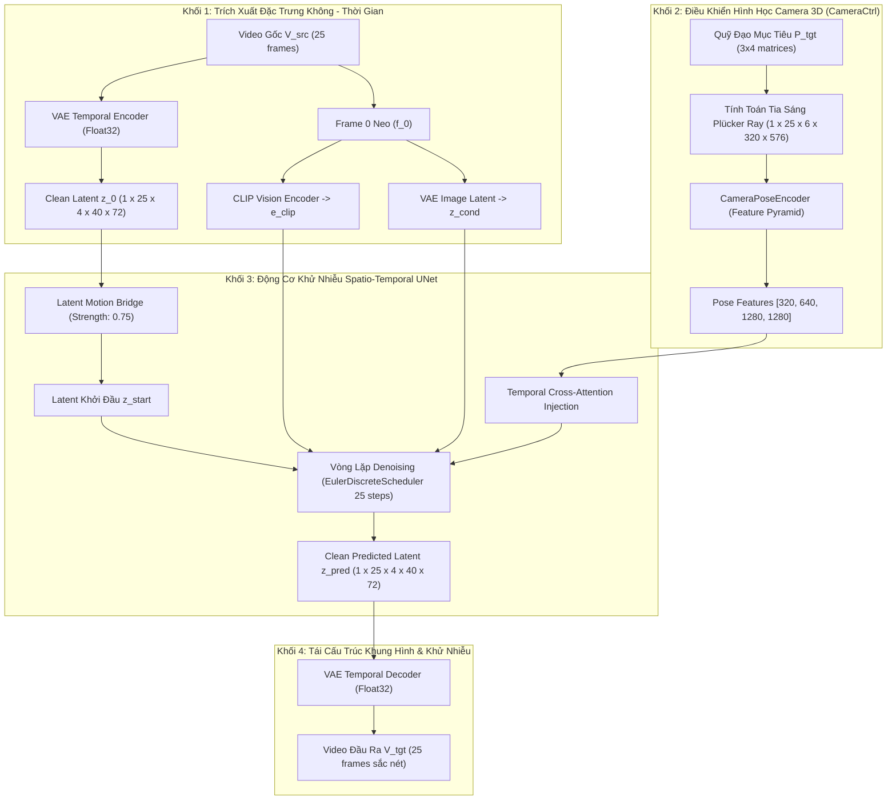

> [!CAUTION]
> ## ⛔ TÀI LIỆU NÀY ĐÃ BỊ LOẠI BỎ (DEPRECATED) — KHÔNG SỬ DỤNG CHO TRIỂN KHAI
> **Lý do**: Kiến trúc SVD-XT + Frame 0 lặp 25 lần + Additive Pose Injection mô tả trong tài liệu này đã được **thực nghiệm chứng minh thất bại hoàn toàn** (xem `architectural_lessons_learned.md` Mục 2-8).
> - Frame 0 lặp thành $z_{\text{cond}}$ gây triệt tiêu chuyển động động lực học ở các frame sau.
> - Cộng $\mathbf{F}_{\text{pose}}$ vào Spatial/Temporal Attention (mâu thuẫn giữa chính tài liệu 4 vs 6) đều thất bại.
> - Monkey-patch Softmax FP32 chỉ là workaround — gốc rễ là kiến trúc injection sai.
>
> **Tài liệu thay thế**: `docs/latent_replacement_and_dynamic_reference_retargeting.md`, `docs/architectural_lessons_learned.md` (Mục 11-14).

# [DEPRECATED] TÀI LIỆU ĐẶC TẢ KIẾN TRÚC CHI TIẾT HỆ THỐNG
# VIDEO-TO-VIDEO CAMERA TRAJECTORY RETARGETING PIPELINE
## Mô Hình Hóa Toán Học, Kiến Trúc Khối & Luồng Dữ Liệu Chi Tiết (Chuẩn Luận Văn / Paper)

---

## 1. ĐẶT VẤN ĐỀ & MÔ HÌNH HÓA TOÁN HỌC (PROBLEM FORMULATION)

### 1.1. Không Gian Dữ Liệu Đầu Vào & Đầu Ra
Hệ thống giải quyết bài toán biến đổi góc quay phối cảnh cho toàn bộ video động $V_{src}$ mà vẫn bảo toàn chuỗi hành động thời gian thực:

* **Không gian đầu vào (Input Domain)**:
  $$V_{src} = \{ f_t \}_{t=0}^{F-1} \in \mathbb{R}^{F \times 3 \times H \times W}, \quad \mathbf{P}_{tgt} = \{ [\mathbf{R}_t \mid \mathbf{T}_t] \in SE(3) \}_{t=0}^{F-1}$$
  * Trong đó $F = 25$ frames, $H = 320$, $W = 576$.
  * $f_0$ đóng vai trò là **Khung hình neo (Anchor Frame)** chứa toàn bộ đặc trưng ngữ nghĩa và phong cách gốc.
  * $\mathbf{P}_{tgt}$ là chuỗi ma trận ngoại tại của camera mục tiêu theo thời gian $t$.

* **Không gian đầu ra (Output Domain)**:
  $$V_{tgt} = \{ \hat{f}_t \}_{t=0}^{F-1} \in \mathbb{R}^{F \times 3 \times H \times W}$$
  * Thỏa mãn: $V_{tgt}$ tái hiện đúng phối cảnh 3D theo $\mathbf{P}_{tgt}$ và giữ nguyên quỹ đạo chuyển động của các đối tượng trong $V_{src}$.

---

## 2. KIẾN TRÚC TỔNG THỂ CỦA PIPELINE (END-TO-END ARCHITECTURE)

Hệ thống gồm **4 Khối chức năng lõi (Core Modules)** kết nối chặt chẽ:

---

## 3. CHI TIẾT TỪNG THÀNH PHẦN KỸ THUẬT

### 3.1. Khối Mã Hóa VAE & Không Gian Latent (Spatio-Temporal Autoencoder)
* **Kiến trúc**: `AutoencoderKLTemporalDecoder` với hệ số nén không gian $8\times$ ($320\times 576 \rightarrow 40\times 72$) và kênh latent $C=4$.
* **Công thức mã hóa**:
  $$\mathbf{z}_0 = \mathcal{E}_{VAE}(V_{src}) \odot s_{scale}, \quad s_{scale} = 0.18215$$
* **Khung hình neo điều kiện**:
  $$\mathbf{z}_{cond} = \mathcal{E}_{VAE}(f_0) \in \mathbb{R}^{1 \times 1 \times 4 \times 40 \times 72} \xrightarrow{\text{Repeat}} \mathbb{R}^{1 \times 25 \times 4 \times 40 \times 72}$$

---

### 3.2. Khối Biểu Diễn & Mã Hóa Camera (Plücker Ray Geometry)
Để mô hình học sâu hiểu được quỹ đạo camera 3D trong không gian liên tục, ma trận ngoại tại $[\mathbf{R}_t \mid \mathbf{T}_t]$ và nội tại $\mathbf{K}$ được chuyển hóa thành **Trường tia Plücker 6 chiều**:

1. **Tạo tia sáng qua từng điểm ảnh $(i, j)$**:
   $$\mathbf{d} = \text{Normalize}\left( \left[ \frac{i - c_x}{f_x}, \frac{j - c_y}{f_y}, 1 \right]^T \right)$$
   $$\mathbf{r}_d(t) = \mathbf{d} \cdot \mathbf{R}_t^T, \quad \mathbf{r}_o(t) = \mathbf{T}_t$$

2. **Tọa độ Plücker 6D**:
   $$\mathbf{Plucker}(i, j, t) = [\mathbf{r}_o(t) \times \mathbf{r}_d(t), \mathbf{r}_d(t)] \in \mathbb{R}^{F \times 6 \times H \times W}$$

3. **Mã hóa đa tỷ lệ qua `CameraPoseEncoder`**:
   Mạng nơ-ron tích chập và Temporal Attention nén $\mathbf{Plucker}$ thành 4 tầng đặc trưng:
   $$\mathbf{F}_{pose} = \{ \mathbf{F}^{(0)} \in \mathbb{R}^{320}, \mathbf{F}^{(1)} \in \mathbb{R}^{640}, \mathbf{F}^{(2)} \in \mathbb{R}^{1280}, \mathbf{F}^{(3)} \in \mathbb{R}^{1280} \}$$

---

### 3.3. Cơ Chế Tiêm Góc Quay Vào Khối Temporal Attention (`PoseAdaptor`)
Tại mỗi khối `CrossAttnBlockSpatioTemporalPoseCond`, đặc trưng camera được hòa trộn vào ma trận `Query` và `Key/Value` của `Temporal Self-Attention`:

$$\mathbf{Q}_{pose} = \mathbf{W}_q (\mathbf{H}_{temporal} + \mathbf{F}_{pose}) \cdot \gamma + \mathbf{H}_{temporal}$$
$$\mathbf{K}_{pose} = \mathbf{W}_k (\mathbf{H}_{temporal} + \mathbf{F}_{pose}) \cdot \gamma + \mathbf{H}_{temporal}$$
$$\mathbf{V}_{pose} = \mathbf{W}_v (\mathbf{H}_{temporal} + \mathbf{F}_{pose}) \cdot \gamma + \mathbf{H}_{temporal}$$
$$\text{Attention}(\mathbf{Q}, \mathbf{K}, \mathbf{V}) = \text{Softmax}\left( \frac{\mathbf{Q}_{pose} \mathbf{K}_{pose}^T}{\sqrt{d_k}} \right) \mathbf{V}_{pose}$$
*(với $\gamma = 1.0$ là hệ số điều khiển góc quay).*

---

### 3.4. Cơ Chế Cầu Nối Chuyển Động (SDE Motion Bridge Schedule)
Để tái tạo video mới bám theo hành động cũ, quá trình khuếch tán không bắt đầu từ nhiễu thuần túy mà bắt đầu tại bước $t_{start}$ thông qua hệ số `strength` $S \in (0, 1)$:

$$t_{start} = \lfloor N_{steps} \times (1 - S) \rfloor, \quad \sigma_{start} = \text{Scheduler.sigmas}[t_{start}]$$
$$\mathbf{z}_{start} = \mathbf{z}_0^{src} + \sigma_{start} \cdot \boldsymbol{\epsilon}, \quad \boldsymbol{\epsilon} \sim \mathcal{N}(\mathbf{0}, \mathbf{I})$$

* Quá trình Denoising chạy lùi từ $t_{start} \rightarrow 0$ thông qua bộ giải `EulerDiscreteScheduler`:
  $$v_{\theta} = \text{UNet}(\text{Concat}[\mathbf{z}_t, \mathbf{z}_{cond}], t, \mathbf{e}_{clip}, \mathbf{F}_{pose})$$
  $$\mathbf{z}_{t-1} = \text{Scheduler.step}(v_{\theta}, t, \mathbf{z}_t).\text{prev\_sample}$$

---

## 4. BẢNG ĐẶC TẢ KÍCH THƯỚC TENSOR TOÀN PIPELINE

| Tên Khối / Tầng | Tên Tensor Dữ Liệu | Kích Thước (Batch x Frames x Channels x H x W) | Kiểu Dữ Liệu (Dtype) |
| :--- | :--- | :--- | :---: |
| **Input Video** | $V_{src}$ | `[1, 25, 3, 320, 576]` | `uint8 / float32` |
| **VAE Encoder** | $\mathbf{z}_0^{src}$ | `[1, 25, 4, 40, 72]` | `float16` |
| **CLIP Encoder** | $\mathbf{e}_{clip}$ | `[1, 1, 1024]` | `float16` |
| **Plücker Rays** | $\mathbf{Plucker}$ | `[1, 25, 6, 320, 576]` | `float16` |
| **Pose Encoder** | $\mathbf{F}_{pose}^{(0 \dots 3)}$ | `[1, 25, C, H', W']` ($C \in \{320, 640, 1280\}$) | `float16` |
| **UNet Input** | $\text{Concat}[\mathbf{z}_t, \mathbf{z}_{cond}]$ | `[2, 25, 8, 40, 72]` *(CFG Batch x 2)* | `float16` |
| **Attention Scores** | $\mathbf{Q}\mathbf{K}^T / \sqrt{d}$ | `[B * Heads, 2880, 2880]` | **`float32` (Zero-NaN Safe)** |
| **VAE Decoder** | $V_{tgt}$ | `[1, 25, 3, 320, 576]` | **`float32` (No Clip Safe)** |

---

## 5. CƠ CHẾ BẢO VỆ SỐ HỌC TRÊN PHẦN CỨNG BLACKWELL (RTX PRO 6000)

1. **Zero-NaN Softmax Protection**:
   - Ở độ phân giải $40 \times 72 = 2880$ tokens, tích vô hướng $\mathbf{Q}\mathbf{K}^T$ dễ chạm mốc $> 20$.
   - Trong FP16, $\exp(20) \approx 4.8 \times 10^8 \gg 65504$ (ngưỡng cực đại của Half) $\rightarrow$ Sinh `NaN`.
   - **Giải pháp**: Monkey-patch hàm `get_attention_scores` ép kiểu $\mathbf{Q}, \mathbf{K}$ sang `float32` trước khi tính Softmax, sau đó cast ngược lại `float16`.
2. **High-Precision VAE Decoding**:
   - Chuyển `AutoencoderKLTemporalDecoder` và `latents` sang `float32` trong suốt quá trình decode 25 frames để triệt tiêu lỗi đốm đen (black artifact) và bão hòa màu cực đại.
