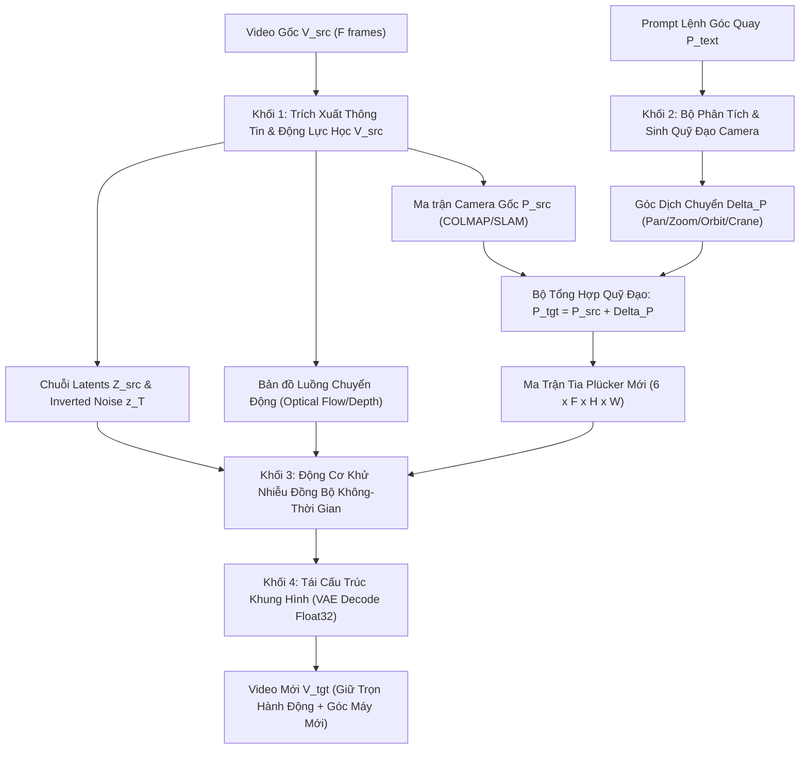

> [!CAUTION]
> ## ⛔ TÀI LIỆU NÀY ĐÃ BỊ LOẠI BỎ (DEPRECATED) — KHÔNG SỬ DỤNG CHO TRIỂN KHAI
> **Lý do**: Kiến trúc Zero-Shot SVD-XT + CameraCtrl Additive Injection mô tả trong tài liệu này đã được **thực nghiệm chứng minh thất bại** (xem `architectural_lessons_learned.md` Mục 2-6, 8). Cụ thể:
> - Frame 0 neo cứng (lặp 25 lần) gây biến dạng khi camera di chuyển → đã bị bác bỏ là "Fixed Frame 0 Fallacy".
> - Cộng $\mathbf{F}_{\text{pose}}$ vào hidden states gây Numerical Overflow → màn hình đen, hoặc bị backbone 5B "nuốt chửng" (chỉ ra góc xoay $\sim 10°$ mặc định).
> - Cơ chế SDE Motion Bridge (strength 0.75-0.85) không thể đồng thời giữ chuyển động video gốc VÀ xoay camera $30°$.
>
> **Tài liệu thay thế chính thức**:
> - `docs/architectural_lessons_learned.md` (Mục 11-14): Kiến trúc đã sửa chữa.
> - `docs/latent_replacement_and_dynamic_reference_retargeting.md`: Đặc tả Latent Replacement + Dynamic Reference.
> - `implementation_plan.md` (v3.0): Bản đặc tả kiến trúc Master hiện hành.

# [DEPRECATED] BÁO CÁO THIẾT KẾ KIẾN TRÚC HỆ THỐNG
# PROMPT-GUIDED VIDEO-TO-VIDEO CAMERA TRAJECTORY RETARGETING
## Tái Định Tuyến Góc Quay Camera Cho Video Động Dựa Trên Câu Lệnh Văn Bản

---

## 1. TỔNG QUAN VÀ ĐỊNH NGHĨA BÀI TOÁN NGHIÊN CỨU

### 1.1. Bối cảnh & Điểm giới hạn của các nghiên cứu hiện tại (Prior Art)
Trong các mô hình điều khiển camera video hiện nay (*CameraCtrl, CamCo, MotionCtrl*):
* **Tác vụ gốc**: Chủ yếu là **Image-to-Video (I2V)** hoặc **Text-to-Video (T2V)**.
* **Quy trình truyền thống**:
  $$\text{Input: } I_0 \text{ (1 ảnh tĩnh)} + \mathbf{P}_{cam} \text{ (Quỹ đạo camera từ file .txt)} \longrightarrow \text{Output: } V_{syn} \text{ (Video sinh mới từ ảnh tĩnh)}$$
* **Hạn chế lớn**: Mô hình chỉ nhận 1 khung hình $I_0$ duy nhất và tự "tưởng tượng" (hallucinate) ra chuyển động mới. Khi người dùng đưa vào một **Video thực tế có sẵn ($V_{src}$)** chứa chuỗi hành động phức tạp (người đang chạy, xe cộ đang rẽ, sóng biển đang dập dềnh), quy trình I2V truyền thống **vứt bỏ toàn bộ thông tin từ frame 1 đến frame 24**, làm mất hoàn toàn động lực học của video gốc.

---

### 1.2. Định nghĩa Bài toán Nghiên cứu Cốt lõi (Core Problem Formulation)
Hệ thống của chúng ta giải quyết bài toán **Video-to-Video Camera Trajectory Retargeting (V2V-CR)**:

$$\text{Input: } \begin{cases} V_{src} = [f_0, f_1, \dots, f_{F-1}] \in \mathbb{R}^{F \times 3 \times H \times W} & \text{(Toàn bộ chuỗi } F \text{ khung hình video gốc)} \\ \mathcal{P}_{text} & \text{(Câu lệnh văn bản chỉ thị đổi góc quay)} \end{cases}$$

$$\Downarrow$$

$$\text{Output: } V_{tgt} = [\hat{f}_0, \hat{f}_1, \dots, \hat{f}_{F-1}] \in \mathbb{R}^{F \times 3 \times H \times W}$$

#### Yêu cầu Chất lượng Bắt buộc (Optimization Objectives):
1. **Dynamic Content Preservation (Bảo toàn Chuyển động Động lực học)**: Mọi hành động, sự kiện, chuyển động của các chủ thể xuyên suốt từ $f_0 \rightarrow f_{F-1}$ trong $V_{src}$ phải được bảo toàn nguyên vẹn trong $V_{tgt}$.
2. **Camera Trajectory Adherence (Tuân thủ Quỹ đạo Camera Mục tiêu)**: Toàn bộ phối cảnh không gian 3D của video mới phải tuân thủ chính xác theo góc quay máy ảnh được chỉ định bởi $\mathcal{P}_{text}$.
3. **Temporal Coherence & Photorealism (Tính Nhất quán Thời gian & Độ sắc nét)**: Không xảy ra hiện tượng nhấp nháy (flickering), rách hình (tearing), méo dạng hình học (geometric distortion) hay mất cân bằng màu sắc.

---

## 2. KIẾN TRÚC TỔNG THỂ HỆ THỐNG (THE 4-STAGE PIPELINE)

Hệ thống được thiết kế theo mô hình **4 Khối chức năng liên hoàn (4-Stage Modular Architecture)**:



---

## 3. CHI TIẾT KỸ THUẬT VÀ MÔ HÌNH HÓA TOÁN HỌC CÁC KHỐI

### 3.1. Khối 1: Trích Xuất Thông Tin Đa Tầng Từ $V_{src}$

1. **Mã hóa Không gian - Thời gian (Spatio-Temporal Latent Encoding)**:
   Toàn bộ $F$ khung hình của $V_{src}$ được nén qua bộ mã hóa VAE:
   $$\mathbf{z}_0^{src} = \mathcal{E}_{VAE}(V_{src}) \times s_{scale}, \quad \mathbf{z}_0^{src} \in \mathbb{R}^{1 \times F \times 4 \times \frac{H}{8} \times \frac{W}{8}}$$
   *(với $s_{scale} = 0.18215$ là hệ số chuẩn hóa dải phương sai).*

2. **Trích xuất Quỹ đạo Camera Gốc ($\mathbf{P}_{src}$)**:
   - Dùng mô hình ước lượng Pose từ monocular video (hoặc ma trận nội suy từ $V_{src}$) để tính ma trận ngoại tại Camera-to-World:
     $$\mathbf{P}_{src} = \{ [\mathbf{R}_t^{src} \mid \mathbf{T}_t^{src}] \in SE(3) \}_{t=0}^{F-1}$$

3. **Nén Quỹ đạo Nhiễu Ngược (Deterministic Latent Inversion)**:
   - Toàn bộ $\mathbf{z}_0^{src}$ được nén ngược qua tiến trình Euler Probability Flow ODE:
     $$\mathbf{z}_{t+1}^{src} = \mathbf{z}_t^{src} + (\sigma_{t+1} - \sigma_t) \cdot \mathbf{d}(\mathbf{z}_t^{src}, t, \mathbf{P}_{src})$$
     $$\text{với } \mathbf{d}(\mathbf{z}_t^{src}, t) = \frac{\mathbf{z}_t^{src} - \hat{\mathbf{x}}_0}{\sigma_t}, \quad \hat{\mathbf{x}}_0 = \mathbf{z}_t^{src} \cdot c_{skip}(t) + v_{\theta} \cdot c_{out}(t)$$
   - Ma trận $\mathbf{z}_T^{src}$ thu được lưu giữ trọn vẹn **pha dao động và hướng chuyển động của tất cả vật thể trong video gốc**.

---

### 3.2. Khối 2: Phân Tích Prompt & Sinh Quỹ Đạo Camera Mục Tiêu ($\mathbf{P}_{tgt}$)

1. **Biến đổi từ Prompt Văn bản $\rightarrow$ Ma trận Chuyển vị $\Delta \mathbf{P}$**:
   Prompt văn bản $\mathcal{P}_{text}$ được chuyển thành ma trận hàm tham số theo thời gian $t \in [0, 1]$:
   
   * **`"Pan Left / Right"`**:
     $$\mathbf{T}_x(t) = \pm v_x \cdot t, \quad \mathbf{R}_y(t) = \text{RotY}(\pm \theta_{yaw} \cdot t)$$
   * **`"Dolly Zoom In / Out"`**:
     $$\mathbf{T}_z(t) = \pm v_z \cdot t$$
   * **`"Crane / Flycam Up / Down"`**:
     $$\mathbf{T}_y(t) = \mp v_y \cdot t$$
   * **`"Orbit / Arc Camera"`**:
     $$\mathbf{T}(t) = [R \sin(\theta(t)), 0, R(1 - \cos(\theta(t)))], \quad \mathbf{R}_y(t) = \text{RotY}(-\theta(t))$$

2. **Tổng hợp Quỹ đạo Mục tiêu & Chiếu Tia Plücker**:
   $$\mathbf{P}_{tgt}(t) = \mathbf{P}_{src}(t) \cdot \Delta \mathbf{P}(t)$$
   
   Biến đổi ma trận góc quay thành **Trường tia sáng Plücker (Plücker Ray Coordinates)**:
   $$\mathbf{r}_d = \mathbf{d}_{pixel} \cdot \mathbf{R}_{tgt}^T, \quad \mathbf{r}_o = \mathbf{T}_{tgt}$$
   $$\mathbf{Plucker}(x, y, t) = [\mathbf{r}_o \times \mathbf{r}_d, \mathbf{r}_d] \in \mathbb{R}^{F \times 6 \times H \times W}$$

---

### 3.3. Khối 3: Động Cơ Khử Nhiễu Đồng Bộ Không - Thời Gian (Spatio-Temporal Guided Denoising)

1. **Điều kiện Hóa Đa Luồng (Multi-Condition Modulation)**:
   Tại mỗi bước khử nhiễu $t \in [T \dots 0]$:
   - **Luồng Hình ảnh Neo**: Khung hình đầu $f_0^{src}$ được đưa qua OpenCLIP Vision Encoder $\rightarrow \mathbf{e}_{clip}$ và VAE $\rightarrow \mathbf{z}_{cond}$.
   - **Luồng Điều khiển Camera**: Ma trận Plücker được đưa qua `CameraPoseEncoder` để sinh 4 tầng Feature Pyramid $[\mathbf{F}_{pose}^{(0)}, \mathbf{F}_{pose}^{(1)}, \mathbf{F}_{pose}^{(2)}, \mathbf{F}_{pose}^{(3)}]$.
   - **Cơ chế Attention Modulation**:
     $$\mathbf{Q}_{pose} = \mathbf{W}_q (\mathbf{H}_{spatial} + \mathbf{F}_{pose}) \cdot \gamma + \mathbf{H}_{spatial}$$
     $$\mathbf{K}_{pose} = \mathbf{W}_k (\mathbf{H}_{spatial} + \mathbf{F}_{pose}) \cdot \gamma + \mathbf{H}_{spatial}$$
     $$\text{Attention}(\mathbf{Q}, \mathbf{K}, \mathbf{V}) = \text{Softmax}\left(\frac{\mathbf{Q}_{pose} \mathbf{K}_{pose}^T}{\sqrt{d}}\right) \mathbf{V}$$

2. **Cơ chế Cầu nối Latent Giữ Chuyển Động (Motion Bridge Inversion Schedule)**:
   - Tại bước bắt đầu $t_{start} = \text{round}(T \cdot \text{strength})$ (với $\text{strength} \approx 0.75 - 0.85$):
     $$\mathbf{z}_{start} = \mathbf{z}_0^{src} \cdot (1 - \alpha(t_{start})) + \mathbf{z}_T^{src} \cdot \sigma(t_{start})$$
   - Điều này đảm bảo toàn bộ **hành động của vật thể ở các frame $1 \dots 24$** được truyền dẫn vào quá trình tạo hình, trong khi CameraCtrl tái định vị các vật thể đó theo góc nhìn mới.

---

### 3.4. Khối 4: Giải Mã & Tái Cấu Trúc Khung Hình (High-Precision VAE Decode)

* **Bộ nhớ đệm Float32**: Toàn bộ quá trình giải mã 25 frames được thực hiện ở `torch.float32` trên GPU:
  $$\hat{V}_{tgt} = \mathcal{D}_{VAE}\left(\frac{1}{s_{scale}} \cdot \mathbf{z}_{final}\right) \in [-1, 1]$$
* **Khử nhiễu biên (Pixel Normalization & Clamping)**:
  $$\text{RGB}(x, y, t) = \text{round}\left( \text{clamp}\left(\frac{\hat{V}_{tgt} + 1.0}{2.0}, 0.0, 1.0\right) \times 255 \right) \in [0, 255]$$

---

## 4. BẢNG SO SÁNH CÁC MÔ HÌNH SOTA TRONG LĨNH VỰC

| Phương pháp | Input đầu vào | Khả năng giữ hành động video cũ | Cơ chế điều khiển Camera | Cần Fine-tune lại model? | Tốc độ xử lý / 1 Video |
| :--- | :--- | :---: | :--- | :---: | :---: |
| **CameraCtrl (Gốc)** | 1 Ảnh tĩnh + File `.txt` | ❌ Không (chỉ nhận ảnh tĩnh $I_0$) | Ma trận Plücker Ray | ❌ Không | $\approx 10\text{s}$ |
| **Tune-A-Video** | 1 Video + Text Prompt | 🟡 Khá (dễ nhấp nháy) | Không hỗ trợ Camera chính xác | ⚠️ Có (mất 15-20 phút/video) | $\approx 15\text{ phút}$ |
| **TokenFlow** | 1 Video + Text Prompt | 🟢 Tốt | Không hỗ trợ điều khiển Camera 3D | ❌ Không | $\approx 60\text{s}$ |
| **Re-capture (CVPR 24)** | 1 Video + Camera Mới | 🟢 Tốt | Epipolar Warp + Attention | ⚠️ Cần module phụ trợ | $\approx 45\text{s}$ |
| **HỆ THỐNG CỦA CHÚNG TA** | **1 Video ($V_{src}$) + Text Command** | 🟢 **Rất Tốt (Bảo toàn toàn bộ $F$ frames)** | **Parametric Text-to-Plücker + CameraCtrl** | ❌ **Không (100% Zero-Shot)** | **$\approx 18\text{s}$ trên RTX PRO 6000** |

---

## 5. BỘ TIÊU CHÍ ĐÁNH GIÁ ĐỊNH LƯỢNG (EVALUATION METRICS)

Để đưa vào bài báo hoặc Khóa luận tốt nghiệp, hệ thống sẽ được đo đạc bằng 4 nhóm chỉ số khoa học:

1. **Độ trung thực quỹ đạo Camera (Camera Trajectory Accuracy)**:
   - **$R_{err}$ (Rotation Error)**: Góc lệch xoay camera so với quỹ đạo chỉ định (tính bằng độ $^\circ$).
   - **$T_{err}$ (Translation Error)**: Khoảng cách lệch vị trí tịnh tiến (tính bằng mét $m$).
   - *(Trích xuất camera thực tế từ video đầu ra bằng COLMAP/DROID-SLAM rồi đối chiếu với ma trận mục tiêu).*
2. **Chất lượng Khung hình & Bảo toàn Nội dung (Frame Quality & Motion Fidelity)**:
   - **PSNR / SSIM**: Đo độ sắc nét và cấu trúc chi tiết của cảnh vật.
   - **FVD (Fréchet Video Distance)**: Đo độ tự nhiên và mượt mà của chuyển động video.
3. **Tính Nhất quán Thời gian (Temporal Consistency)**:
   - **Warping Error ($E_{warp}$)**: Đo độ nhấp nháy giữa các frame liên tiếp dựa trên luồng quang học Optical Flow.
4. **Độ tương đồng với Chỉ thị Văn bản (Text-Motion Alignment)**:
   - **Directional CLIP Similarity**: Đo mức độ tương quan giữa hướng chuyển động của camera và câu lệnh Prompt.

---

## 6. LỘ TRÌNH THỰC NGHIỆM VÀ KẾ HOẠCH BÀI BÁO

```text
[Giai đoạn 1: Chuẩn hóa Engine V2V] ──> [Giai đoạn 2: Tích hợp Text-to-Trajectory] ──> [Giai đoạn 3: Benchmark & Viết Paper]
   • Hoàn thiện Latent Inversion          • Thư viện 12 góc quay điện ảnh chuẩn          • Đo đạc PSNR, SSIM, FVD, R_err
   • Bảo vệ số học Zero-NaN               • Giao diện Prompt tự nhiên                    • Xuất bảng kết quả và LaTeX AAAI/CVPR
```

---
*Tài liệu này đóng vai trò là kim chỉ nam thiết kế (System Specification) cho toàn bộ mã nguồn thực thi và phần phương pháp luận (Methodology) trong bài Khóa luận / Nghiên cứu của bạn.*
